=======
UI Tour
=======

This article is a quick tour of the main sections of the JavaScript Debugger's user interface. The UI is split vertically into three panels

- :ref:`Source list pane <debugger-ui-tour-source-list-pane>`
- :ref:`Source pane <debugger_ui_tour_source_pane>`
- The contents of the third pane depend on the current state of the debugger and may include the following sections:

   - :ref:`Toolbar <debugger-ui-tour-toolbar>`
   - Watch expressions
   - :ref:`Breakpoints <debugger-ui-tour-breakpoints-list>`
   - :ref:`Call stack <debugger-ui-tour-call-stack>`
   - :ref:`Scopes <debugger-ui-tour-scopes>`
   - XHR Breakpoints
   - Event Listener Breakpoints
   - DOM Mutation Breakpoints

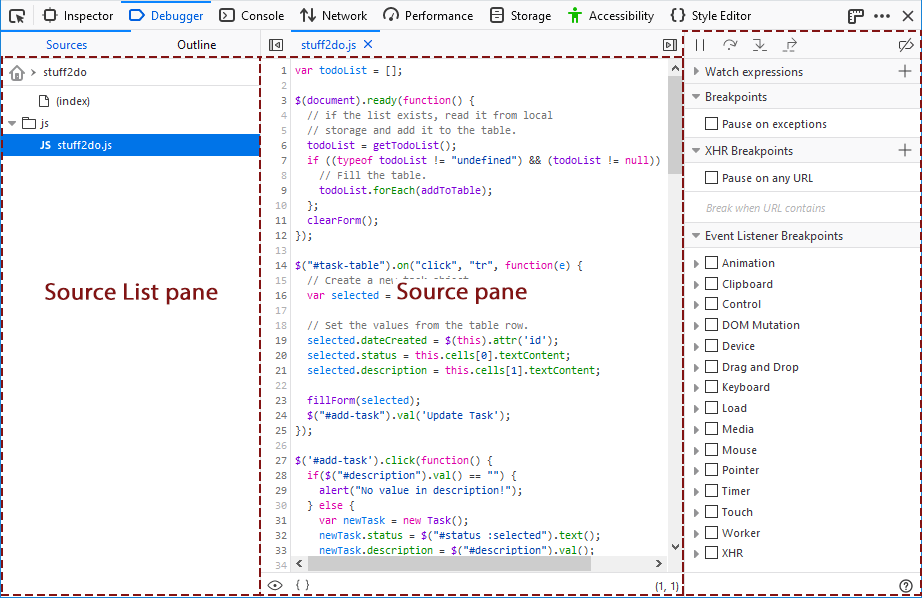

.. _debugger-ui-tour-source-list-pane:

Source list pane
****************

The source list pane lists all the JavaScript source files loaded into the page (`including scripts for active web workers <https://developer.mozilla.org/en-US/docs/Web/API/Web_Workers_API/Using_web_workers#debugging_worker_threads>`_), and enables you to select one to debug. At the top level sources are organized by origin, and under that they're organized by the directory structure from which they are served.

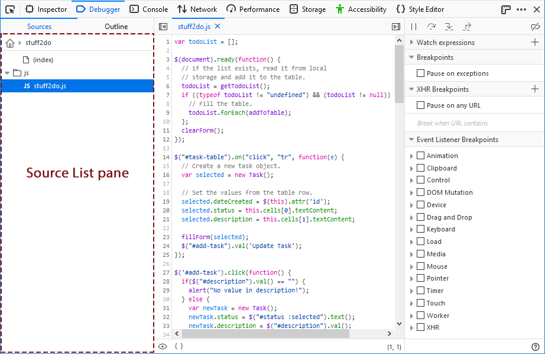

You can :ref:`search for a file <debugger-how-to-search-searching-for-files>` using :kbd:`Ctrl` + :kbd:`P` (:kbd:`Cmd` + :kbd:`P` on a Mac).

WebExtensions are listed in the Source List pane using the extension's name.

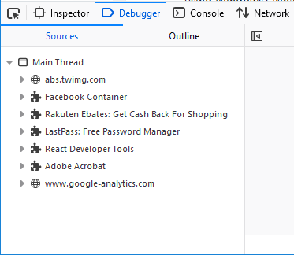

There are several context menu options available for individual files and folders or groups; typically viewed by right-clicking on the item.

For files, the following context menu options are available:

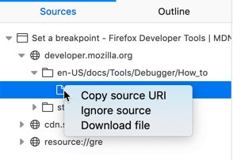

- **Copy source URI** copies the full identifier of the file to the clipboard.
- **Ignore source** causes the debugger to skip the file when "stepping into" functions; this can be helpful for avoiding stepping into libraries used by your code. When a file is ignored, it has a small eye icon next to it in place of its regular icon.
- **Download file** opens a file dialog so you can save the file locally.

For folders and groups, the following context menu options are available:

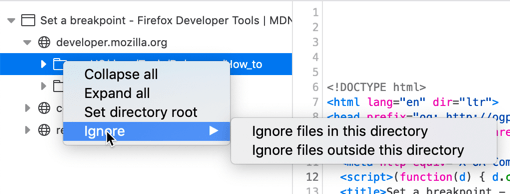

- **Collapse all** collapses all subfolders of the item.
- **Expand all** expands all subfolders of the item.
- **Set directory root** changes the Source List view so that only that item and its children are visible. The name of the selected directory is shown at the top of the Source List pane; clicking this name reverts the pane to showing all source items.
- **Ignore** (since Firefox 76)

   - **Ignore files in this directory** causes all files within the selected directory to be skipped by the debugger. All child files acquired the eye icon, and the folder menu option changes to **Unignore files in this directory**.
   - **Ignore files outside this directory** causes all files other than those within the selected directory to be skipped by the debugger. All such files acquire the eye icon, and the menu option for that folder changes to **Unignore files outside this directory**.

Outline View
------------

The Outline view shows a tree for navigating the currently open file. Use it to jump directly to a function, class or method definition.

.. _debugger_ui_tour_source_pane:

Source pane
***********

This shows the JavaScript file currently loaded.

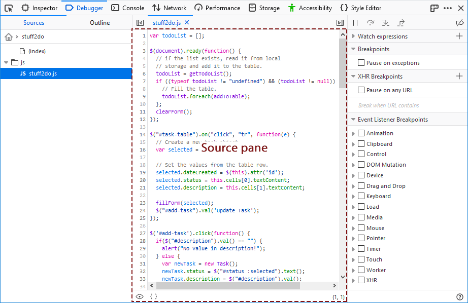

When the source pane is focused you can :ref:`search for a string in the file <debugger-how-to-search-searching-within-a-file>` using :kbd:`Ctrl` + :kbd:`F` (:kbd:`Cmd` + :kbd:`F` on a Mac).

:doc:`Breakpoints <../how_to/set_a_breakpoint/index>` have a blue arrow overlaid on the line number. :doc:`Conditional breakpoints <../how_to/set_a_conditional_breakpoint/index>` have an orange arrow. If you're stopped at a breakpoint, the entire line gets a green overlay. In the screenshot below there are three breakpoints:

- line 82 has a normal breakpoint and execution is paused here
- line 85 has a logpoint which logs the contents of table row to the console
- line 100 has a conditional breakpoint

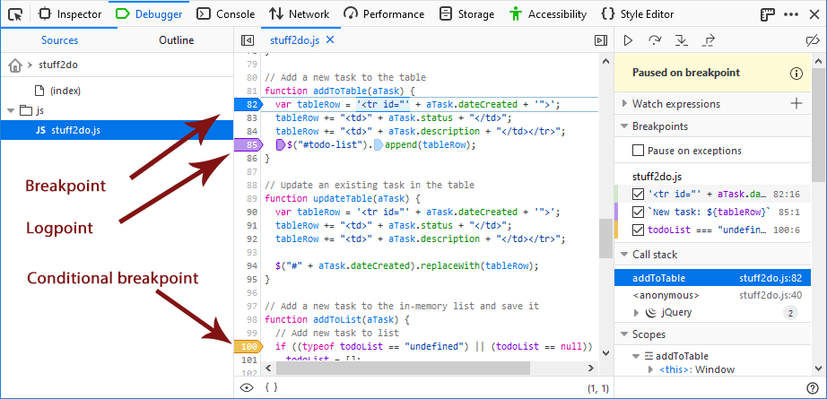

The third column shows more information about the breakpoints. For example, the logpoint at line 85 logs the value of the tableRow variable to the console and the conditional breakpoint at line 100 breaks if the contents of the todoList is undefined.

The source pane provides the following context menu options:

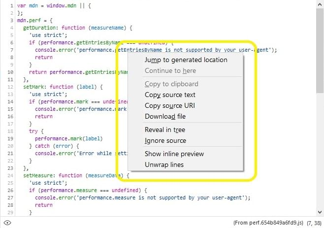

- **Jump to generated location** is used when you have a sourcemap in a project and are currently viewing the original file. Selecting it takes you to the generated file where the selected item was placed.
- **Continue to here** causes the debugger to continue execution to the currently selected line (execution will stop before it gets there if there is a breakpoint "on the way").
- **Copy to clipboard** copies selected text in the pane into the system clipboard.
- **Copy source text** copies all text in the file into the clipboard.
- **Copy source URI** copies the file location into the clipboard.
- **Download file** opens a file dialog so you can save the file locally.
- **Reveal in tree** highlights the file in the source pane list hierarchy.
- **Ignore source** causes the debugger to skip the file when "stepping into" functions; this can be helpful for avoiding stepping into libraries used by your code.
- **Show inline preview** toggles the inline preview feature, which displays the value of the variable right next to the source when execution is paused.
- **Wrap lines**/**Unwap lines** toggles the wrapping of long lines in the pane.

.. _debugger-ui-tour-toolbar:

Toolbar
*******

At the top of the right-hand pane, there's a toolbar:

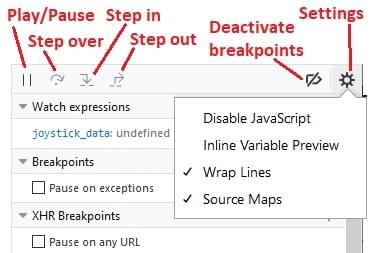

The toolbar consists of:

- Four buttons to :doc:`control the debugger's movement through the script <../how_to/step_through_code/index>`:

  - **Play/pause** (:kbd:`F8`): pauses or resumes execution of the script you're debugging. When it displays a "play" icon, that means the script is paused, either because you've paused it with this button or because you've hit a breakpoint.
  - **Step over** (:kbd:`F10`): steps to the next line of JavaScript code.
  - **Step in** (:kbd:`F11`): steps into the function call on the current line of JavaScript code.
  - **Step out** (:kbd:`Shift`-:kbd:`F11`): runs the script until the current function exits.

- A button that deactivates all breakpoints.
- A settings menu that contains:

  - **Disable JavaScript**: disables JavaScript for this tab. This option enables you to see how your web page looks if the user has disabled JavaScript via an extension or a configuration setting. The setting is reset when the Developer Tools are closed (except in Firefox 77, see `bug 1640318 <https://bugzilla.mozilla.org/show_bug.cgi?id=1640318>`_).
  - **Inline Variable Preview**: enabled by default, this option displays variable values within the source pane when the debugger is paused.
  - **Wrap Lines**: Toggles wrapping of long lines in the :ref:`source pane <debugger_ui_tour_source_pane>`.
  - **Source Maps**: enabled by default, this option directs the Debugger to load the original versions of files, and map them to the generated ones loaded in a page, to ease debugging of transformed sources. See :doc:`Use a source map <../how_to/use_a_source_map/index>` for details.

.. _debugger-ui-tour-breakpoints-list:

Breakpoints list
****************

Under the toolbar, you'll see all the breakpoints you've set. Next to each breakpoint is a checkbox which you can use to :doc:`enable/disable it <../how_to/disable_breakpoints/index>`:

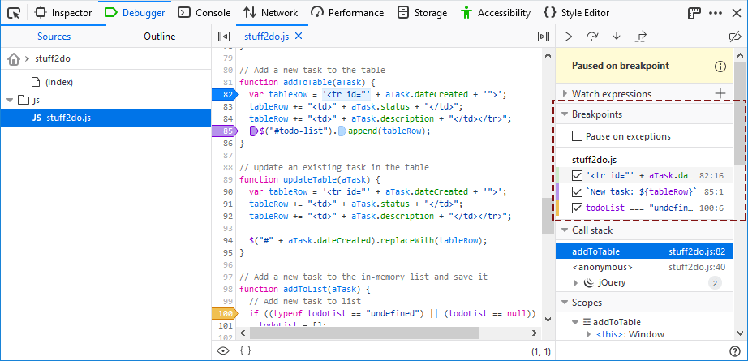

Watch expressions
*****************

You can add watch expressions in the right pane. They will be evaluated when code execution is paused:

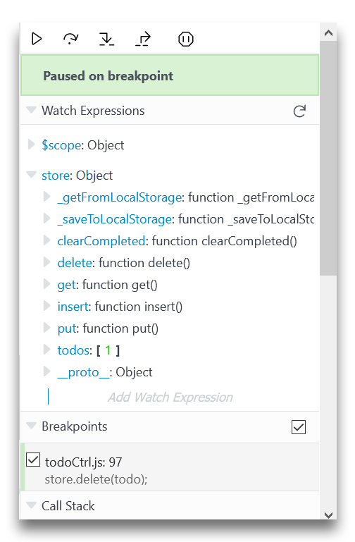

Variable tooltip
****************

Hover on a variable show a tooltip with its value inside:

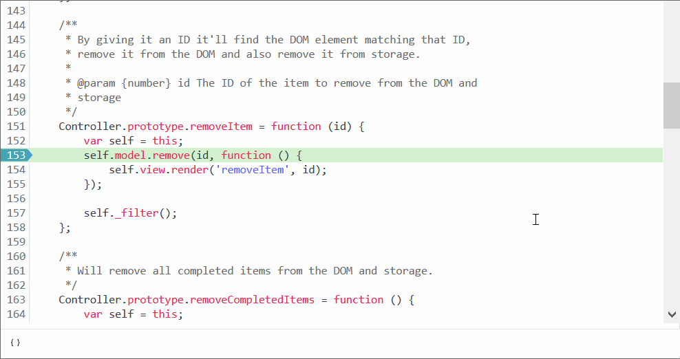

.. _debugger-ui-tour-call-stack:

Call stack
**********

The *call stack* becomes visible when the debugger is paused.

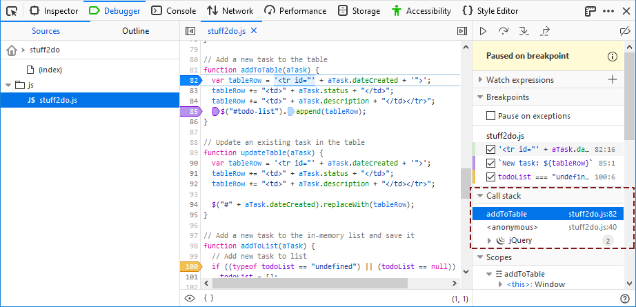

The stack lists the chain of functions that are waiting to complete, with the frame for the function that was called last at the top (i.e. the most deeply nested function).Selecting a line opens the associated file in the source pane, at the specified location. It also updates the :ref:`Scopes <debugger-ui-tour-scopes>` section with the variables for that frame/scope.

.. note::

  The call stack is a useful tool for tracking execution flow through your application! It allows you to confirm that functions are called in the order you expect, and with sensible variable values.

Call stack lines for frames in your own code show the function name and the file location in which it was called.

.. note::

  If you click **Step over** (:kbd:`F10`) after changing the selected line in the source pane, the debugger executes until reaching the line following the newly-selected line (disregarding whatever line the debugger originally stopped at).

Lines for JavaScript frameworks/libraries *used* by your code (React, jQuery, Angular, Webpack, Backbone etc.) are grouped by default,and represented by a framework-specific icon (see the *jQuery* frame in the screenshot above).Generally you won't want to debug into the code of frameworks or libraries, so grouping these reduces the complexity of the call stack list. You can still expand and inspect the grouped frames if needed, or disableframework grouping using a context menu option: **Disable framework grouping**.

You can also use the context menu to **Ignore source** for a particular line. This will remove the line from the call stack, and the debugger will subsequently skip through any calls into that file. Note that you'll have to use the source pane "eye icon" or source list if you want to *Unignore* the source later!

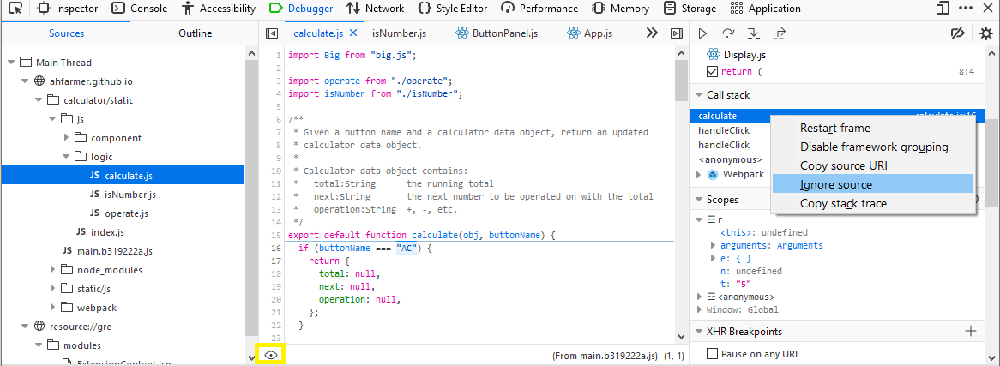

Right-/Ctrl- clicking in the call stack pane opens a context menu with the following items:

- **Restart frame** restarts execution at the beginning of the current frame.
- **Enable framework grouping** collects items belonging to a framework into a collapsible group (for example, Webpack in the screenshot immediately above). When grouping is enabled, the menu option changes to **Disable framework grouping**.
- **Copy source URI** copies the full identifier of the source file to the clipboard.
- **Ignore source** causes the debugger to skip the file when "stepping into" functions. Any stack frames from the ignored source file are hidden in the call stack pane. (To remove this restriction, choose **Unignore source** in the context menu of the Sources list or the Source pane.)
- **Copy stack trace** copies all items in the call stack (including their URIs and line number) to the clipboard.

.. _debugger-ui-tour-scopes:

Scopes
******

In the right-hand pane you'll see a label "Scopes" with a disclosure arrow next to it. When the debugger's paused, you'll be able to expand this section to see all objects that are in scope at this point in the program:

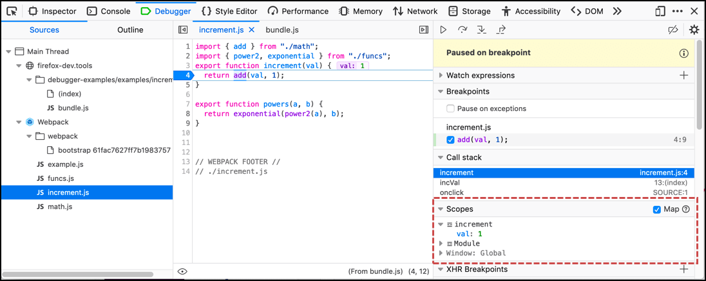

Objects are organized by scope: the most local appears first, and the global scope (Window, in the case of page scripts) appears last.

Within the Scopes pane, you can create :doc:`watchpoints <../how_to/use_watchpoints/index>` that pause the debugger when a value is read or assigned.
