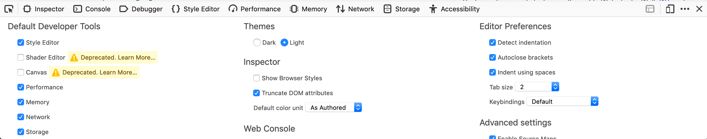
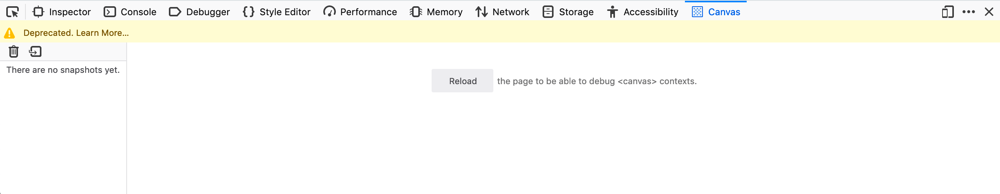
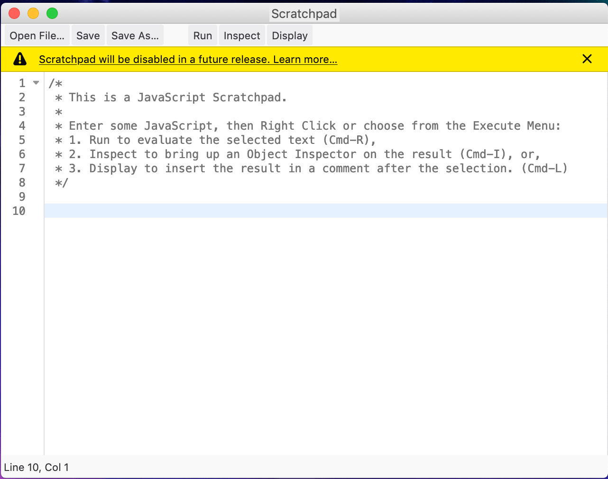
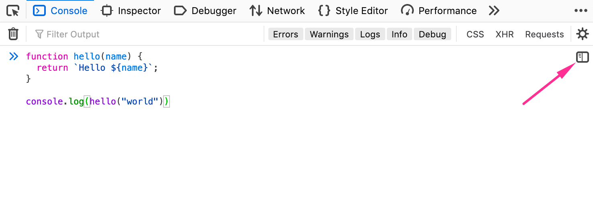
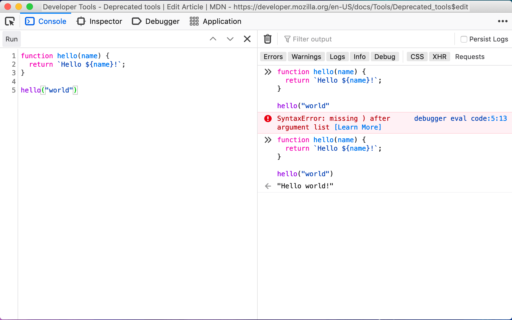
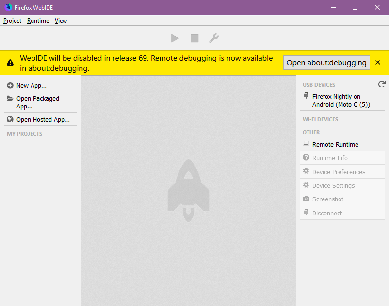
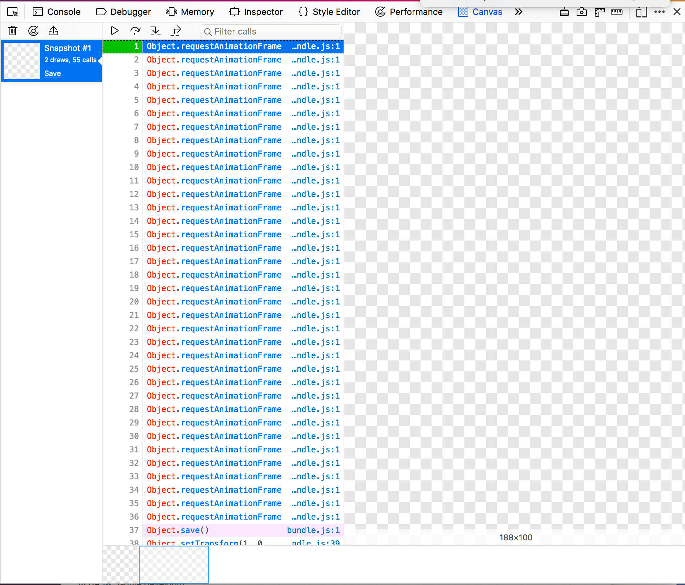
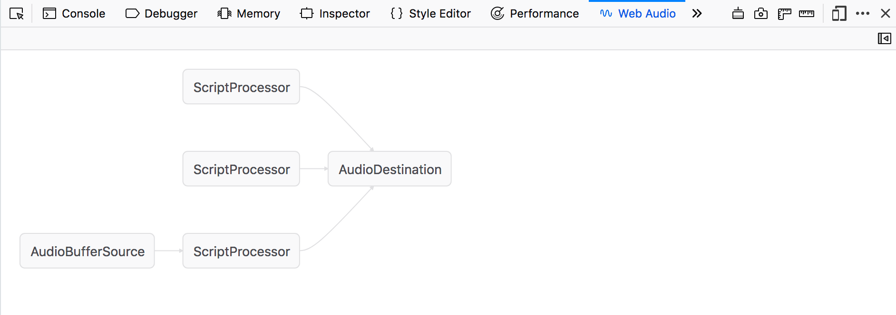
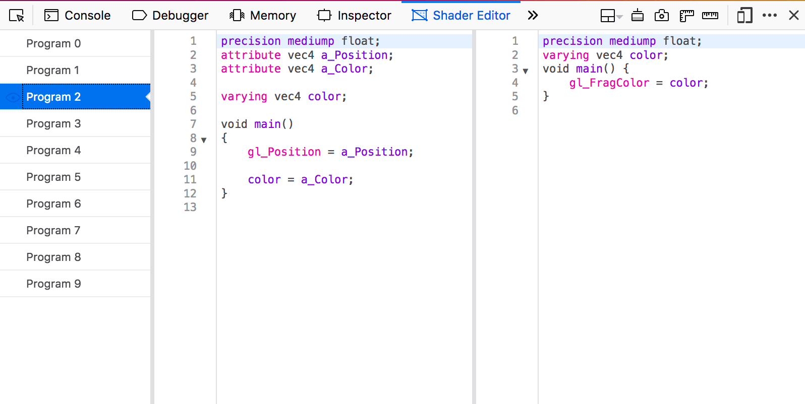

================
Deprecated tools
================

Over the course of DevTools development, we have added several experimental panels to try out new ideas. Not all of these have had wide adoption, and due to the cost of maintenance, seldom used panels are eventually removed.

We have created this list of deprecated or removed panels. This page documents the deprecated panels and the bugs that track their removal. Although these panels have been removed, you still have access to the old code, and there are alternative webextensions that you can try to get similar functionality.

When we deprecate a panel, we begin by getting feedback from the community to determine the impact of removing that panel. Once we have decided to remove the panel, we will provide a warning message, and finally, we will remove the panel from the codebase.

You may see a warning message, as in the following image, when trying to activate a deprecated panel:

In addition, if you open the panel for one of these tools, you will also see a warning message about its removal.

Scratchpad
**********

Scratchpad is deprecated as of Firefox 70 (`bug 1565380 <https://bugzilla.mozilla.org/show_bug.cgi?id=1565380>`_), and will be removed as of Firefox 72 (`bug 1519103 <https://bugzilla.mozilla.org/show_bug.cgi?id=1519103>`_).

Description
-----------

Scratchpad provided an environment for experimenting with JavaScript code. You can write, run, and examine the result of code that interacts with the web page.

Alternatives
------------

In Firefox 71+, you can write multi-line JavaScript code in the Web Console Editor Mode, making it similar to the Scratchpad. The Editor Mode can be triggered clicking on the icon on the right of the console input, or with :kbd:`Ctrl` + :kbd:`B` (:kbd:`Cmd` + :kbd:`B` on macOS)

When in Editor Mode, the :kbd:`Enter` key adds a new line in the input, and you can evaluate the expression using :kbd:`Ctrl` + :kbd:`Enter` (:kbd:`Cmd` + :kbd:`Enter` on macOS).

When evaluating, the input isn't cleared, which makes it possible to quickly iterate over a snippet of code.

The results are displayed in the console output, to the right of the input, providing immediate feedback. Unlike in Scratchpad, errors are properly displayed in the output with an expandable stacktrace, making it easier to debug the code you're currently writing.

Starting Firefox 72, you can import a Javascript file content in the console input with :kbd:`Ctrl` + :kbd:`O` (:kbd:`Cmd` + :kbd:`O` on macOS), as well as saving the console input content to a file using :kbd:`Ctrl` + :kbd:`S` (:kbd:`Cmd` + :kbd:`S` on macOS).

WebIDE and Connect page
***********************

WebIDE was deprecated as of Firefox 69

Disabled as of Firefox 70 (`bug 1539451 <https://bugzilla.mozilla.org/show_bug.cgi?id=1539451>`_).

Removed as of Firefox 71 (`bug 1539462 <https://bugzilla.mozilla.org/show_bug.cgi?id=1539462>`_).

Description
-----------

WebIDE allowed you to connect the Firefox Developer Tools to remote browsers, such as Firefox for Android. It was also intended to support application development for Firefox OS.

Alternatives
------------

Remote debugging is available in about:debugging as of Firefox 68. Features not ported to about:debugging are: WiFi debugging for Firefox for Android, application development. Features that are planned but not ported yet: remote browser screenshots and edit remote browser configuration. More details on the `mailing-list thread <https://groups.google.com/forum/#!topic/mozilla.dev.developer-tools/aWA7JJ-TpRw>`_.

Wireless debugging over Wi-Fi is possible and documented at :ref:`about-colon-debugging-connecting-to-android-over-wi-fi`.

Canvas debugger
***************

Bugzilla issue: `bug 1403938 <https://bugzilla.mozilla.org/show_bug.cgi?id=1403938>`_

Removed as of Firefox 67

Description
-----------

Canvas Debugger allowed users to inspect the canvas element and see how frequently a given function is called. It was deprecated due to lack of use.

We do not have dedicated documentation for the Canvas Debugger.

Alternatives
------------

`Spector.js <https://addons.mozilla.org/en-US/firefox/addon/spector-js/#&gid=1&pid=2>`_ is a WebExtension that can provide these features with 3D contexts.

Web Audio editor
****************

Bugzilla issue: `bug 1403944 <https://bugzilla.mozilla.org/show_bug.cgi?id=1403944>`_

Removed as of Firefox 67

Description
-----------

The Web Audio Editor allowed you to examine an audio context constructed in the page and provided a visualization of its graph. This gave a high-level view of its operation, and enabled you to ensure that all the nodes are connected in the way you expect. It was possible to edit the AudioParam properties for each node in the graph. Some non-AudioParam properties, like an OscillatorNode's type property, were displayed and editable as well. It was deprecated due to lack of use.

More details about the :doc:`Web Audio Editor <../web_audio_editor/index>`

Alternatives
------------

Alternatives include the `AudioN <https://github.com/google/audion>`_ and https://github.com/spite/WebAudioExtension WebExtensions.

Shader editor
*************

Bugzilla issue: `bug 1342237 <https://bugzilla.mozilla.org/show_bug.cgi?id=1342237>`_

Removed as of Firefox 67

Description
-----------

The Shader Editor allowed users to examine and edit the source of the WebGL vertex and fragment shaders. It was deprecated due to low usage and maintenance costs.

:doc:`Shader Editor <../shader_editor/index>`

Alternatives
------------

An alternative to this panel is this extension: https://github.com/spite/ShaderEditorExtension, or `Spector.js <https://addons.mozilla.org/en-US/firefox/addon/spector-js/#&gid=1&pid=2>`_ also supports a Shader Editor that requires a library to use a shader reloader hook. Currently only the Babylon library does.
