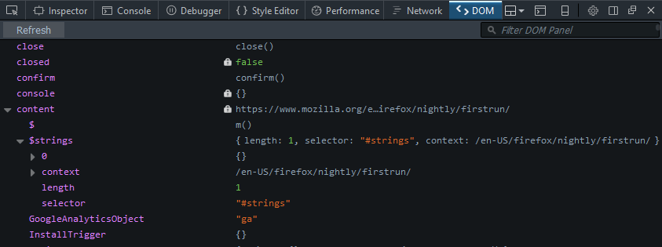
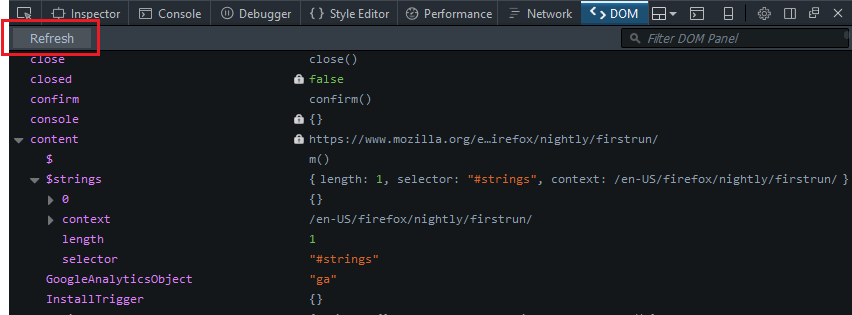
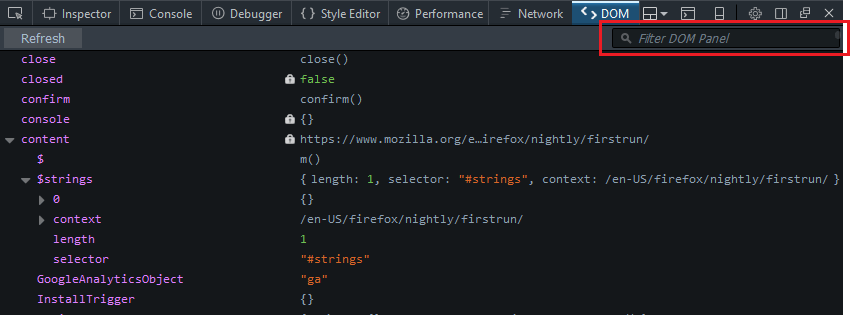

===================
DOM Property Viewer
===================

.. container:: block_quote

  The DOM Property Viewer is new in Firefox 48. It is disabled by default. Enable it in the :ref:`Developer Tools Settings <tool-toolbox-settings>`

The DOM Property Viewer lets you inspect the properties of the `DOM <https://developer.mozilla.org/en-US/docs/Glossary/DOM>`_ as an expandable tree structure, starting from the `window <https://developer.mozilla.org/en-US/docs/Web/API/Window>`_ object of the current page or the :doc:`selected iframe <../working_with_iframes/index>`.

Enabling the DOM Property Viewer
********************************

The DOM Property Viewer is not enabled by default. To enable it, open the :ref:`developer tools settings <tool-toolbox-settings>` and check the "DOM" box under "Default Firefox Developer Tools".

Opening the DOM Property Viewer
*******************************

Once enabled, you can select the *DOM* panel in the Web Developer Tools, accessible from the Browser Tools submenu

The :doc:`Toolbox <../tools_toolbox/index>` will appear at the bottom of the browser window, with the DOM Property Viewer activated. It's just called "DOM" in the Toolbox.

DOM Property Viewer user interface
**********************************

DOM tree
--------

The different properties of the DOM are displayed as an expandable tree. The left-hand side shows the property's name, and the right-hand side shows its value. Up to three properties of an object and items of an array are displayed. If a property has more elements than this, you'll see a "more..." annotation, and will need to click the property to see all elements. A lock icon indicates that a property is not writable.

Refreshing the display
----------------------

If the DOM changes you can hit the *Refresh* button to update the display:

Filtering
---------

There is a search box within the toolbar:

This filters the list to show only items which match the search term. Items match the search term if their name contains the search term. Matching is case-sensitive.
