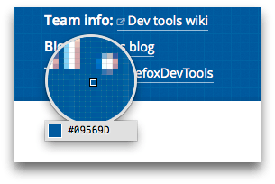

==========
Eyedropper
==========

The Eyedropper tool enables you to select colors in the current page. It works like a magnifying glass over the page, enabling you to select with pixel precision. Underneath the magnifying glass it shows the color value for the current pixel using whichever scheme you've selected in :ref:`Settings > Inspector <settings-inspector>` > Default color unit:

You can use it in one of two ways:

- to select a color from the page and copy it to the clipboard
- to change a color value in the Inspector's Rules view to a color you've selected from the page

Copying a color to the clipboard
********************************

Open the Eyedropper in one of these two ways:

- select "Eyedropper" under the "Browser Tools" menu
- open the :doc:`Page Inspector <../page_inspector/index>` tab and click the eyedropper button in its toolbar

As you move the mouse around the page you'll see the current color value in the Eyedropper change. Clicking copies the current color value to the clipboard.

.. raw:: html

  <iframe width="560" height="315" src="https://www.youtube.com/embed/xf2uk6UyRB8" title="YouTube video player" frameborder="0" allow="accelerometer; autoplay; clipboard-write; encrypted-media; gyroscope; picture-in-picture" allowfullscreen></iframe>
   
   

Changing a color value in the Rules view
****************************************

Color values appearing in the Inspector's Rules view have color samples next to them: clicking the sample shows a :doc:`color picker popup <../page_inspector/how_to/inspect_and_select_colors/index>`. From Firefox 31, the popup contains an eyedropper icon: click this icon to activate the Eyedropper.

Now, when you click the Eyedropper, the color in the Rules view is set to the color you selected.

.. raw:: html

  <iframe width="560" height="315" src="https://www.youtube.com/embed/0Zx1TN21QOo" title="YouTube video player" frameborder="0" allow="accelerometer; autoplay; clipboard-write; encrypted-media; gyroscope; picture-in-picture" allowfullscreen></iframe>
   
   

Keyboard shortcuts
******************

See :ref:`All keyboard shortcuts > Eyedropper <keyboard-shortcuts-eyedropper>`.
