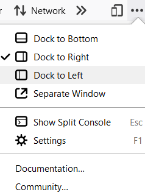
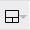
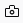
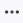
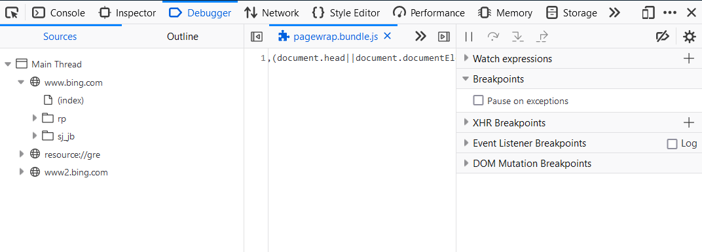
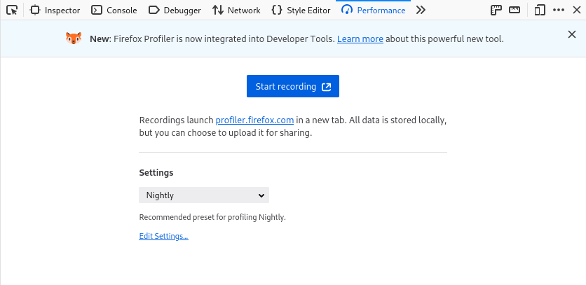
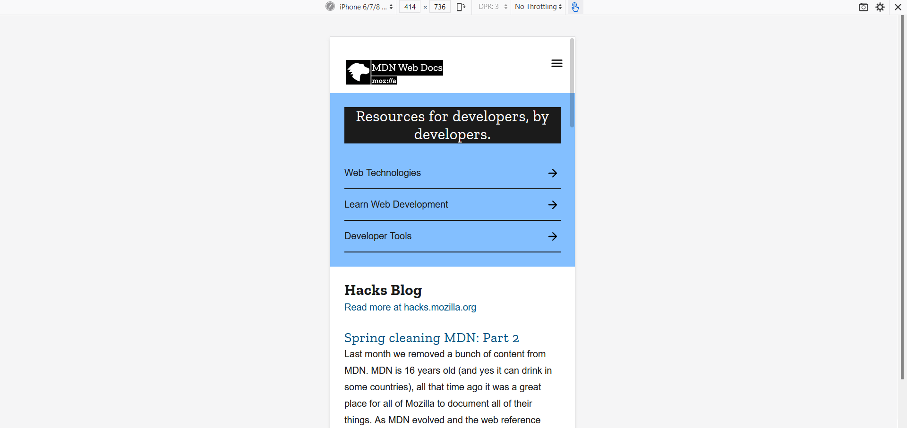
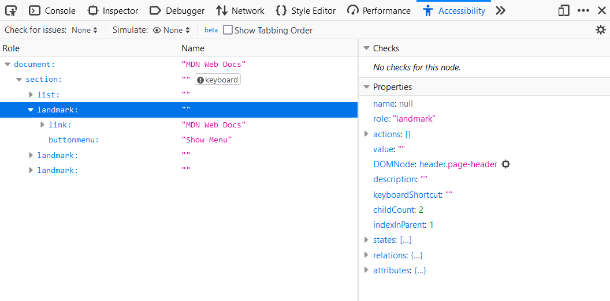
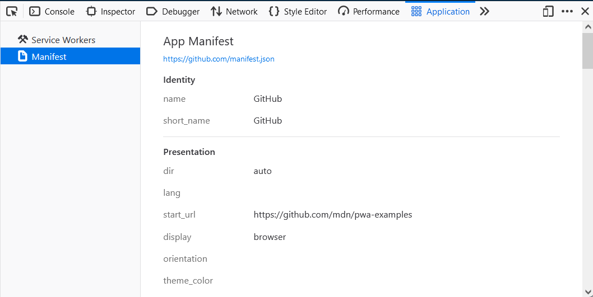

.. toctree::
   :name: devtools-user-doc

==========================
Firefox DevTools User Docs
==========================

Firefox Developer Tools is a set of web developer tools built into Firefox. You can use them to examine, edit, and debug HTML, CSS, and JavaScript.

This section contains detailed guides to all of the tools as well as information on how to debug Firefox for Android, how to extend DevTools, and how to debug the browser as a whole.

If you have any feedback on DevTools or want to contribute to the project, you can `join the DevTools community <https://firefox-dev.tools/>`_.

.. note::

  If you are just getting started with web development and using developer tools, our `learning <https://developer.mozilla.org/en-US/docs/Learn>`_ docs will help you — see `Getting started with the Web <https://developer.mozilla.org/en-US/docs/Learn/Getting_started_with_the_web>`_ and `What are browser developer tools? <https://developer.mozilla.org/en-US/docs/Learn/Common_questions/What_are_browser_developer_tools>`_ for good starting points.

The Core Tools
**************

You can open the Firefox Developer Tools from the menu by selecting **Tools > Web Developer > Web Developer Tools** or use the keyboard shortcut :kbd:`Ctrl` + :kbd:`Shift` + :kbd:`I` or :kbd:`F12` on Windows and Linux, or :kbd:`Cmd` + :kbd:`Opt` + :kbd:`I` on macOS.

The ellipsis menu on the right-hand side of Developer Tools contains several commands that let you perform actions or change tool settings.

========== ================================================================
 |image1|   This button only appears when there are multiple iframes on a
            page. Click it to display a list of the iframes on the current
            page and select the one with which you want to work.

 |image2|   Click this button to take a screenshot of the current page.
            (*Note:* This feature is not turned on by
            default and must be enabled in settings before the icon will
            appear.)

 |image3|   Toggles Responsive Design Mode

 |image4|   Opens the menu that includes docking options, the ability to show
            or hide the split console, and Developer Tools settings.
            The menu also includes links to the documentation for Firefox
            Web Tools and the Mozilla Community.

 |image5|   Closes the Developer Tools

========== ================================================================

.. |image3| image:: responsive_button.png
    :class: center

Page Inspector
--------------

.. image:: landingpage_pageinspector.png
    :class: border
    :target: page_inspector
    :alt: The all-new Inspector panel in Firefox 57.

View and edit page content and layout. Visualize many aspects of the page including the box model, animations, and grid layouts

Web Console
-----------

.. image:: landingpage_console.png
    :class: border
    :target: web_console
    :alt: The all-new Console panel in Firefox 57.

See messages logged by a web page and interact with the page using JavaScript.

JavaScript Debugger
-------------------

Stop, step through, and examine the JavaScript running on a page.

Network Monitor
---------------

.. image:: landingpage_network.png
    :class: border
    :target: network_monitor
    :alt: The Network panel in Firefox 57 DevTools.

See the network requests made when a page is loaded.

Performance Panel
-----------------

Analyze your site's general responsiveness, JavaScript, and layout performance.

Responsive Design Mode
----------------------

See how your website or app will look and behave on different devices and network types.

Accessibility inspector
-----------------------

Provides a means to access the page's accessibility tree, allowing you to check what's missing or otherwise needs attention.

Application panel
-----------------

Provides tools for inspecting and debugging modern web apps (also known as `Progressive Web Apps <https://developer.mozilla.org/en-US/docs/Web/Progressive_web_apps>`_). This includes inspection of `service workers <https://developer.mozilla.org/en-US/docs/Web/API/Service_Worker_API>`_ and `web app manifests <https://developer.mozilla.org/en-US/docs/Web/Manifest>`_

.. note::

  The collective term for the UI inside which the DevTools all live is the :doc:`Toolbox <tools_toolbox/index>`

More Tools
**********

These developer tools are also built into Firefox. Unlike the "Core Tools" above, you might not use them every day.

.. list-table::
  :widths: 25 75
  :header-rows: 0

  * - :doc:`Memory <memory/index>`
    - Figure out which objects are keeping memory in use.

  * - :doc:`Storage Inspector <storage_inspector/index>`
    - Inspect cookies, local storage, indexedDB, and session storage present in a page.

  * - :doc:`DOM Property Viewer <dom_property_viewer/index>`
    - Inspect the page's DOM properties, functions, etc.

  * - :doc:`Eyedropper <eyedropper/index>`
    - Select a color from the page.

  * - :doc:`Style Editor <style_editor/index>`
    - View and edit CSS styles for the current page.

  * - :doc:`Taking screenshot <taking_screenshots/index>`
    - Take a screenshot of the entire page or of a single element.

  * - :doc:`Measure a portion of the page <measure_a_portion_of_the_page/index>`
    - Measure a specific area of a web page.

  * - :doc:`Rulers <rulers/index>`
    - Overlay horizontal and vertical rulers on a web page

.. image:: logo-developer-quantum.png
    :class: center

.. rst-class:: center

  For the latest developer tools and features, try Firefox Developer Edition.

  `Download Firefox Developer Edition <https://www.mozilla.org/en-US/firefox/developer/>`_

Connecting the Developer Tools
******************************

If you open the developer tools using :ref:`keyboard shortcuts <keyboard-shortcuts-opening-and-closing-tools>` or the equivalent menu items, they'll target the document hosted by the currently active tab. But you can attach the tools to a variety of other targets, too, both within the current browser and in different browsers or even different devices.

.. list-table::
   :widths: 30 70
   :header-rows: 0

   * - :doc:`about:debugging <about_colon_debugging/index>`
     - Debug add-ons, content tabs, and workers running in the browser.

   * - :ref:`Connecting to Firefox for Android <about-color-debugging-connecting-over-the-network>`
     - Connect the developer tools to an instance of Firefox running on an Android device.

   * - :doc:`Connecting to iframes <working_with_iframes/index>`
     - Connect the developer tools to a specific iframe in the current page.

Debugging the browser
*********************

By default, the developer tools are attached to a web page or web app. But you can also connect them to the browser as a whole. This is useful for browser and add-on development.

.. list-table::
   :widths: 30 70
   :header-rows: 0

   * - :doc:`Browser Console <browser_console/index>`
     - See messages logged by the browser itself and by add-ons, and run JavaScript code in the browser's scope.

   * - :doc:`Browser Toolbox <browser_toolbox/index>`
     - Attach the Developer Tools to the browser itself.

Extending DevTools
******************

For information on extending the Firefox DevTools, see `Extending the developer tools <https://developer.mozilla.org/en-US/docs/Mozilla/Add-ons/WebExtensions/Extending_the_developer_tools>`_ over in the `Browser Extensions <https://developer.mozilla.org/en-US/docs/Mozilla/Add-ons/WebExtensions>`_ section of MDN.

Migrating from Firebug
**********************

Firebug has come to the end of its lifespan (see `Firebug lives on in Firefox DevTools <https://hacks.mozilla.org/2016/12/firebug-lives-on-in-firefox-devtools/>`_ for details of why), and we appreciate that some people will find migrating to another less familiar set of DevTools to be challenging. To ease a transition from Firebug to the Firefox developer tools, we have written a handy guide — :doc:`Migrating from Firebug <./migrating_from_firebug/index>`

Contribute
**********

If you want to help improve the developer tools, these resources will get you started.

.. list-table::
   :widths: 30 70
   :header-rows: 0

   * - `Get Involved <https://firefox-dev.tools/>`_
     - Our community website explains how to get involved.

   * - `bugs.firefox-dev.tools <https://bugs.firefox-dev.tools/>`_
     - A tool helping to find bugs to work on.

   * - :ref:`Read source docs <devtools-contributor-doc>`
     - Firefox DevTools source code documentation.
