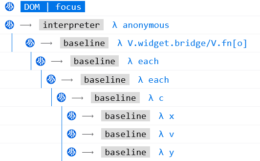
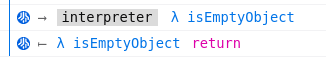
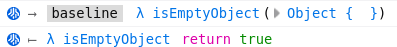
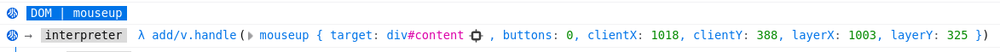

=================
JavaScript Tracer
=================

How to use the JavaScript Tracer
*****************************************

.. note::

  This feature is still under development and may drastically change at any time.
  You will have to toggle `devtools.debugger.features.javascript-tracing preference` preference to true in about:config
  before opening DevTools in order to use it.

Once enabled, you have three ways to toggle the tracer:

  * From the debugger, via the tracer icon on the top right of its toolbar |image1|.

    You can right click on this button (only when the tracer is OFF) to configure its behavior.

  * From the console, via the `:trace` command.

    You can execute `:trace --help` to see all supported optional arguments.
    Otherwise `:trace` will either start or stop the JS Tracer based on its current state.

  * From the page, via Ctrl+Shift+5 key shortcut (or Cmd+Shift+5 on MacOS).

    Triggering this key shortcut will either start or stop the JS Tracer based on its current state.
    This will use the configuration current defined in the Debugger tracer icon's context menu.

.. |image1| image:: trace-icon.svg

Tracer options
**************

Logging output
--------------

 * Web Console (Default)

   The JS Tracer will log all JS function calls into the Web Console panel.
   This helps see the precise order of JS calls versus anything logged in the console:
   console API usages, exceptions, CSS warnings, ...

   |image2|

   (`:trace --logMethod console`)

 * Stdout

   The JS Tracer will log all JS function calls in your terminal (assuming you launched Firefox from a terminal).
   This output is especially useful when the page involves lots of JS activity as it is faster to render.
   You may also use various terminal tricks to filter the output the way you want.
   Note that source URLs are flagged with some special characters so that most terminal will allow you to click on them.
   If Firefox is your default browser, the links should open the debugger on the right location.
   Assuming this is the same Firefox instance that is logging the traces and the same instance that the terminal app tries to open.
   And you need DevTools to be kept opened, otherwise the link will open as a regular URL in a new tab.

.. code-block:: bash

  —DOM | click
  —[interpreter]—> https://bugzilla.mozilla.org/static/v20240305.1/js/jquery/jquery-min.js:2:37892 - λ add/v.handle
  ——[baseline]—> https://bugzilla.mozilla.org/static/v20240305.1/js/jquery/jquery-min.js:2:39398 - λ dispatch
  ———[interpreter]—> https://bugzilla.mozilla.org/static/v20240305.1/js/jquery/jquery-min.js:2:40960 - λ fix
  ————[interpreter]—> https://bugzilla.mozilla.org/static/v20240305.1/js/jquery/jquery-min.js:2:41576 - λ ce.Event
  ———[interpreter]—> https://bugzilla.mozilla.org/static/v20240305.1/js/jquery/jquery-min.js:2:30171 - λ get
  ————[interpreter]—> https://bugzilla.mozilla.org/static/v20240305.1/js/jquery/jquery-min.js:2:29696 - λ F
  ———[interpreter]—> https://bugzilla.mozilla.org/static/v20240305.1/js/jquery/jquery-min.js:2:40177 - λ handlers

(`:trace --logMethod stdout`)

Delayed start
-------------

There is two ways to delay the actual start of the JS Tracer.
Both require to request the tracer to start by clicking on the debugger tracer icon, or run the `:trace` console command, or trigger the key shortcut.
The Tracer will then be in pending mode, which is indicated via a blue badge on the tracer icon. |image3|

 * on next user interaction

   The tracer will only really start logging function calls when the first clicking or pressing a key on the page.
   To be precise, the tracer will start on first mousdown or keydown event.

   (`:trace --on-next-interaction`)

 * on next page load

   The tracer will only really start when navigating to another page or reloading the current page.
   It will start just before anything starts being executed.
   It help see the very first JavaScript code running on the page.

   (Note that this feature is not available via the console command.)

Tracing function returns
------------------------

You may optionally log function returns, i.e. the precise execution ordering when a function ends and returns.
This is disabled by default as it doubles the output of the tracer.

(`:trace --returns`)

Tracing values
--------------

You may optionally display all function call arguments as well as function return values (if enabled).
This is disabled by default as it complexify the output of the tracer, making it slower and less readable.

(`:trace --values`)

Web Console Command only options
--------------------------------

 * Log DOM Mutations

You may optionally trace all DOM Mutations happening on the page.
The mutation will appear according to their precise execution order versus JavaScript code modifying the DOM (JS Traces),
but also errors, warnings and console API logs.
By default, the console command argument `--dom-mutations` will record all types of mutations: new nodes being added to the document,
attributes changed on a node and node being removed from the document.
The argument also accept a coma separated list of options to control which type of mutation should be logged.

(`:trace --dom-mutations` === `:trace --dom-mutations add,attributes,remove`)

 * Depth limit

You may optionally limit the depth of function calls being logged.
For example, limiting the depth to "1" will typically only log the event listener function. i.e. the top level function being called by the Web Engine.
This allows to drastically reduce the output of the trace, but may hide precious information.
The tracer will not be automatically stopped by this option. This will only ignore nested function calls passed the given depth limit.

For example, while :trace without any argument would log the following on bugzilla:

.. code-block:: bash

  —DOM | mousedown
  —[interpreter]—> https://bugzilla.mozilla.org/static/v20240305.1/js/jquery/jquery-min.js:2:37892 - λ add/v.handle
  ——[baseline]—> https://bugzilla.mozilla.org/static/v20240305.1/js/jquery/jquery-min.js:2:39398 - λ dispatch
  ———[interpreter]—> https://bugzilla.mozilla.org/static/v20240305.1/js/jquery/jquery-min.js:2:40960 - λ fix
  ————[interpreter]—> https://bugzilla.mozilla.org/static/v20240305.1/js/jquery/jquery-min.js:2:41576 - λ ce.Event
  ———[interpreter]—> https://bugzilla.mozilla.org/static/v20240305.1/js/jquery/jquery-min.js:2:30171 - λ get
  ————[interpreter]—> https://bugzilla.mozilla.org/static/v20240305.1/js/jquery/jquery-min.js:2:29696 - λ F
  ———[interpreter]—> https://bugzilla.mozilla.org/static/v20240305.1/js/jquery/jquery-min.js:2:40177 - λ handlers
  —DOM | mouseup
  —[interpreter]—> https://bugzilla.mozilla.org/static/v20240305.1/js/jquery/jquery-min.js:2:37892 - λ add/v.handle
  ——[baseline]—> https://bugzilla.mozilla.org/static/v20240305.1/js/jquery/jquery-min.js:2:39398 - λ dispatch
  ———[interpreter]—> https://bugzilla.mozilla.org/static/v20240305.1/js/jquery/jquery-min.js:2:40960 - λ fix
  ————[interpreter]—> https://bugzilla.mozilla.org/static/v20240305.1/js/jquery/jquery-min.js:2:41576 - λ ce.Event
  ———[interpreter]—> https://bugzilla.mozilla.org/static/v20240305.1/js/jquery/jquery-min.js:2:30171 - λ get
  ————[interpreter]—> https://bugzilla.mozilla.org/static/v20240305.1/js/jquery/jquery-min.js:2:29696 - λ F
  ———[interpreter]—> https://bugzilla.mozilla.org/static/v20240305.1/js/jquery/jquery-min.js:2:40177 - λ handlers

running `:trace --max-depth 1` will give us:

.. code-block:: bash

  —DOM | mousedown
  —[interpreter]—> https://bugzilla.mozilla.org/static/v20240305.1/js/jquery/jquery-min.js:2:37892 - λ add/v.handle
  —DOM | mouseup
  —[interpreter]—> https://bugzilla.mozilla.org/static/v20240305.1/js/jquery/jquery-min.js:2:37892 - λ add/

and running `:trace --max-depth 3` will give us:

.. code-block:: bash

  —DOM | mousedown
  —[interpreter]—> https://bugzilla.mozilla.org/static/v20240305.1/js/jquery/jquery-min.js:2:37892 - λ add/v.handle
  ——[baseline]—> https://bugzilla.mozilla.org/static/v20240305.1/js/jquery/jquery-min.js:2:39398 - λ dispatch
  ———[interpreter]—> https://bugzilla.mozilla.org/static/v20240305.1/js/jquery/jquery-min.js:2:40960 - λ fix
  ———[interpreter]—> https://bugzilla.mozilla.org/static/v20240305.1/js/jquery/jquery-min.js:2:30171 - λ get
  ———[interpreter]—> https://bugzilla.mozilla.org/static/v20240305.1/js/jquery/jquery-min.js:2:40177 - λ handlers
  —DOM | mouseup
  —[interpreter]—> https://bugzilla.mozilla.org/static/v20240305.1/js/jquery/jquery-min.js:2:37892 - λ add/v.handle
  ——[baseline]—> https://bugzilla.mozilla.org/static/v20240305.1/js/jquery/jquery-min.js:2:39398 - λ dispatch
  ———[interpreter]—> https://bugzilla.mozilla.org/static/v20240305.1/js/jquery/jquery-min.js:2:40960 - λ fix
  ———[interpreter]—> https://bugzilla.mozilla.org/static/v20240305.1/js/jquery/jquery-min.js:2:30171 - λ get
  ———[interpreter]—> https://bugzilla.mozilla.org/static/v20240305.1/js/jquery/jquery-min.js:2:40177 - λ handlers

(`:trace --max-depth 5`)

 * Record limit

You may optionally limit the number of "records" being logged, after which the tracer will be automatically stopped.
A record is composed of one top level function call, including all its nested function being called from this top level one.

This option can be especially useful in combination to tracer on next user interaction.
This can help narrow down to a very precise code acting only on a mouse or key event processing.

(`:trace --max-records 10`)
