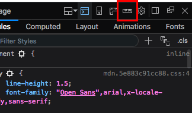
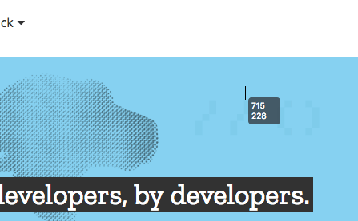
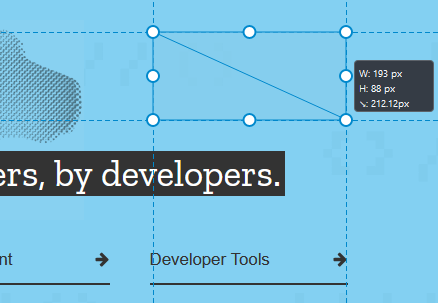

=============================
Measure a portion of the page
=============================

Using the **Measuring Tool** you can measure a specific area of a web page.

This tool is hidden by default. To enable its button:

- Go to the DevTools :doc:`Settings <../settings/index>`.
- From the *Available Toolbox Buttons* check the *Measure a portion of the page* checkbox.

You will now see the *Measure a portion of the page* button at the top right of the Toolbox, in the same place as the Settings/Options button.

When you want to use the tool, click this button. Now when you mouse over the viewport, you'll see the mouse has a crosshair cursor with its current coordinates displayed beside it.

When you hold the mouse button down and then drag, you'll start to draw a rectangle, with its x, y, and diagonal dimensions displayed. The units are in pixels.

When you stop holding the mouse down, the rectangle that was displayed on screen when you released the button will stay there until you click again, allowing you time to take screenshots, note the information down, etc. The rectangle can also be resized later on by clicking one of the handles around it.

.. note::

  **Tip**: Use the arrow keys to move the tool around and :kbd:`Ctrl` + arrow keys (:kbd:`Cmd` + arrow keys on a Mac) to resize it. Hold :kbd:`Shift` to make it move faster.
