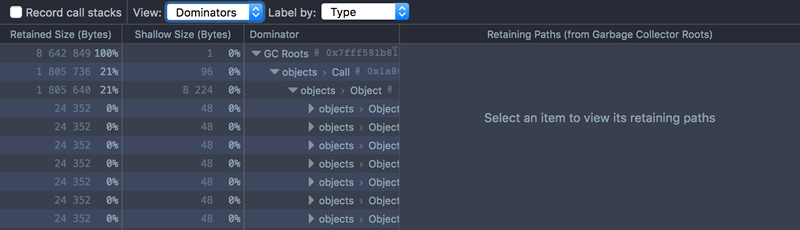
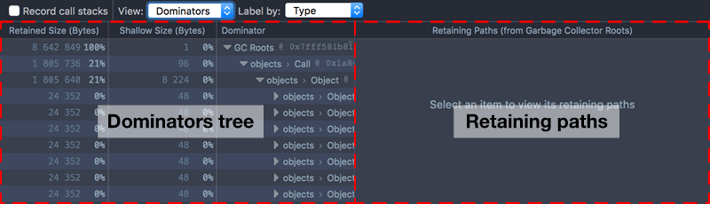
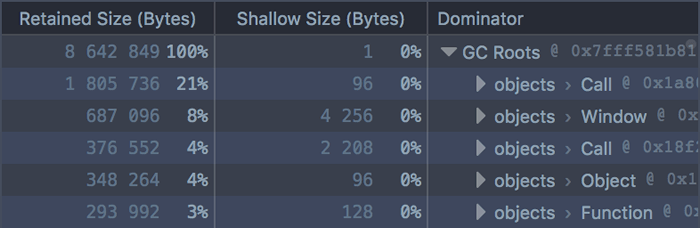
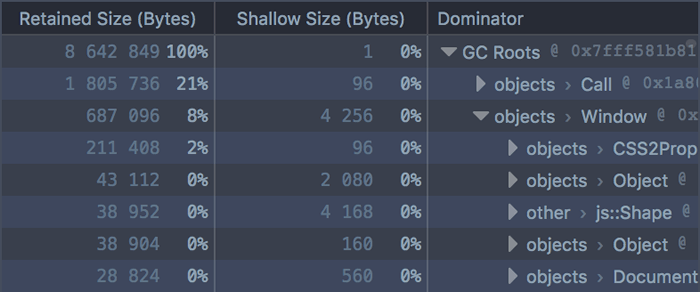
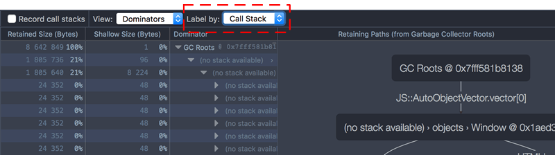
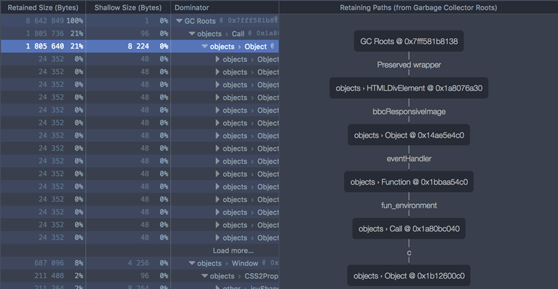
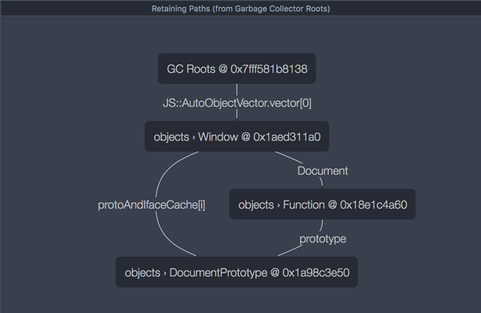
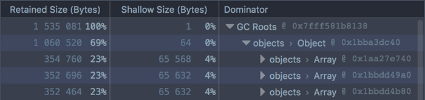
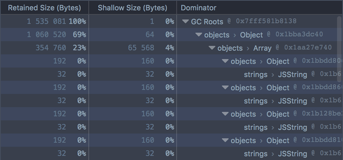
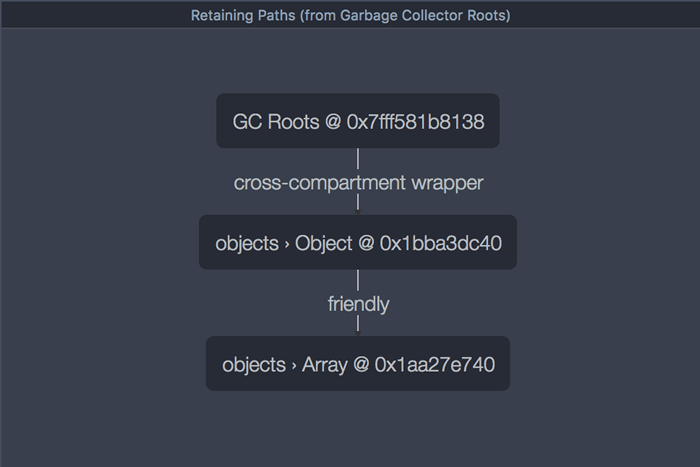

===============
Dominators view
===============

The Dominators view is new in Firefox 46.

Starting in Firefox 46, the Memory tool includes a new view called the Dominators view. This is useful for understanding the "retained size" of objects allocated by your site: that is, the size of the objects themselves plus the size of the objects that they keep alive through references.

If you already know what shallow size, retained size, and dominators are, skip to the Dominators UI section. Otherwise, you might want to review the article on :doc:`Dominators concepts <../dominators/index>`.

Dominators UI
*************

To see the Dominators view for a snapshot, select "Dominators" in the "View" drop-down list. It looks something like this:

The Dominators view consists of two panels:

- the :ref:`Dominators Tree panel <memory-dominators-view-dominators-tree-panel>` shows you which nodes in the snapshot are retaining the most memory
- the :ref:`Retaining Paths panel <memory-dominators-view-retaining-paths-panel>` (new in Firefox 47) shows the 5 shortest retaining paths for a single node.

.. _memory-dominators-view-dominators-tree-panel:

Dominators Tree panel
*********************

The Dominators Tree tells you which objects in the snapshot are retaining the most memory.

In the main part of the UI, the first row is labeled "GC Roots". Immediately underneath that is an entry for:

- Every GC root node. In Gecko, there is more than one memory graph, and therefore more than one root. There may be many (often temporary) roots. For example: variables allocated on the stack need to be rooted, or internal caches may need to root their elements.
- Any other node that's referenced from two different roots (since in this case, neither root dominates it).

Each entry displays:

- the retained size of the node, as bytes and as a percentage of the total
- the shallow size of the node, as bytes and as a percentage of the total
- the nodes's name and address in memory.

Entries are ordered by the amount of memory that they retain. For example:

In this screenshot we can see five entries under "GC Roots". The first two are Call and Window objects, and retain about 21% and 8% of the total size of the memory snapshot, respectively. You can also see that these objects have a relatively tiny "Shallow Size", so almost all of the retained size is in the objects that they dominate.

Immediately under each GC root, you'll see all the nodes for which this root is the :ref:`immediate dominator <memory-dominators-immediate-dominator>`. These nodes are also ordered by their retained size.

For example, if we click on the first Window object:

We can see that this Window dominates a CSS2Properties object, whose retained size is 2% of the total snapshot size. Again the shallow size is very small: almost all of its retained size is in the nodes that it dominates. By clicking on the disclosure arrow next to the Function, we can see those nodes.

In this way you can quickly get a sense of which objects retain the most memory in the snapshot.

You can use :kbd:`Alt` + :kbd:`click` to expand the whole graph under a node.

Call Stack
**********

In the toolbar at the top of the tool is a dropdown called "Label by":

By default, this is set to "Type". However, you can set it instead to "Call Stack" to see exactly where in your code the objects are being allocated.

.. note::

  This option is called "Allocation Stack" in Firefox 46.

To enable this, you must check the box labeled "Record call stacks" *before* you run the code that allocates the objects. Then take a snapshot, then select "Call Stack" in the "Label by" drop-down.

Now the node's name will contain the name of the function that allocated it, and the file, line number and character position of the exact spot where the function allocated it. Clicking the file name will take you to that spot in the Debugger.

.. note::

  Sometimes you'll see "(no stack available)" here. In particular, allocation stacks are currently only recorded for objects, not for arrays, strings, or internal structures.

.. _memory-dominators-view-retaining-paths-panel:

Retaining Paths panel
*********************

The Retaining Paths panel is new in Firefox 47.

The Retaining Paths panel shows you, for a given node, the 5 shortest paths back from this node to a GC root. This enables you to see all the nodes that are keeping the given node from being garbage-collected. If you suspect that an object is being leaked, this will show you exactly which objects are holding a reference to it.

To see the retaining paths for a node, you have to select the node in the Dominators Tree panel:

Here, we've selected an object, and can see a single path back to a GC root.

The ``Window`` GC root holds a reference to an ``HTMLDivElement`` object, and that holds a reference to an ``Object``, and so on. If you look in the Dominators Tree panel, you can trace the same path there. If either of these references were removed, the items below them could be garbage-collected.

Each connection in the graph is labeled with the variable name for the referenced object.

Sometimes there's more than one retaining path back from a node:

Here there are three paths back from the ``DocumentPrototype`` node to a GC root. If one were removed, then the ``DocumentPrototype`` would still not be garbage-collected, because it's still retained by the other two path.

Example
*******

Let's see how some simple code is reflected in the Dominators view.

We'll use the :doc:`monster allocation example <../monster_example/index>`, which creates three arrays, each containing 5000 monsters, each monster having a randomly-generated name.

Taking a snapshot
*****************

To see what it looks like in the Dominators view:

- load the page
- enable the Memory tool in the :ref:`Settings <tool-toolbox-settings>`, if you haven't already
- open the Memory tool
- check "Record call stacks"
- press the button labeled "Make monsters!"
- take a snapshot
- switch to the "Dominators" view

Analyzing the Dominators Tree
*****************************

You'll see the three arrays as the top three GC roots, each retaining about 23% of the total memory usage:

If you expand an array, you'll see the objects (monsters) it contains. Each monster has a relatively small shallow size of 160 bytes. This includes the integer eye- and tentacle-counts. Each monster has a bigger retained size, which is accounted for by the string used for the monster's name:

All this maps closely to the :ref:`memory graph we were expecting to see <memory-dominators-immediate-dominator>`. One thing you might be wondering, though, is: where's the top-level object that retains all three arrays? If we look at the Retaining Paths panel for one of the arrays, we'll see it:

Here we can see the retaining object, and even that this particular array is the array of ``fierce`` monsters. But the array is also rooted directly, so if the object were to stop referencing the array, it would still not be eligible for garbage collection.

This means that the object does not dominate the array, and is therefore not shown in the Dominators Tree view. :ref:`See the relevant section of the Dominators concepts article <memory-dominators-multiple-paths>`.

Using the Call Stack view
*************************

Finally, you can switch to the Call Stack view, see where the objects are being allocated, and jump to that point in the Debugger.
