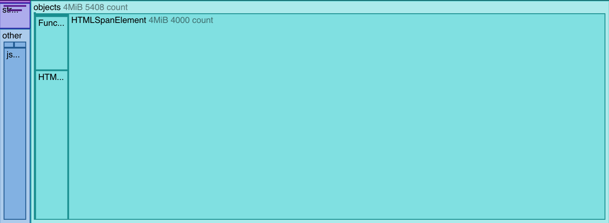
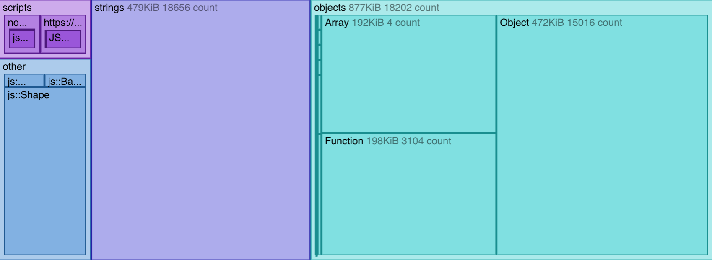
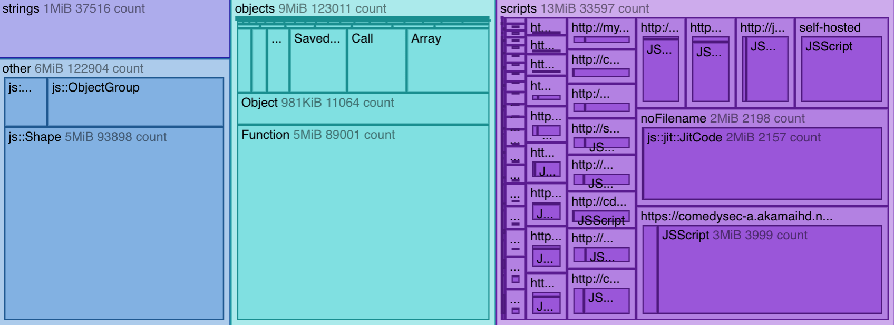

=============
Tree map view
=============

The Tree map view is new in Firefox 48.

The Tree map view provides a visual representation of the snapshot, that helps you quickly get an idea of which objects are using the most memory.

A treemap displays `"hierarchical (tree-structured) data as a set of nested rectangles" <https://en.wikipedia.org/wiki/Treemapping>`_. The size of the rectangles corresponds to some quantitative aspect of the data.

For the treemaps shown in the Memory tool, things on the heap are divided at the top level into four categories:

- **objects**: JavaScript and DOM objects, such as `Function <https://developer.mozilla.org/en-US/docs/Web/JavaScript/Reference/Global_Objects/Function>`_, `Object <https://developer.mozilla.org/en-US/docs/Web/JavaScript/Reference/Global_Objects/Object>`_, or `Array <https://developer.mozilla.org/en-US/docs/Web/JavaScript/Reference/Global_Objects/Array>`_, and DOM types like `Window <https://developer.mozilla.org/en-US/docs/Web/API/Window>`_ and `HTMLDivElement <https://developer.mozilla.org/en-US/docs/Web/API/HTMLDivElement>`_.
- **scripts**: JavaScript sources loaded by the page.
- **strings**
- **other**: this includes internal `SpiderMonkey <https://spidermonkey.dev/>`_ objects.

Each category is represented with a rectangle, and the size of the rectangle corresponds to the proportion of the heap occupied by items in that category. This means you can quickly get an idea of roughly what sorts of things allocated by your site are using the most memory.

Within top-level categories:

- **objects** is further divided by the object's type.
- **scripts** is further subdivided by the script's origin. It also includes a separate rectangle for code that can't be correlated with a file, such as JIT-optimized code.
- **other** is further subdivided by the object's type.

Here are some example snapshots, as they appear in the Tree map view:

This treemap is from the :doc:`DOM allocation example <../dom_allocation_example/index>`, which runs a script that creates a large number of DOM nodes (200 `HTMLDivElement <https://developer.mozilla.org/en-US/docs/Web/API/HTMLDivElement>`_ objects and 4000 `HTMLSpanElement <https://developer.mozilla.org/en-US/docs/Web/API/HTMLSpanElement>`_ objects). You can see how almost all the heap usage is from the ``HTMLSpanElement`` objects that it creates.

This treemap is from the :doc:`monster allocation example <../monster_example/index>`, which creates three arrays, each containing 5000 monsters, each monster having a randomly-generated name. You can see that most of the heap is occupied by the strings used for the monsters' names, and the objects used to contain the monsters' other attributes.

This treemap is from http://www.bbc.com/, and is probably more representative of real life than the examples. You can see the much larger proportion of the heap occupied by scripts, that are loaded from a large number of origins.
