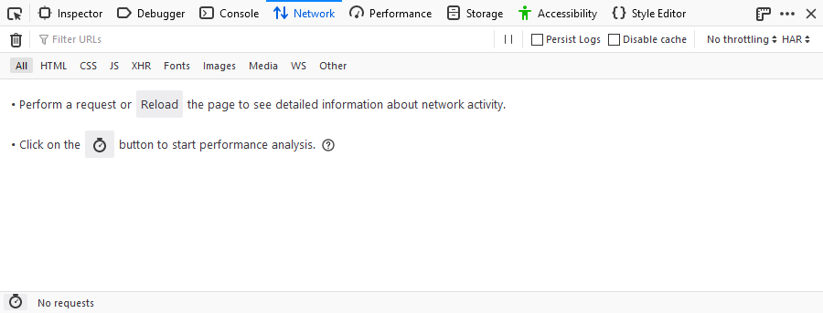
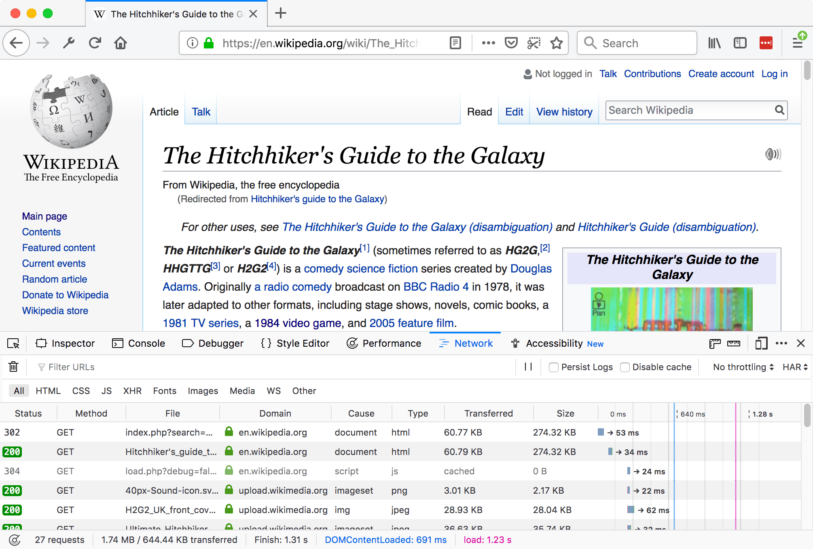
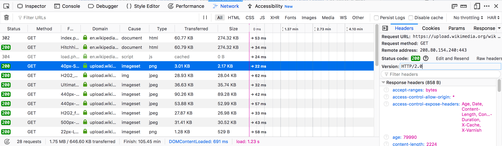

===============
Network Monitor
===============

The Network Monitor shows you all the HTTP requests Firefox makes (for example, when it loads a page, or due to `XMLHttpRequests <https://developer.mozilla.org/en-US/docs/Web/API/XMLHttpRequest>`_), how long each request takes, and details of each request.

Opening the Network Monitor
***************************

There are a few different ways to open the Network Monitor:

- Press :kbd:`Ctrl` + :kbd:`Shift` + :kbd:`E` (:kbd:`Cmd` + :kbd:`Opt` + :kbd:`E` on a Mac).

- Select the *Network* panel in the Web Developer Tools, accessible from the Browser Tools submenu

- Click the wrench icon |image1|, which is in the main toolbar or under the Hamburger menu |image2|, then select "Network".

.. |image2| image:: hamburger.png
  :width: 20

The Network Monitor will appear at the bottom of the browser window. When it first opens, the Network Monitor does not show request information. The just opened tool looks like this:

Either action causes the Network Monitor to begin monitoring network activity. Once the tool is monitoring network requests, the display looks like this:

When it is actively monitoring activity, the Network Monitor records network requests any time the Toolbox is open, even if the Network Monitor itself is not selected. This means you can start debugging a page in, for example, the Web Console, then switch to the Network Monitor to see network activity without having to reload the page.

UI overview
***********

The UI is divided into four main pieces:

- The main screen contains the :doc:`toolbar <toolbar/index>`, the :doc:`network request list <request_list/index>`, and the :doc:`network request details pane <request_details/index>`:

- The :doc:`performance analysis <peformance_analysis/index>` view is a separate screen:

.. image:: network_performance.png
  :class: border

Working with the network monitor
********************************

The following articles cover different aspects of using the network monitor:

- :doc:`Toolbar <toolbar/index>`
- :doc:`Network request list <request_list/index>`
- :doc:`Network request details <request_details/index>`
- :doc:`Network traffic recording <performance_analysis/index>`
- :doc:`Throttling <throttling/index>`
- :doc:`Inspecting web sockets <inspecting_web_sockets/index>`
- :doc:`Inspecting server-sent events <inspecting_server-sent_events/index>`
