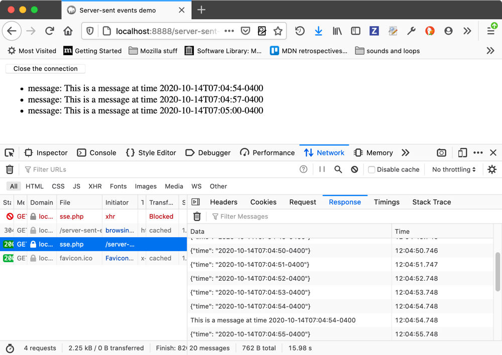
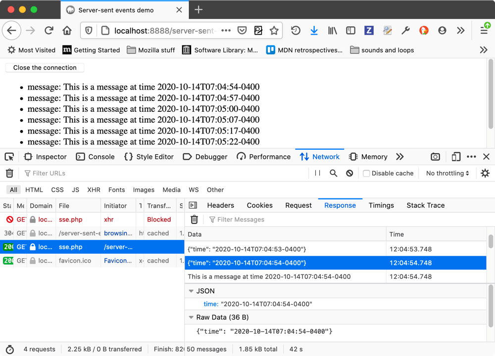
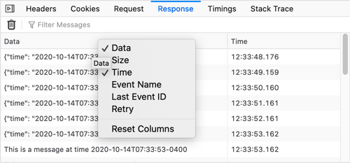

=============================
Inspecting server-sent events
=============================

`Server-sent events <https://developer.mozilla.org/en-US/docs/Web/API/Server-sent_events>`_ allow for an inversion of the traditional client-initiated web request model, with a server sending new data to a web page at any time by pushing messages. From Firefox 82 onwards, you can inspect server-sent events and their message contents using the :doc:`Network Monitor <../index>`. This article shows you how.

Inspecting the SSE network activity
***********************************

When you are viewing a document that is receiving server-sent events, you can go to the Network Monitor, select the file that is sending the server-sent events, and view the received messages in the *Response* tab on the right-hand panel.




At the top of the panel there is a trash can icon, which allows you to trash the messages sent so far, and a filter field in which you can enter a text string to filter the displayed messages by.


Viewing the message contents
****************************

Select one of the messages listed in the *Response* tab, and you'll see the message contents displayed at the bottom of that same tab.



In the above example, you can see that JSON and raw data representations of the content are shown. For a plain text message, you'd just see a raw data section.

The supported data formats are as follows:

- Mercure protocol
- JSON


Customizing the displayed columns
*********************************

For each message, you'll see *Data* and Time columns by default, but you can right-click on the table header to bring up a context menu in which you can toggle columns on and off, and reset it back to its original state.



The available columns are as follows:

- *Data*: A summary of the contained message data.
- *Size*: The size of the message.
- *Time*: A timestamp representing when the message was sent.
- *Event Name*: The name of the event type that resulted in the message being sent (e.g. ```message``` or ```ping```).
- *Last Event ID*: The ID of the last event that was fired.
- *Retry*: The interval after which failed message will be resent.


Network Monitor features
************************

The following articles cover different aspects of using the network monitor:

- :doc:`Toolbar <../toolbar/index>`
- :doc:`Network request list <../request_list/index>`
- :doc:`Network request details <../request_details/index>`
- :doc:`Network traffic recording <../performance_analysis/index>`
- :doc:`Throttling <../throttling/index>`
- :doc:`Inspecting web sockets <../inspecting_web_sockets/index>`
