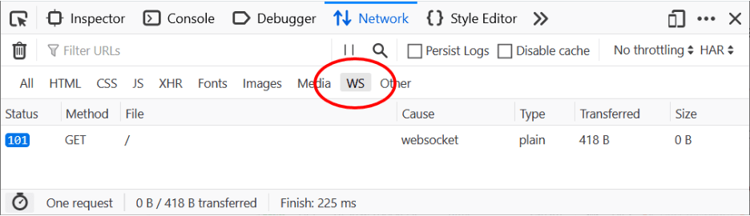
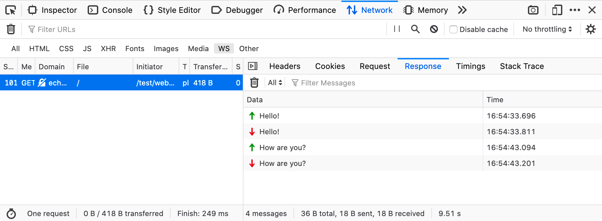
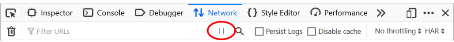
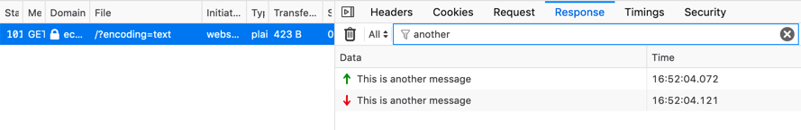
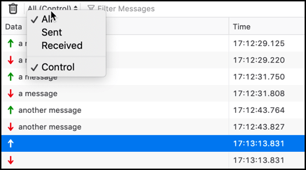
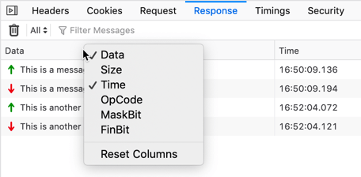
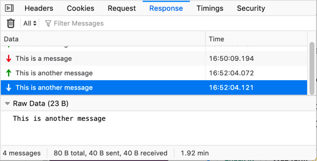

======================
Inspecting web sockets
======================

Since Firefox 71, the :doc:`Network Monitor <../index>` has had the ability to inspect `web socket <https://developer.mozilla.org/en-US/docs/Web/API/WebSockets_API>`_ connections. This article explores what functionality the Web Socket Inspector makes available.

Accessing the inspector
***********************

When you are inspecting a web app that utilizes a web socket connection, the web socket requests are listed in the list of requests in the Network Monitor along with all other requests.

You can use the WS button to filter the list for just web socket connections. Only requests with the `101 status code <https://developer.mozilla.org/en-US/docs/Web/HTTP/Status/101>`_ (WebSocket Protocol Handshake) are visible, which indicates that the server is switching to a web socket connection.

Clicking on a web socket request opens the usual sidebar to reveal additional details. Choose the **Response** tab to inspect web socket frames sent and received through the selected connection.

The live-updated table shows data for sent (green arrow) and received (red arrow) frames. Each frame expands on click, so you can inspect the formatted data.

Pausing web socket traffic
**************************

You can use the pause/resume button in the Network Monitor toolbar to stop intercepting web socket traffic. This allows you to capture only the frames that you are interested in.

Filtering web socket frames
***************************

To focus on specific messages, frames can be filtered using the filter at the top of the *Response* panel.

There are also predefined filters, available in the tool bar of the Response pane, grouped into a selection list.

The following filters are available:

.. list-table::
   :widths: 20 80
   :header-rows: 0

   * - **All**
     - Displays all messages (by default, except control messages).

   * - **Sent**
     - Displays only messages sent by the browser (by default, except control messages).

   * - **Received`**
     - Displays only messages received from the server (by default, except control messages).

   * - **Control**
     - (Available starting in Firefox 76). Displays messages for control frames (Ping, Pong, or Close). This filter can be combined with the others, to display, for example, only messages for control frames sent by the browser.

Columns in the Response pane
****************************

In the **Response** pane, you can choose to show the following information about each frame:

- Data
- Size
- Time
- OpCode
- MaskBit
- FinBit

The *Data* and *Time* columns are visible by default, but you can customize the interface to see more columns by choosing which ones to show from the context menu that is opened by right-clicking in the table header.

Expanding each message
**********************

Selecting a message in the list shows a preview of the data being sent in that message, at the bottom of the Response pane.

Supported WS protocols
**********************

The inspector currently supports the following web socket protocols:

- Plain JSON
- Socket.IO
- SockJS
- SignalR
- WAMP
- STOMP
- STOMP inside SockJS

The payload based on those protocols is parsed and displayed as an expandable tree for easy inspection, although you can of course still see the raw data (as sent over the wire) as well.

Network Monitor features
************************

The following articles cover different aspects of using the network monitor:

- :doc:`Toolbar <../toolbar/index>`
- :doc:`Network request list <../request_list/index>`
- :doc:`Network request details <../request_details/index>`
- :doc:`Network traffic recording <../performance_analysis/index>`
- :doc:`Throttling <../throttling/index>`
- :doc:`Inspecting web sockets <../inspecting_web_sockets/index>`
- :doc:`Inspecting server-sent events <../inspecting_server-sent_events/index>`
