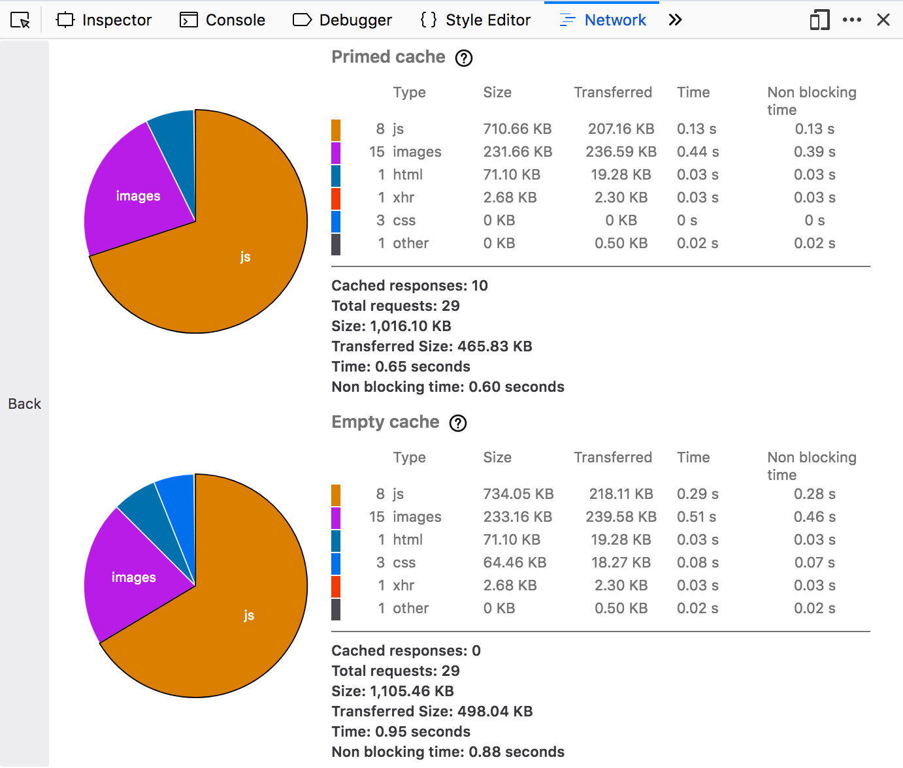

====================
Performance Analysis
====================

The Network Monitor includes a performance analysis tool, to help show you how long the browser takes to download the different parts of your site.

Using the Performance analysis tool
***********************************

To run the performance analysis tool click the stopwatch icon in the :doc:`Toolbar <../toolbar/index>`

(Alternatively, if you have only just opened the Network Monitor, so it's not yet populated with the list of requests, you'll get a stopwatch icon in the main window.)

The Network Monitor then loads the site twice: once with an empty browser cache, and once with a primed browser cache. This simulates the first time a user visits your site, and subsequent visits. It displays the results for each run side by side, or vertically if the browser window is narrow:

The results for each run are summarized in a table and a pie chart. The tables group resources by type, and show the total size of each resource and the total time it took to load them. The accompanying pie chart shows the relative size of each resource type.

To get back to the Network Monitor's list of network requests click the "Back" button on the left.

Clicking on a slice of the pie takes you to the Network Monitor for that run, with a filter automatically applied to see :ref:`only that resource type <request-list-filtering-requests>`.

Network Monitor Features
************************

The following articles cover different aspects of using the network monitor:

- :doc:`Toolbar <../toolbar/index>`
- :doc:`Network request list <../request_list/index>`
- :doc:`Network request details <../request_details/index>`
- :doc:`Network traffic recording <../recording/index/>`
- :doc:`Network traffic recording <../recording/index/>`
- :doc:`Throttling <../throttling/index>`
