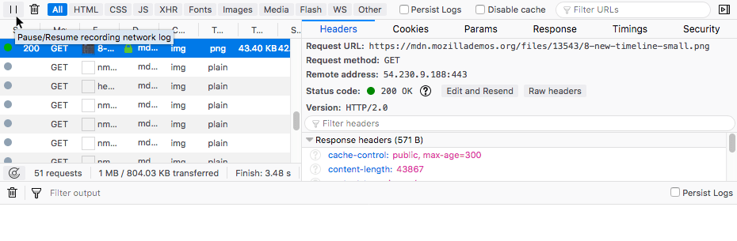

=========================
Network monitor recording
=========================

You can pause and resume the monitoring of network traffic using the pause button.

Pausing and resume network traffic recording
********************************************

The Network Monitor has a button that pauses and resumes recording of the current page's network traffic. This is useful in situations where, for example, you are trying to get a stable view of a page for debugging purposes, but under normal circumstances the view keeps evolving due to persistent network requests. The pause button allows you to look at a certain snapshot.

The button can be found at the far left of the main Network Monitor toolbar, and looks like a typical pause button — |image1|.

You can see it here in context:

Once pressed, the button changes to a play icon, and you can toggle network traffic recording back on by pressing it again.

Network Monitor features
************************

The following articles cover different aspects of using the network monitor:

- :doc:`Toolbar <../toolbar/index>`
- :doc:`Network request list <../request_list/index>`
- :doc:`Network request details <../request_details/index>`
- :doc:`Network traffic recording <../recording/index/>`
- :doc:`Performance analysis <../performance_analysis/index>`
- :doc:`Throttling <../throttling/index>`
