=======================
Network request details
=======================

The request details pane appears when you click on a network request in the request list. This pane provides more detailed information about the request.

Network request details
***********************

Clicking on a row displays a new pane in the right-hand side of the network monitor, which provides more detailed information about the request.

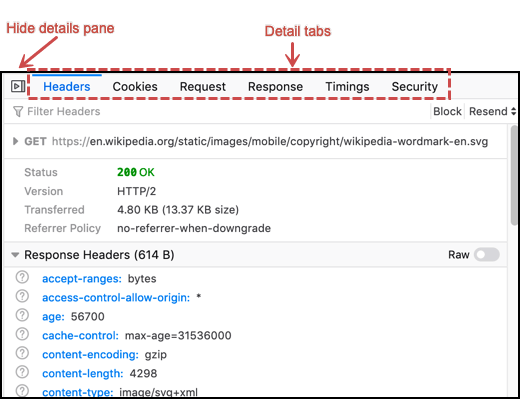

.. note::

  The screenshots and descriptions in this section reflect Firefox 78. Earlier versions appeared similarly, but might not include some functionality.

The tabs at the top of this pane enable you to switch between the following pages:

- :ref:`Headers <network-monitor-request-details-headers-tab>`
- **Messages** (only for WebSocket items)
- :ref:`Request <network-monitor-request-details-request-tab>`
- :ref:`Response <network-monitor-request-details-response-tab>`
- :ref:`Cache <network-monitor-request-details-cache-tab>`
- :ref:`Timings <network-monitor-request-details-timings-tab>`
- :ref:`Security <network-monitor-request-details-security-tab>`
- :ref:`Stack trace <network-monitor-request-details-stack-trace-tab>` (only when the request has a stack trace, e.g. a script called by another script).

Clicking the icon at the right-hand end of the :doc:`toolbar <../toolbar/index>` closes the details pane and returns you to the list view.

.. _network-monitor-request-details-headers-tab:

Headers tab
-----------

The Headers tab has a toolbar, followed by three main sections.

This includes:

- Information about the request

  - Status: The response status code for the request; click the "?" icon to go to the reference page for the status code.
  - Version: The version of HTTP used.
  - Transferred: The amount of data transferred for the request.
  - Referrer policy: The value of the `Referrer-policy header <https://developer.mozilla.org/en-US/docs/Web/HTTP/Headers/Referrer-Policy>`_.

- **HTTP Response headers**
- **HTTP Request headers**

Each section has a disclosure triangle to expand the section to show more information.

Headers toolbar
~~~~~~~~~~~~~~~

Using the Headers toolbar, you can:

- Filter the headers in the Response Headers and Request Headers sections.
- **Block** the domain involved in this request. The domain is added to the :ref:`Blocking sidebar <network_monitor_blocking_specific_urls>`.
- Resend the request. The **Resend** button opens a menu with two items:

  - **Resend**: Resends the request.
  - **Edit and Resend**: Enables an editing mode, where you can modify the method, URL, request headers, or request body of the request. Click **Send** to send the modified request, or **Cancel** to cancel editing.

Request Information
~~~~~~~~~~~~~~~~~~~

The following information is shown only when the section is expanded:

- **Scheme**: The scheme used in the URL
- **Host**: The server involved in the request
- **Filename**: The full path to the file requested
- **Address**: The IP address of the host

The following information is shown in both the collapsed and the expanded states:

- **Status:** The `HTTP response code <https://developer.mozilla.org/en-US/docs/Web/HTTP/Status>`_ for the request.
- **Version**: The HTTP version used
- **Transferred**: The amount of data transferred with the request
- The **Referrer Policy**, which governs which referrer information, sent in the `Referer <https://developer.mozilla.org/en-US/docs/Web/HTTP/Headers/Referer>`_ header, should be included with requests. (See `Referrer-Policy <https://developer.mozilla.org/en-US/docs/Web/HTTP/Headers/Referrer-Policy>`_ for a description of possible values)
- **Blocking**: If the request is to a site that is associated with a known tracker, an icon and a message are shown; otherwise, this field is not shown.

Response headers
~~~~~~~~~~~~~~~~

The response headers section shows details about the response. For each line in the response headers section, a question mark links to the documentation for that response header, if one is available.

A **Raw** toggle button in the section heading controls whether the headers are shown with formatting, or as plain, unformatted text.

.. note::
  Note that the keys in the response header are all in lowercase, while the request headers keys are not. `HTTP/2 requires that all headers be lowercase <https://datatracker.ietf.org/doc/html/rfc7540#section-8.1.2>`_; response headers are shown as they are received from the server. (There may be some exceptions, such as ``X-Firefox-Spdy``, which is added by Firefox.)

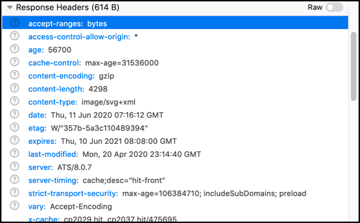

You can copy some or all of the response header in JSON format by using the context menu:

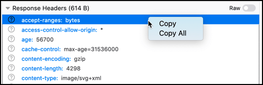

If you select **Copy**, a single key word, value pair is copied. If you select **Copy All**, the entire header is copied in JSON format, giving you something like this (after running the results through a JSON validator):

.. code-block:: json

  {
    "Response headers (1.113 KB)": {
      "headers": [
        {
          "name": "accept-ranges",
          "value": "bytes"
        },
        {
          "name": "age",
          "value": "0"
        },
        {
          "name": "backend-timing",
          "value": "D=74716 t=1560258099074460"
        },
        {
          "name": "cache-control",
          "value": "private, must-revalidate, max-age=0"
        },
        {
          "name": "content-disposition",
          "value": "inline; filename=api-result.js"
        },
        {
          "name": "content-encoding",
          "value": "gzip"
        },
        {
          "name": "content-length",
          "value": "673"
        },
        {
          "name": "content-type",
          "value": "text/javascript; charset=utf-8"
        },
        {
          "name": "date",
          "value": "Tue, 11 Jun 2019 13:01:39 GMT"
        },
        {
          "name": "mediawiki-login-suppressed",
          "value": "true"
        },
        {
          "name": "p3p",
          "value": "CP=\"This is not a P3P policy! See https://en.wikipedia.org/wiki/Special:CentralAutoLogin/P3P for more info.\""
        },
        {
          "name": "server",
          "value": "mw1316.eqiad.wmnet"
        },
        {
          "name": "server-timing",
          "value": "cache;desc=\"pass\""
        },
        {
          "name": "strict-transport-security",
          "value": "max-age=106384710; includeSubDomains; preload"
        },
        {
          "name": "vary",
          "value": "Accept-Encoding,Treat-as-Untrusted,X-Forwarded-Proto,Cookie,Authorization,X-Seven"
        },
        {
          "name": "via",
          "value": "1.1 varnish (Varnish/5.1), 1.1 varnish (Varnish/5.1)"
        },
        {
          "name": "x-analytics",
          "value": "ns=-1;special=Badtitle;WMF-Last-Access=11-Jun-2019;WMF-Last-Access-Global=11-Jun-2019;https=1"
        },
        {
          "name": "x-cache",
          "value": "cp1075 pass, cp1075 pass"
        },
        {
          "name": "x-cache-status",
          "value": "pass"
        },
        {
          "name": "x-client-ip",
          "value": "204.210.158.136"
        },
        {
          "name": "x-content-type-options",
          "value": "nosniff"
        },
        {
          "name": "X-Firefox-Spdy",
          "value": "h2"
        },
        {
          "name": "x-frame-options",
          "value": "SAMEORIGIN"
        },
        {
          "name": "x-powered-by",
          "value": "HHVM/3.18.6-dev"
        },
        {
          "name": "x-search-id",
          "value": "esvan0r5bnnwscyk2wq09i1im"
        },
        {
          "name": "x-varnish",
          "value": "766019457, 417549316"
        }
      ]
    },
    "Request headers (665 B)": {
      "headers": [
        {
          "name": "Accept",
          "value": "*/*"
        },
        {
          "name": "Accept-Encoding",
          "value": "gzip, deflate, br"
        },
        {
          "name": "Accept-Language",
          "value": "en-US,en;q=0.5"
        },
        {
          "name": "Connection",
          "value": "keep-alive"
        },
        {
          "name": "Cookie",
          "value": "WMF-Last-Access=11-Jun-2019; WMF-Last-Access-Global=11-Jun-2019; mwPhp7Seed=5c9; GeoIP=US:NY:Port_Jervis:41.38:-74.67:v4"
        },
        {
          "name": "DNT",
          "value": "1"
        },
        {
          "name": "Host",
          "value": "en.wikipedia.org"
        },
        {
          "name": "Referer",
          "value": "https://www.wikipedia.org/"
        },
        {
          "name": "TE",
          "value": "Trailers"
        },
        {
          "name": "User-Agent",
          "value": "Mozilla/5.0 (Windows NT 10.0; Win64; x64; rv:68.0) Gecko/20100101 Firefox/68.0"
        }
      ]
    }
  }

Request headers
~~~~~~~~~~~~~~~

The Request headers section shows details about the request headers. For each line in the request headers section, a question mark links to the documentation for that request header, if one is available.

A **Raw** toggle button in the section heading controls whether the headers are shown with formatting, or as plain, unformatted text.

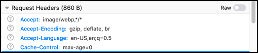

.. _network-monitor-request-details-cookies-tab:

Cookies tab
-----------

This tab lists full details of any cookies sent with the request or response:

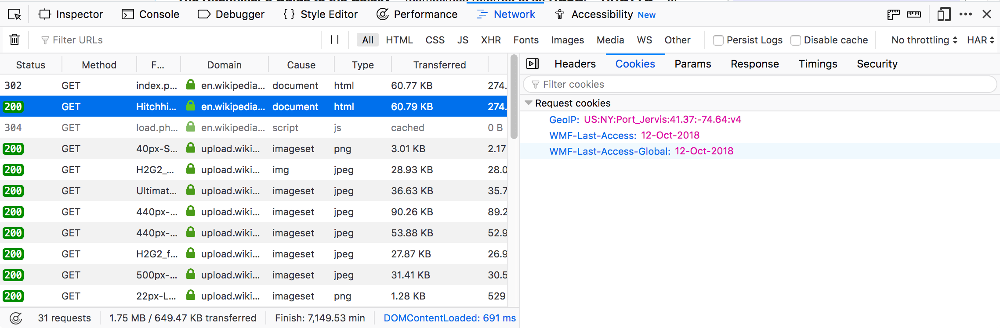

As with headers, you can filter the list of cookies displayed. The full list of cookie attributes is shown—see the following screenshot showing Response cookies with further attributes shown.

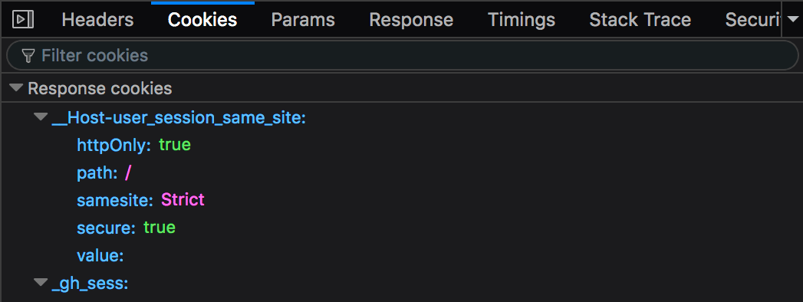

The ``samesite`` attribute has been shown since Firefox 62 (`bug 1452715 <https://bugzilla.mozilla.org/show_bug.cgi?id=1452715>`_).

.. _network-monitor-request-details-request-tab:

Request tab
-----------

Request shows the complete request parameters, by default, in a formatted view:

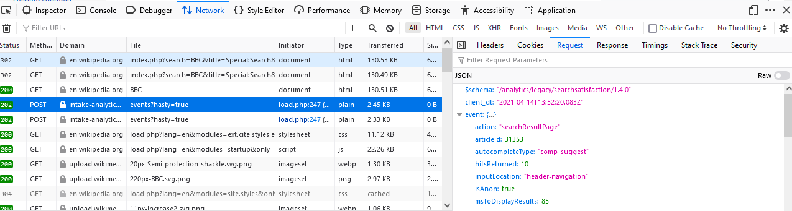

Switch the toggle button to have the raw view presented:

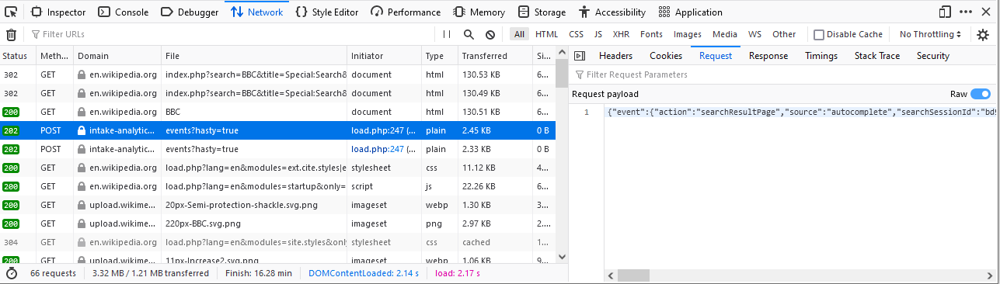

.. _network-monitor-request-details-response-tab:

Response tab
------------

The complete content of the response. If the response is HTML, JS, or CSS, it will be shown as text:

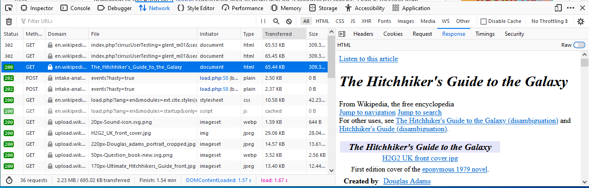

The toggle button for switching between raw and formatted response view has been implemented (`bug 1693147 <https://bugzilla.mozilla.org/show_bug.cgi?id=1693147>`_). The previous HTML example makes use of the formatted view. When the toggle button is turned on, the raw response view will be enabled:

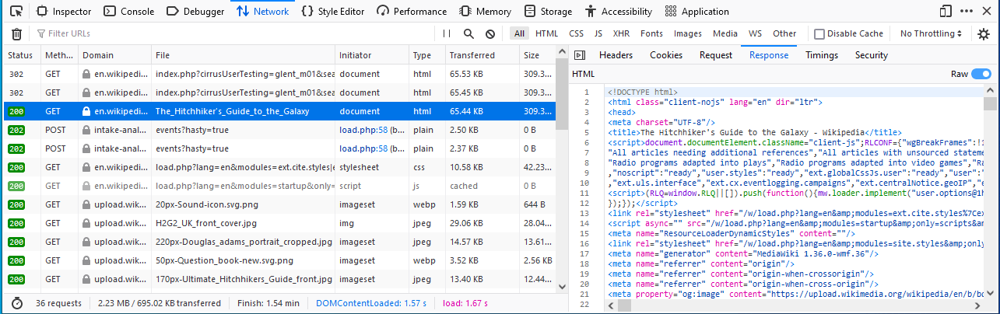

If the response is JSON, it will be shown as an inspectable object:

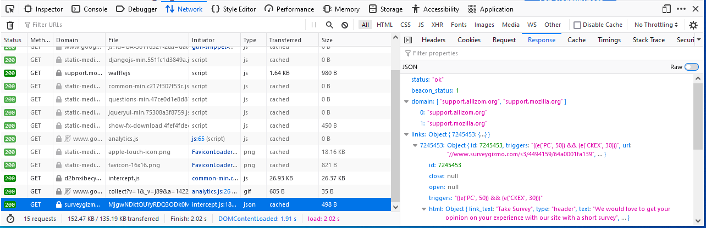

In the raw response view the response will be shown as a string:

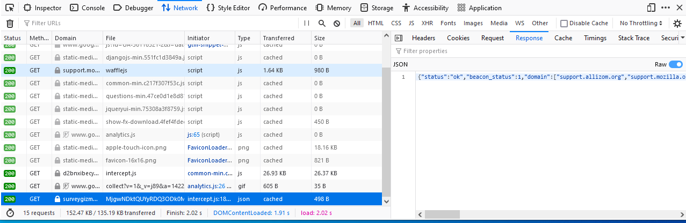

If the response is an image, the tab displays a preview:

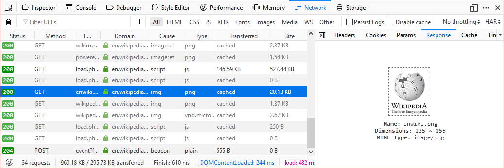

If the response is a web font, the tab also displays a preview:

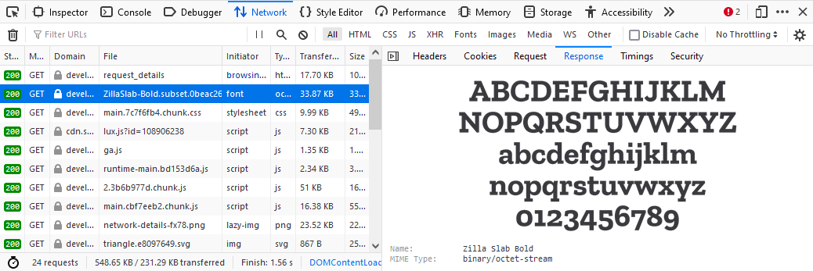

For network responses that are initiated by a `WebSocket <https://developer.mozilla.org/en-US/docs/Web/API/WebSockets_API>`_ connection, the details pane shows any associated messages. For more information, see :doc:`Inspecting web sockets <../inspecting_web_sockets/index>`.

.. _network-monitor-request-details-cache-tab:

Cache tab
---------

If the response is cached (i.e. a 304), the Cache tab displays details about that cached resource.

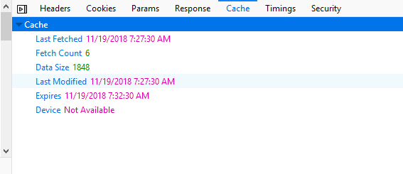

These details include:

- **Last fetched:** The date the resource was last fetched
- **Fetched count:** The number of times in the current session that the resource has been fetched
- **Data size:** The size of the resource.
- **Last modified:** The date the resource was last modified.
- **Expires:** The date the resource expires.
- **Device:** The device the resource was fetched from (e.g. "disk").

HTML preview
~~~~~~~~~~~~

If the response is HTML, a preview of the rendered HTML appears inside the Response tab, above the response payload.

.. _network-monitor-request-details-timings-tab:

Timings tab
-----------

The Timings tab provides information about how long each stage of a network request took, with a more detailed, annotated, view of the timeline bar, so it is easy to locate performance bottlenecks.

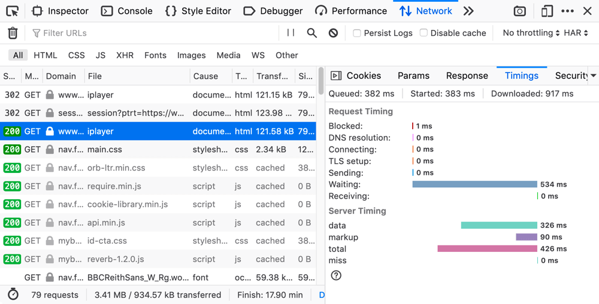

This tab can include the following sections.

Queued, Started, Downloaded
~~~~~~~~~~~~~~~~~~~~~~~~~~~

New in Firefox 72, we now show the following timings at the top of the Timings tab, making dependency analysis a lot easier:

- Queued: When the resource was queued for download.
- Started: When the resource started downloading.
- Downloaded: When the resource finished downloading.

.. note::
  Future versions will also show this information when entries in the network monitor timeline graph are moused over (see `bug 1580493 <https://bugzilla.mozilla.org/show_bug.cgi?id=1580493>`_).

Request Timing
~~~~~~~~~~~~~~

The *Request Timing* section breaks a network request down into the following subset of the stages defined in the `HTTP Archive <https://dvcs.w3.org/hg/webperf/raw-file/tip/specs/HAR/Overview.html>`_ specification:

.. list-table::
  :widths: 20 80
  :header-rows: 0

  * - Name
    - Description

  * - Blocked
    - Time spent in a queue waiting for a network connection.

      The browser imposes a limit on the number of simultaneous connections that can be made to a single server. In Firefox this defaults to 6, but can be changed using the `network.http.max-persistent-connections-per-server <http://kb.mozillazine.org/Network.http.max-persistent-connections-per-server>`_ preference. If all connections are in use, the browser can't download more resources until a connection is released.

  * - DNS resolution
    - Time taken to resolve a host name.

  * - Connecting
    - Time taken to create a TCP connection.

  * - Sending
    - Time taken to send the HTTP request to the server.

  * - Waiting
    - Waiting for a response from the server.

  * - Receiving
    - Time taken to read the entire response from the server (or cache).

Server Timing
~~~~~~~~~~~~~

New in Firefox 71, the *Server Timing* section lists any information provided in the `Server-Timing <https://developer.mozilla.org/en-US/docs/Web/HTTP/Headers/Server-Timing>`_ header — this is used to surface any backend server timing metrics you've recorded (e.g. database read/write, CPU time, file system access, etc.).

The header takes a series of descriptions and durations, which can be anything you like. In the above screenshot for example, the highlighted request's ``Server-Timing`` header contains 4 items — *data*, *markup*, *total*, and *miss*.

Service Worker Timing
~~~~~~~~~~~~~~~~~~~~~

The *Service Worker Timing* section lists the information relating to the specific service worker request. The metrics include Startup, Dispatch fetch and Handle fetch.

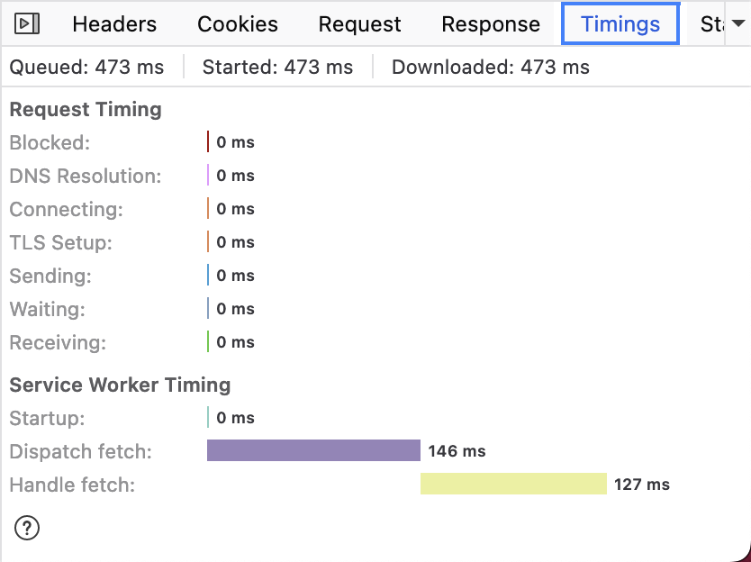

.. list-table::
  :widths: 20 80
  :header-rows: 0

  * - Name
    - Description

  * - Startup
    - Time taken to launch the service worker, this is only indicated if the launch starts after the fetch event has already been dispatched.

  * - Dispatch fetch
    - Time taken from when a fetch event is triggered to just before it starts getting handled by the service worker.

  * - Handle fetch
    - Time taken to by the service worker to handle the fetch event.

.. _network-monitor-request-details-security-tab:

Security tab
------------

If the site is being served over HTTPS, you get an extra tab labeled "Security". This contains details about the secure connection used including the protocol, the cipher suite, and certificate details:

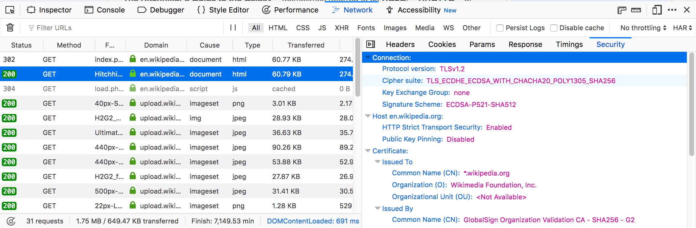

The Security tab shows a warning for security weaknesses. Currently it warns you about two weaknesses:

1. Using SSLv3 instead of TLS
2. Using the RC4 cipher

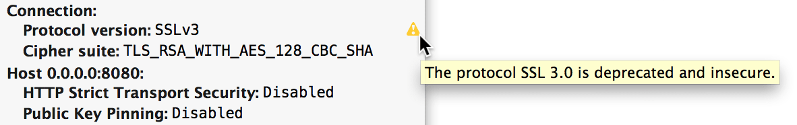

.. _network-monitor-request-details-stack-trace-tab:

Stack trace tab
---------------

Stack traces are shown in the *Stack Trace* tab, for responses that have a stack trace of course.

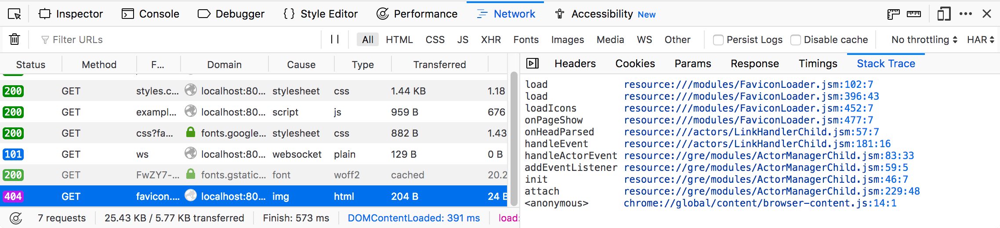

Network Monitor Features
************************

The following articles cover different aspects of using the network monitor:

- :doc:`Toolbar <../toolbar/index>`
- :doc:`Network request list <../request_list/index>`
- :doc:`Network request details <../request_details/index>`
- :doc:`Network traffic recording <../performance_analysis/index>`
- :doc:`Throttling <../throttling/index>`
- :doc:`Inspecting web sockets <../inspecting_web_sockets/index>`
