====================
Network request list
====================

The request list of the Network Monitor shows a list of all the network requests made in the course of loading the page.

Network request list
--------------------

By default, the Network Monitor shows a list of all the network requests made in the course of loading the page. Each request is displayed in its own row:

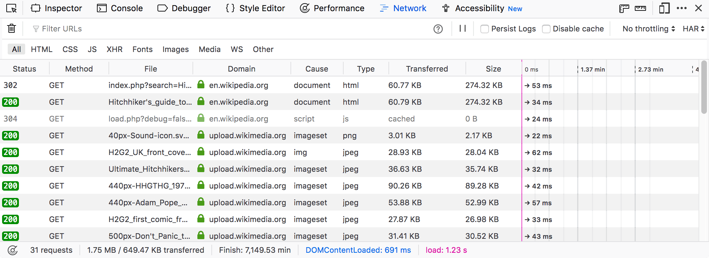

By default, the Network Monitor is cleared each time you navigate to a new page or reload the current page. You can override this behavior by checking "Enable persistent logs" in the :ref:`Settings <settings-common-preferences>`.

Network request columns
-----------------------

You can toggle columns on and off by right-clicking on the table header and choosing the specific column from the context menu. A **Reset Columns** command is available on the context menu to reset the columns to their initial configuration.

You can also change the width of the columns to help make the information you are looking for easier to view. The mouse pointer changes to a resize icon when you move it over the border of a column. You can drag to manually set the size of column. Starting in Firefox 76 you can double-click a column divider to resize the column to the left of it to fit its contents.

The **Reset Columns** command on the context menu also resets the width of the columns to the default values.

.. raw:: html

  <iframe width="560" height="315" src="https://www.youtube.com/embed/5fbuDO2s9Pk" title="YouTube video player" frameborder="0" allow="accelerometer; autoplay; clipboard-write; encrypted-media; gyroscope; picture-in-picture" allowfullscreen></iframe>
   
   

Clicking the column header label sorts the request list by that column. You can reset the sort to the default by selecting "Reset Sorting" from the context menu.

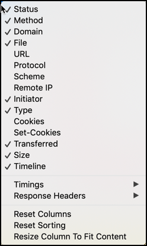

Here is a list of all available columns:

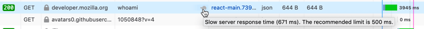

- **Status**: The HTTP status code returned. The numeric code is displayed on a colored background, to help unusual ones stand out. If there was no response, this column is empty. Or you might see a |image1| red circle with a diagonal slash for responses that were blocked by the browser or the server.
- **Method**: The HTTP request method used.
- **Domain**: Domain of the path requested.

  - If the request used SSL/TLS and the connection had security weaknesses such as weak ciphers, you'll see a warning triangle next to the domain. Y
  - Hover over the domain to see the IP address.
  - There's an icon next to the domain that gives you extra information about the security status of that request. See :ref:`Security icons <network-monitor-request-list-security-icons>`.

- **File**: The basename of the file requested.

  - (Starting in Firefox 80) On the right edge of the File column, a turtle icon appears if the server waiting time exceeds a threshold (default: 500 ms). A tooltip explains the problem. You can configure the threshold in the `Configuration Editor <https://support.mozilla.org/en-US/kb/about-config-editor-firefox>`_ (about:config) by modifying the ``devtools.netmonitor.audits.slow`` setting.
  - |image2|

- **URL**: The `URL <https://developer.mozilla.org/en-US/docs/Glossary/URL>`_ of the file requested.
- **Protocol:** The network protocol used to transfer the data, this column is hidden by default.
- **Scheme:** The scheme (https/http/ftp/...) of the path requested. This column is hidden by default.
- **Remote IP**: The IP address of the server answering the request. This column is hidden by default.
- **Type**: ``Content-type`` of the response.
- **Cookies:** The number of request cookies associated to the request. This column is hidden by default. This is new in Firefox 55.
- **Set-Cookies:** The number of response cookies associated to the request. This column is hidden by default. This is new in Firefox 55.
- **Transferred**: The number of bytes that were actually transferred to load the resource, or a message about why the resource was not transferred. A number value is less than **Size** if the resource was compressed.

  - If the resource was fetched from a `service worker <https://developer.mozilla.org/en-US/docs/Web/API/Service_Worker_API>`_ cache, then this cell displays "service worker".
  - Cached resources may be fetched from the cache and the network simultaneously, which may improve load time for slow caches. `Starting with Firefox 68 <https://bugzilla.mozilla.org/show_bug.cgi?id=1358038>`_, the transferred column lists either "cached (raced)" or "[size] (raced)" depending on the faster source. This feature is called `Race Cache With Network (RCWN) <https://slides.com/valentingosu/race-cache-with-network-2017#>`_.
  - If the resource was blocked, the message indicates why it was blocked. For example, "CSP", "Malware", "CORS Missing Allow Origin", "Blocked by [Name of Extension]".

- **Size**: The size of the transferred resource.

Image thumbnails
~~~~~~~~~~~~~~~~

If the request is for an Image, hovering over its filename shows a preview of the image in a tooltip:

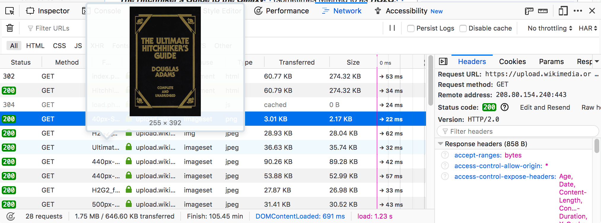

.. _network-monitor-request-list-security-icons:

Security icons
~~~~~~~~~~~~~~

The Network Monitor displays an icon in the Domain column:

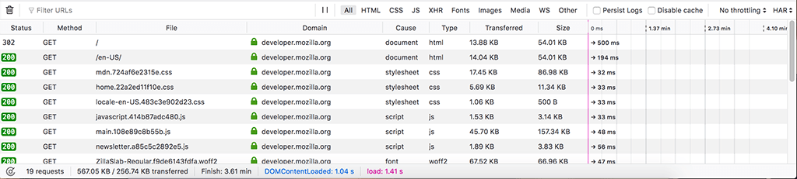

This gives you extra information about the security status of the request:

.. list-table::
  :widths: 25 75
  :header-rows: 1

  * - Icon
    - Meaning

  * - |image3|
    - HTTPS

  * - |image4|
    - Weak HTTPS (for example, a weak cipher was used)

  * - |image5|
    - Failed HTTPS (for example, a certificate was invalid)

  * - |image6|
    - HTTP

  * - |image7|
    - Localhost

  * - |image8|
    - Indicates that the URL belongs to a known tracker that would be blocked with content blocking enabled.

Timeline
--------

The request list also displays a timeline for the different parts of each request.

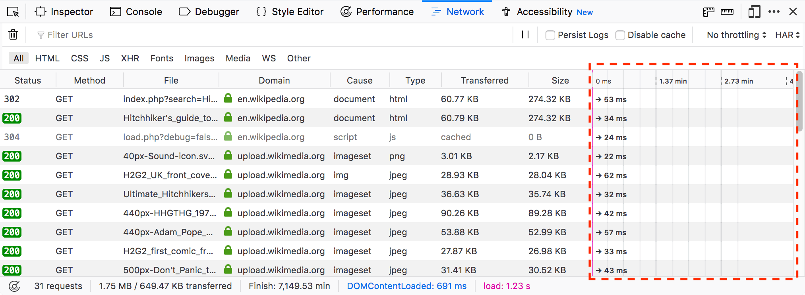

Each timeline is given a horizontal position in its row relative to the other network requests, so you can see the total time taken to load the page. For more details on the color-coding used here, see the section on the :ref:`Timings <network-monitor-request-details-timings-tab>` page.

Starting in Firefox 45, the timeline also contains two vertical lines:

- The blue line marks the point at which thepage's `DOMContentLoaded <https://developer.mozilla.org/en-US/docs/Web/API/Window/DOMContentLoaded_event>`_ event is triggered.
- The red line marks the point at which the page's `load <https://developer.mozilla.org/en-US/docs/Web/API/Window/load_event>`_ event is triggered.

.. _network_monitor_blocking_specific_urls:

Blocking specific URLs
----------------------

If you want to view your page as it would look without a resource (e.g., if it were blocked by the browser or an extension), you can block requests matching patterns you specify.

1. Click the **Request Blocking** icon in the toolbar. This opens the **Blocking** sidebar. (Click the icon again when you want to close the sidebar.)

  .. image:: request_blocking_panel.png
    :alt: Screen shot of the Blocking panel, with arrows indicating the panel and the Request Blocking toolbar icon
    :class: center

2. Enter a string in the field with the placeholder text *Block resource when URL contains*.
3. Reload the page to test it with the specified URL blocked.

Other actions you can take with Request Blocking:

- To turn all request blocking off or on: Toggle the checkbox next to Enable Request Blocking.
- To turn a specific block off or on: Toggle the checkbox next to that item.
- To delete a blocked item, click the X icon that appears when you focus the item.
- (Starting with Firefox 77) Right-click any item in the list and choose from the context menu:

  - **Enable all** enables blocking of all items in the list.
  - **Disable all** disables blocking of all items in the list.
  - **Remove all** deletes all items in the list.

Blocking a specific URL from the request list
~~~~~~~~~~~~~~~~~~~~~~~~~~~~~~~~~~~~~~~~~~~~~

You can also block a URL from the request list:

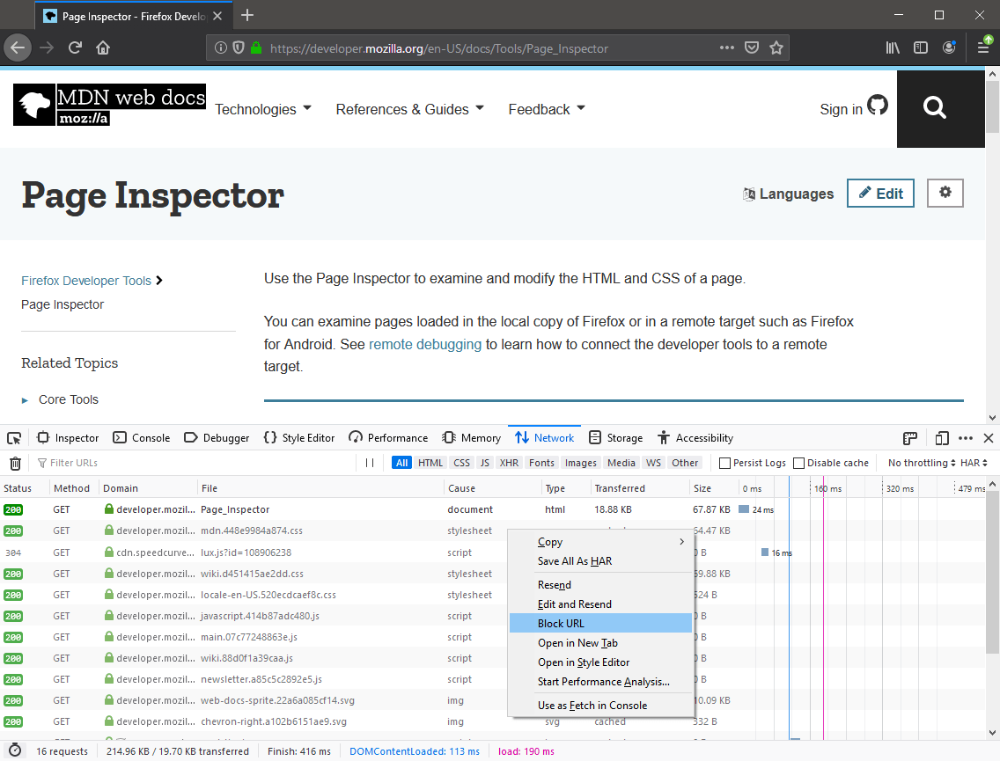

1. Hover over the item you want to block in the Request List.
2. Select Block URL from the context menu.
3. When you refresh the page, that specific URL will be blocked and a message will be added to the item in the list indicating that it has been blocked by the DevTools.

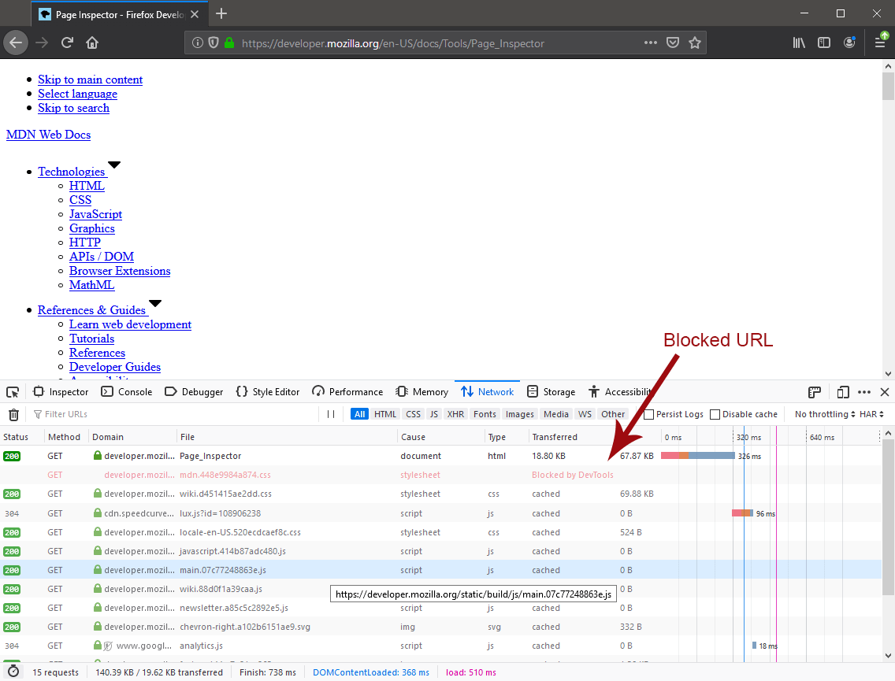

Stop blocking a URL from the Request List
~~~~~~~~~~~~~~~~~~~~~~~~~~~~~~~~~~~~~~~~~

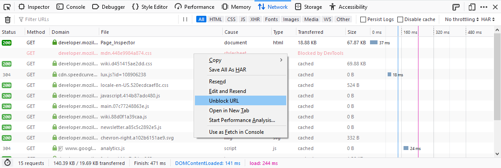

1. Hover over the item.
2. Select **Unblock URL**.
3. Now when you refresh the page, the item will once enabled.

.. note::
  (Starting in Firefox 80) You can also block and unblock URLs from the :doc:`Web Console <../../web_console/index>`, using the ``:block`` and ``:unblock`` helper commands. These accept any string, and affect any URL containing the string.

.. _request-list-filtering-requests:

Filtering requests
******************

You can filter requests by content type, by whether they are XMLHttpRequests or WebSocket requests, or by request properties.

.. |br| raw:: html

     

.. list-table::
  :widths: 25 75
  :header-rows: 1

  * - Filter type
    - How to apply

  * - Content type
    - Use the buttons in the :doc:`toolbar <../toolbar/index>` (**HTML**, **CSS**, **JS**).

  * - `XHR <https://developer.mozilla.org/en-US/docs/Glossary/XHR_(XMLHttpRequest)>`_ requests
    - Use the **XHR** button in the :doc:`toolbar <../toolbar/index>`.

  * - `WebSocket <https://developer.mozilla.org/en-US/docs/Web/API/WebSockets_API>`_ connections
    - Use the **WS** button in the :doc:`toolbar <../toolbar/index>`. You can filter by plain text (in which case the text is used to find partial matches; entering "for" will match any message that contains the word "for") or—as of `Firefox 75 <https://developer.mozilla.org/en-US/docs/Mozilla/Firefox/Releases/75>`_ — using `regular expressions <https://developer.mozilla.org/en-US/docs/Web/JavaScript/Guide/Regular_Expressions>`_ (by writing the regexp bracketed within slashes; "/.+Corp.*/" will look for any occurrence of "Corp" which has at least one character before it and may or may not have any characters after it, for example). |br| |br| The third-party add-on `WebSocket Sniffer <https://addons.mozilla.org/en-US/firefox/addon/websocketsniff>`_ may be helpful as well.

  * - URL
    - Use the *Filter URLs* box in the :doc:`toolbar <../toolbar/index>`. You can focus it by clicking in the filter box, or by pressing :kbd:`Ctrl` + :kbd:`F` (or :kbd:`Cmd` + :kbd:`F` on a Mac); then start typing. The list of network requests is filtered to include only requests that contain your filter string, in either the Domain or the File portions. |br| |br| You can filter requests that *don't* contain your filter string by prefixing your query with the "-" operator. For example, the query "-google.com" will show all requests that don't have "google.com" in the URL.

  * - Request properties
    - Use the search box in the :doc:`toolbar <../toolbar/index>`. See next section.

.. _request-list-filtering-by-properties:
.. _request-list-requst-list-cause-column:

Filtering by properties
~~~~~~~~~~~~~~~~~~~~~~~

The search box recognizes specific keywords, which can be used to filter the requests by specific request properties. Those keywords are followed by a colon and a related filter value. The filter values are matched case insensitive. Prepending a minus (``-``) negates the filter. You can combine different filters together by separating them with a space.

.. list-table::
  :widths: 20 40 40
  :header-rows: 1

  * - Keyword
    - Meaning
    - Examples

  * - ``status-code``
    - Shows resources that have the specific HTTP status code.
    - ``status-code:304``

  * - ``method``
    - Shows resources that have were requested via the specific HTTP request method.
    - ``method:post``

  * - ``domain``
    - Shows resources coming from a specific domain.
    - ``domain:mozilla.org``

  * - ``remote-ip``
    - Shows resources coming from a server with the specified IP.
    - ``remote-ip:63.245.215.53`` |br| |br| ``remote-ip:[2400:cb00:2048:1::6810:2802]``

  * - ``cause``
    - Shows resources matching a specific cause type. The types can be found in the description of the cause column.
    - ``cause:js`` |br| |br| ``cause:stylesheet`` |br| |br| ``cause:img``

  * - ``transferred``
    - Shows resources having a specific transferred size or a transferred size close to the one specified. ``k`` can be used as suffix for kilobytes and ``m`` for megabytes, e.g. the value ``1k`` is equivalent to ``1024``.
    - ``transferred:1k``

  * - ``size``
    - Shows resources having a specific size (after decompression) or a size close to the one specified. ``k`` can be used as suffix for kilobytes and ``m`` for megabytes, e.g. the value ``1k`` is equivalent to ``1024``.
    - ``size:2m``

  * - ``larger-than``
    - Shows resources that are larger than the specified size in bytes. ``k`` can be used as suffix for kilobytes and ``m`` for megabytes, e.g. the value ``1k`` is equivalent to ``1024``.
    - ``larger-than:2000`` |br| |br|  ``-larger-than:4k``

  * - ``mime-type``
    - Shows resources that match the specified MIME type.
    - ``mime-type:text/html`` |br| |br| ``mime-type:image/png`` |br| |br| ``mime-type:application/javascript``

  * - ``is``
    - ``is:cached`` and ``is:from-cache`` shows only resources coming from cache. ``is:running`` shows only resources, which are currently being transferred.
    - ``is:cached`` |br| |br| ``-is:running``

  * - ``scheme``
    - Shows resources transferred via the given scheme.
    - ``scheme:http``

  * - ``has-response-header``
    - Shows resources that contain the specified HTTP response header.
    - ``has-response-header:cache-control`` |br| |br| ``has-response-header:X-Firefox-Spdy``

  * - ``set-cookie-domain``
    - Shows the resources that have a ``Set-Cookie`` header with a ``Domain`` attribute that matches the specified value.
    - ``set-cookie-domain:.mozilla.org``

  * - ``set-cookie-name``
    - Shows the resources that have a ``Set-Cookie`` header with a name that matches the specified value.
    - ``set-cookie-name:_ga``

  * - ``set-cookie-value``
    - Shows the resources that have a ``Set-Cookie`` header with a value that matches the specified value.
    - ``set-cookie-value:true``

  * - ``regexp``
    - Shows the resources having a URL that matches the given `regular expression <https://developer.mozilla.org/en-US/docs/Glossary/Regular_expression>`_.
    - ``regexp:\d{5}`` |br| |br| ``regexp:mdn|mozilla``

For example, to find all 404, not found, errors, you can type "404" into the search and auto-complete suggests "status-code:404" so you'll end up with something like this:

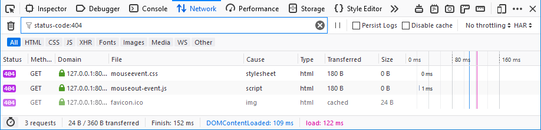

Search in requests
------------------

Use the *Search* panel to run a full-text search on headers and content.

1. Click the **Search** icon in the toolbar. This opens the Search sidebar.

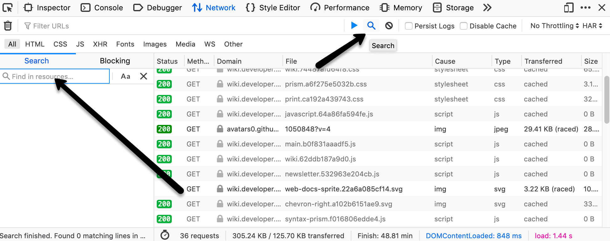

2. Enter a string in the search field of the sidebar, and press :kbd:`Enter` or :kbd:`Return`. The search results area below the search field displays the requests that contain that string in the request or response headers or in the content of the response. You can expand each item to show the specific item that matches the string. Clicking an item in the search results highlights that item in the monitor list, and displays the corresponding information in the request details pane.

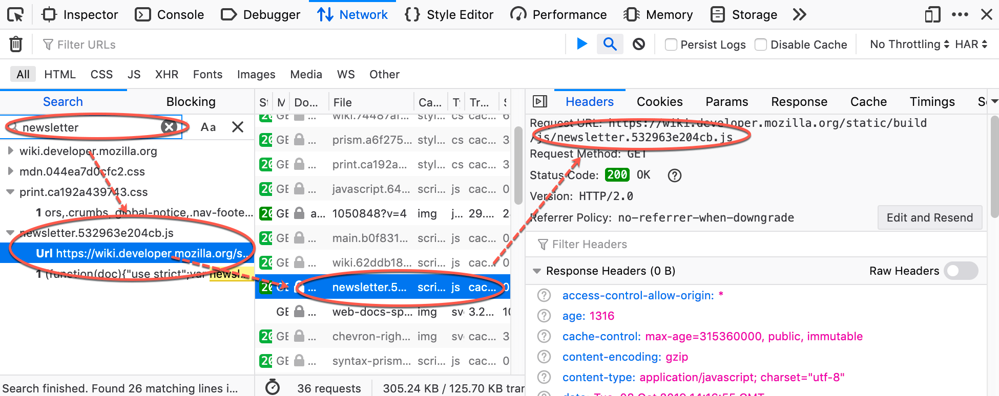

Other ways to use the search panel:

- To clear the search string: click the **X** icon in the search field.
- To make the search case sensitive: click the **Case Sensitive** (**Aa**) icon next to the search field.
- To close the search panel, do one of the following:

  - Click the **X** icon next to the search field.
  - Click the **Search** icon in the Network Monitor toolbar.

.. _network-monitor-request-list-edit-and-resend:

Context menu
------------

Context-clicking on a row in the list displays a context menu with the following options:

.. list-table::
  :widths: 25 75
  :header-rows: 1

  * - Menuitem
    - Description

  * - Copy > Copy URL
    - Copies the URL.

  * - Copy > Copy as cURL
    - Copies the network request to the clipboard as a `cURL <https://curl.haxx.se/>`_ command, so you can execute it from a command line. See :ref:`Copy as cURL <request-list-copy-as-curl>`, below.

  * - Copy > Copy as Fetch
    - Copies the request as a call to the <a href="/en-US/docs/Web/API/fetch">fetch()</a> method, including the URL and any settings object.

  * - Copy > Copy Request Headers
    - Copies the request's header to the clipboard.

  * - Copy > Copy Response Headers
    - Copies the headers of the response for this request, to the clipboard.

  * - Copy > Copy Response
    - Copies the entire response that was sent for this request.

  * - Copy > Copy All As HAR
    - Creates an `HTTP Archive <https://w3c.github.io/web-performance/specs/HAR/Overview.html>`_ (HAR) for all requests listed, and copies it to the clipboard.

  * - Save All As HAR
    - Creates an `HTTP Archive <https://w3c.github.io/web-performance/specs/HAR/Overview.html>`_ (HAR) for all requests listed, and opens a file dialog, so you can save it to a file.

  * - Resend
    - Resends the request as it was originally sent with no changes made.

  * - Edit and Resend
    - Opens an editor enabling you to edit the request's method, URL, parameters, and headers, and resend the request.

  * - Block URL
    - Blocks the selected URL for future requests. See :ref:`Blocking a specific URL from the Request List <network_monitor_blocking_specific_urls>`.

  * - Open in New Tab
    - Resends the request in a new tab — very useful for debugging asynchronous requests.

  * - Open in Style Editor
    - For a CSS resource, opens it in the :doc:`Style Editor <../../style_editor/index>`.

  * - Start :doc:`Performance Analysis <../performance_analysis/index>`
    -

  * - Use as Fetch in Console
    - Submits the request as a call to the `fetch() <https://developer.mozilla.org/en-US/docs/Web/API/fetch>` method in the console.

.. _request-list-copy-as-curl:

Copy as cURL
~~~~~~~~~~~~

The command may include the following options:

.. list-table::
  :widths: 25 75
  :header-rows: 0

  * - ``-X [METHOD]``
    - If the method is not GET or POST

  * - ``--data``
    - For URL encoded request parameters

  * - ``--data-binary``
    - For multipart request parameters

  * - ``--http/VERSION``
    - If the HTTP version is not 1.1

  * - ``-I``
    - If the method is HEAD

  * - ``-H``
    - One for each request header. |br| |br| If the "Accept-Encoding" header is present, the cURL command includes ``--compressed`` instead of ``-H "Accept-Encoding: gzip, deflate"``. This means that the response will be automatically decompressed.

  * - ``--globoff``
    - Suppresses cURL's globbing (wildcard matching) feature if the copied URL includes square bracket characters (``[`` or ``]``). (Starting in Firefox 76)

Managing HAR data
~~~~~~~~~~~~~~~~~

The HAR format enables you to export detailed information about network requests. In addition to the **Copy** and **Save** menu items for HAR in the context menu, similar menu items are available in the **HAR** dropdown menu in the toolbar, as well as an **Import** menuitem.

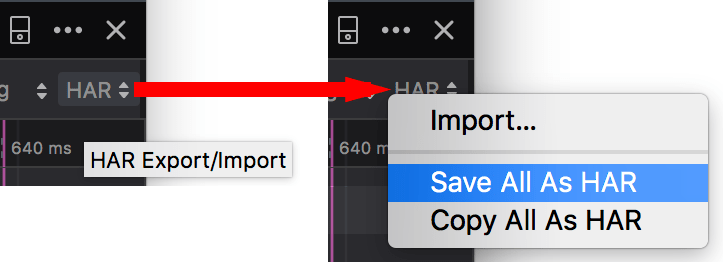

Network Monitor features
************************

The following articles cover different aspects of using the network monitor:

- :doc:`Toolbar <../toolbar/index>`
- :doc:`Network request list <../request_list/index>`
- :doc:`Network request details <../request_details/index>`
- :doc:`Network traffic recording <../performance_analysis/index>`
- :doc:`Throttling <../throttling/index>`
- :doc:`Inspecting web sockets <../inspecting_web_sockets/index>`
- :doc:`Inspecting server-sent events <../inspecting_server-sent_events/index>`
