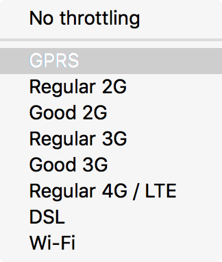

==========
Throttling
==========

The network monitor allows you to throttle your network speed to emulate various connection speeds so you can see how your app will behave under different connection types.

Throttling
**********

The toolbar includes a Throttling dropdown, which allows you to throttle your network speed to emulate various different network speed conditions. Choose an option from the menu, and it will persist across reloads.

The characteristics emulated are:

- Download speed
- Upload speed
- Minimum latency

The table below lists the numbers associated with each network type, but please do not rely on this feature for exact performance measurements; it's intended to give an approximate idea of the user experience in different conditions. The speeds are expressed in multiples of bits per second.

.. csv-table::
  :header: "Selection", "Download speed", "Upload speed", "Minimum latency"
  :widths: auto

  GPRS, 50 Kbps, 20 Kbps, 500
  Regular 2G, 250 Kbps, 50 Kbps, 300
  Good 2G, 450 Kbps, 150 Kbps, 150
  Regular 3G, 750 Kbps, 250 Kbps, 100
  Good 3G, 1.5 Mbps, 750 Kbps, 40
  Regular 4G/LTE, 4 Mbps, 3 Mbps, 20
  DSL, 2 Mbps, 1 Mbps, 5
  Wi-Fi, 30 Mbps, 15 Mbps, 2
  Offline, 0 Mbps, 0 Mbps, 5

Network Monitor Features
************************

The following articles cover different aspects of using the network monitor:

- :doc:`Toolbar <../toolbar/index>`
- :doc:`Network request list <../request_list/index>`
- :doc:`Network request details <../request_details/index>`
- :doc:`Network traffic recording <../recording/index/>`
- :doc:`Performance analysis <../performance_analysis/index>`
