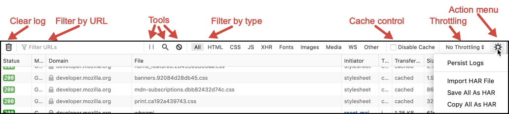

=======================
Network monitor toolbar
=======================

The network monitor provides two toolbar areas, one above the main section, and another below.

Toolbar
*******

The toolbar is at the top of the main network monitor window. (Prior to Firefox 77, this toolbar was arranged somewhat differently.)



It provides:

- An icon to clear the :doc:`network request list <../request_list/index>`
- A box enabling you to :ref:`filter requests <request-list-filtering-requests>` by URL and by properties.
- A set of tool icons:

  - Pause (or **resume**) recording network log
  - **Search** the log
  - **Request Blocking**

- An array of buttons to filter the network request list by type:

  - by the content type of the response
  - XHR requests
  - WebSocket upgrades and messages (labeled **WS**)
  - Other requests

- A checkbox that allows you to disable caching.
- **Throttling** menu, to simulate various connection types
- A menu of other actions:

  - **Persist Logs**: By default, the Network Monitor is cleared each time you navigate to a new page or reload the current page. When you select **Persist Logs**, the log is not cleared on page load.
  - **Import HAR** imports a HAR (HTTP Archive) file.
  - **Save All as HAR** opens a file dialog box so you can save the current contents of the Network log as a HAR file with the extension ```.har```.
  - **Copy All as HAR** copies the current contents of the Network log to the clipboard in HAR format.

A second toolbar area at the bottom of the network monitor provides:


- An icon to launch :doc:`performance analysis <../performance_analysis/index>`.
- A summary of this page, including the number of requests, total size, and total time.


Network Monitor features
************************

The following articles cover different aspects of using the network monitor:

- :doc:`Network request list <../request_list/index>`
- :doc:`Network request details <../request_details/index>`
- :doc:`Network traffic recording <../recording/index/>`
- :doc:`Performance analysis <../performance_analysis/index>`
- :doc:`Throttling <../throttling/index>`
