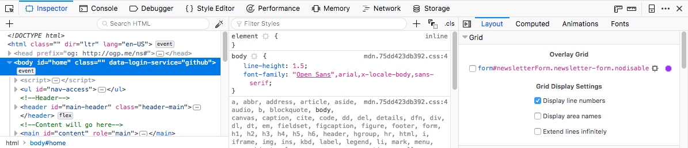
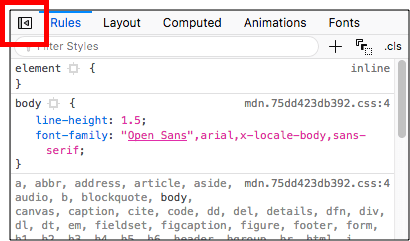
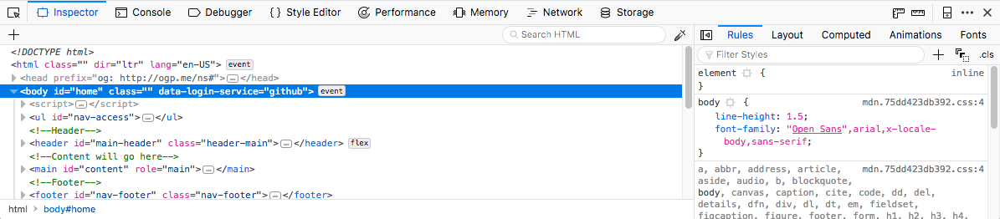

==========================
Page inspector 3-pane mode
==========================

This article explains how to use the Page Inspector's 3-pane mode.

Feature summary
***************

From Firefox 62 onwards, the :doc:`Page Inspector <../index>` has a new mode available — **3-Pane mode**. When activated, this allows you to see the following simultaneously:

- The :doc:`HTML pane <../how_to/examine_and_edit_html/index>` on the left hand side, as usual.

- The :ref:`CSS Rules <page-inspector-how-to-examine-and-edit-css-examine-css-rules>` in the middle in their own separate pane, rather than as a tab.

- The other CSS related features — such as :ref:`Computed styles view <page_inspector_how_to_examine_and_edit_css_examine_computed_css>`, :doc:`Animations view <../how_to/work_with_animations/index>`, and :doc:`Fonts view <../how_to/edit_fonts/index>` — in tabs on the right hand side, as usual.

.. note::

  At narrower browser window widths, the tabs appear below the CSS Rules pane.

Having the CSS Rules in their own pane is very useful because it allows you to not only inspect your HTML and edit the CSS applied to it, but also see the effect this has on CSS features such as computed styles and grids in real time. You just need to have the relevant tab open to see the effect.

A brief walkthrough
*******************

The 3-pane inspector is disabled by default. It is enabled via a toggle control found in the tabs pane on the left hand side.

Press the toggle control to toggle between the 2- and 3-pane views.

With the 3-pane mode enabled, you can observe live changes in CSS features as you edit the rules applied to the page. For example, you could edit a `CSS Grid <https://developer.mozilla.org/en-US/docs/Web/CSS/CSS_Grid_Layout>`_ property and observe the change immediately in the :doc:`Grid Inspector <../how_to/examine_grid_layouts/index>`.

.. raw:: html

  <iframe width="560" height="315" src="https://www.youtube.com/embed/ELS2OOUvxIw" title="YouTube video player" frameborder="0" allow="accelerometer; autoplay; clipboard-write; encrypted-media; gyroscope; picture-in-picture" allowfullscreen></iframe>
   
   

Enabling the 3-pane inspector pre-Firefox 62
********************************************

In earlier versions of Firefox (since Firefox 59/60), you can enable 3 pane mode in Release/Beta by going to about:config and flipping the following prefs to ``true``:

``devtools.inspector.split-rule-enabled`` — this switches 3-pane mode on and off.

``devtools.inspector.split-sidebar-toggle`` — this adds the UI toggle button that lets you toggle it on and off.

In Firefox 61, these preferences got renamed to:

- ``devtools.inspector.three-pane-enabled``
- ``devtools.inspector.three-pane-toggle``

You need to flip these two to ``true`` in Release/Beta to test the feature in Firefox 61.

.. note::

  The 3-pane inspector is already enabled in Nightly/Developer edition before Firefox 62.
