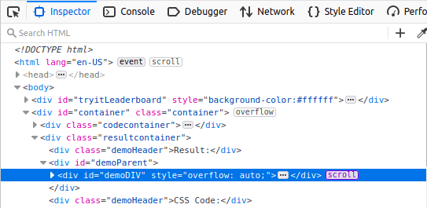
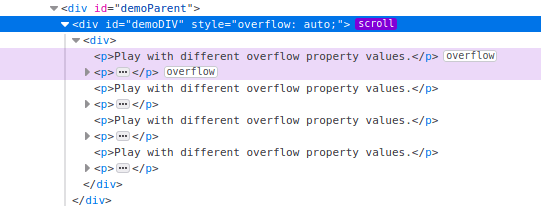
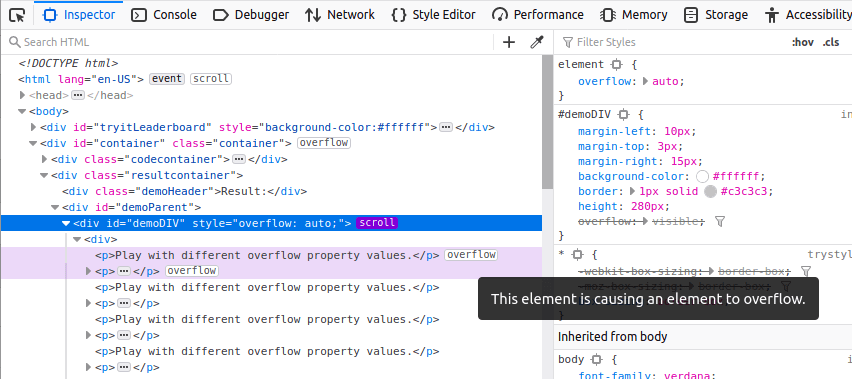

=========================
Debug scrollable overflow
=========================

A `scroll container <https://developer.mozilla.org/en-US/docs/Glossary/Scroll_container>`_ is created by applying `overflow: scroll <https://developer.mozilla.org/en-US/docs/Web/CSS/overflow>`_ to a container, or `overflow: auto <https://developer.mozilla.org/en-US/docs/Web/CSS/overflow>`_ when there is enough content to cause overflow. The Firefox DevTools make it easy to discover both scrollable elements and any elements that are causing overflow.

In the :ref:`HTML Pane <page_inspector_ui_tour_html_pane>`, ascrollable element has the ``scroll`` badge next to it, as shown in the following image:

You can toggle the ``scroll`` badge to highlight elements causing an overflow, expanding nodes as needed to make the nodes visible:

You will also see an ``overflow`` badge next to the node causing the overflow.

