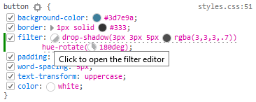
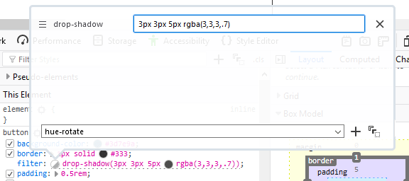
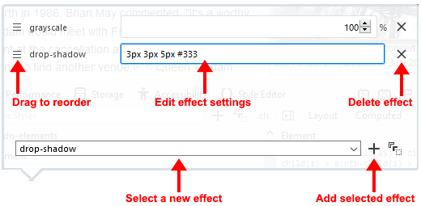
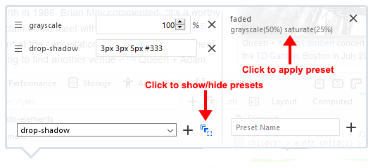

================
Edit CSS filters
================

`CSS filter <https://developer.mozilla.org/en-US/docs/Web/CSS/filter>`_ properties in the :ref:`Rules view <page_inspector_ui_tour_rules_view>` have a circular gray and white swatch next to them:

Clicking the swatch opens a filter editor:

The filter editor lists each of the effects performed by that filter on a separate line. You can edit these lines, remove them individually, or drag the effects to change the order in which they are applied.

You can also add new effects by selecting an effect from the dropdown list at the bottom of the dialog. Once you have selected the effect you want to add, click the plus sign (+) to the right of the dropdown list.

Once you have added an effect, enter the settings you want and then press :kbd:`Enter` to update the effect. The change will be apparent as soon as you press :kbd:`Enter`.

Saving filter presets
*********************

From Firefox 42 onwards, you can also add filters to a list of presets. The list of presets will be preserved between browser sessions, making it easy to apply the settings in the future. You can save the current filter to the preset list:

1. Click to edit the filter, display the preset list by clicking the icon as shown below.
2. Type a name for your preset, and then click the plus sign to add it to the list of presets.

You can then apply saved filters to new elements. To apply one of your saved presets, click its name in the list.
