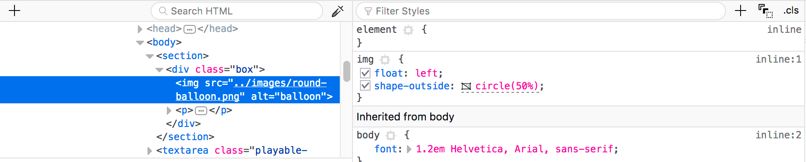
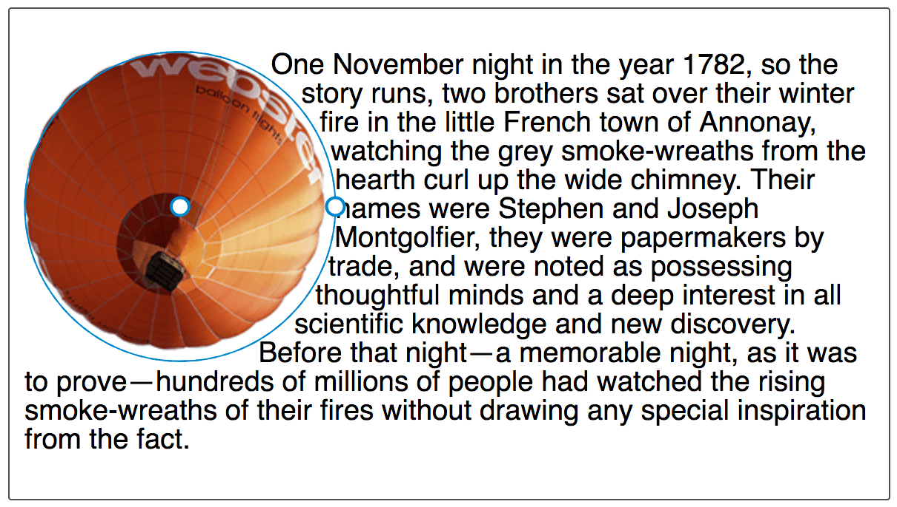
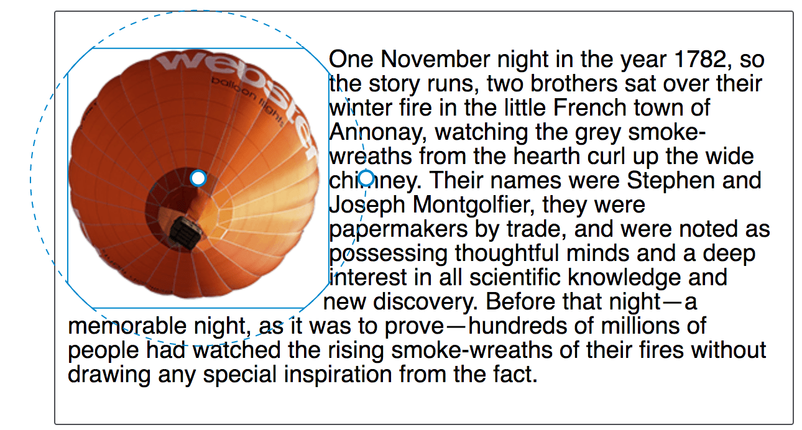
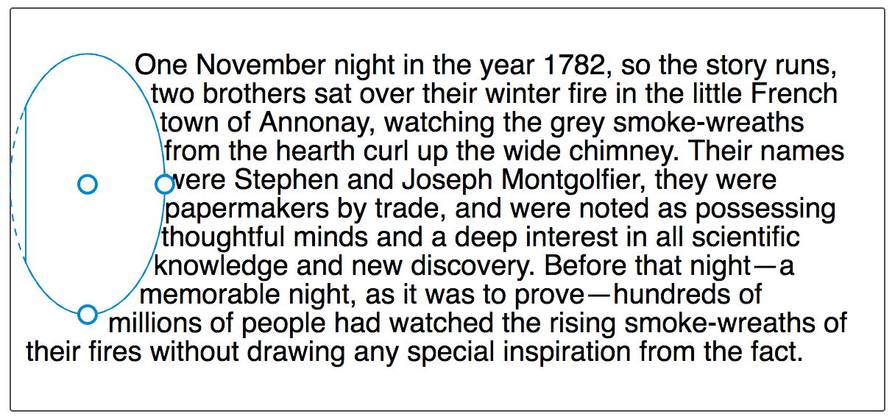
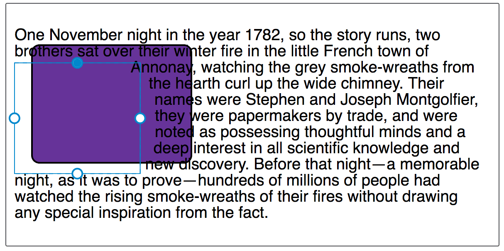
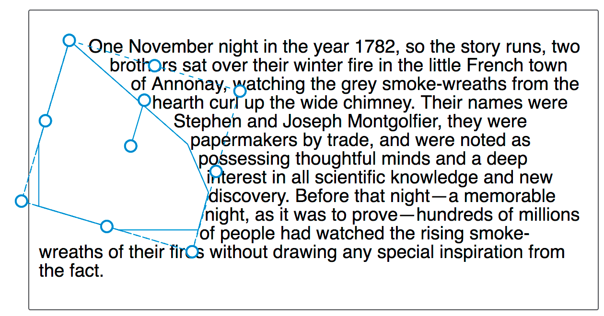
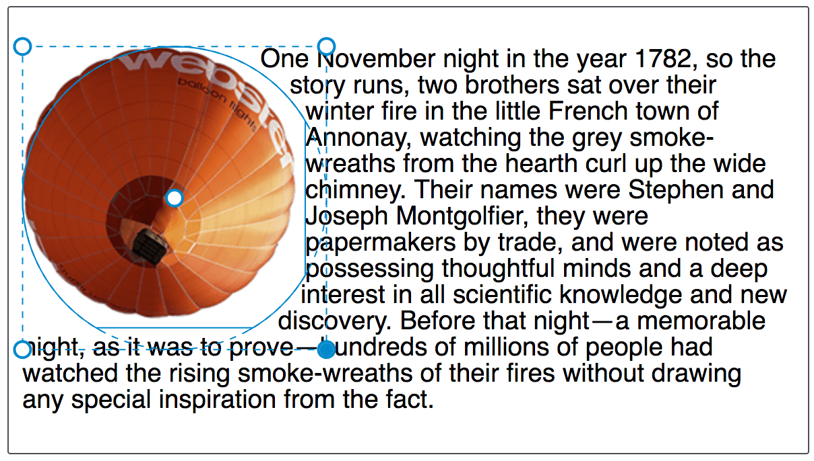

=======================
Edit Shape Paths in CSS
=======================

The Shape Path Editor is a tool that helps you see and edit shapes created using `clip-path <https://developer.mozilla.org/en-US/docs/Web/CSS/clip-path>`_ and also the CSS `shape-outside <https://developer.mozilla.org/en-US/docs/Web/CSS/shape-outside>`_ property and `<basic-shape> <https://developer.mozilla.org/en-US/docs/Web/CSS/basic-shape>`_ values. This guide walks you through all of the available options.

Activate / deactivate the Shape Path Editor
*******************************************

The Shape Path Editor is accessed via the CSS Rules Panel, which can be opened as described in the guide to :doc:`Opening the Inspector <../open_the_inspector/index>`. Once you have selected your element, you should see the shape icon alongside any valid value, e.g. one for ``shape-outside``.

Clicking the icon will cause the Editor to highlight the shape.

To deactivate the Shape Path Editor click on the icon again, or select another element or a different editor. Note that the Shape Path Editor does not persist between page reloads — if you reload your page you will need to select the element again.

Understanding the lines drawn by the editor
*******************************************

Once you have selected a shape on your page, the Shape Path Editor will draw lines to help you understand the path that is being created.

- **A solid line** shows the outline of the shape that is wrapping the text. This is your shape. If the shape is clipped by the margin box then the margin box will make up part of this line.
- **A dashed line** demonstrates the outline of the shape which extends past the margin box reference; this is the area that will be clipped by the margin box. To understand the margin box, and other boxes used by CSS Shapes see our guide to `Shapes from box values <https://developer.mozilla.org/en-US/docs/Web/CSS/CSS_Shapes/From_box_values>`_.

Editing Basic Shapes
********************

The options given to you by the tool will differ depending on the type of basic shape that you are editing. Options can be accessed by activating the Shape Path Editor with a regular click on the icon, and you can use the context menu (:kbd:`Ctrl`/:kbd:`Cmd` + click) to access additional functionality.

circle()
--------

If the value of ``shape-outside`` is ``circle()``, you are creating a `circle basic shape <https://developer.mozilla.org/en-US/docs/Web/CSS/CSS_Shapes/Basic_Shapes#circle()>`_. Clicking on the shapes icon next to the value of ``circle()`` will highlight the shape, and also give you the option to resize the circle or move its center. If you move or resize the circle past the margin box, the edges become clipped by it.

In the Rules Panel you can see the values for ``circle()`` change as you edit the shape. You can then copy these values back into your stylesheet to create the new, tweaked shape path.

ellipse()
---------

If the value of ``shape-outside`` is ``ellipse()`` then you are using the `ellipse basic shape <https://developer.mozilla.org/en-US/docs/Web/CSS/CSS_Shapes/Basic_Shapes#ellipse()>`_. The ``ellipse()`` value works in much the same way as ``circle()`` in the Shape Path Editor. An ellipse is a squashed circle and therefore has the option to resize horizontally and vertically when you click on the shapes icon.

inset()
-------

If the value of ``shape-outside`` is ``inset()`` then you are using the `inset basic shape <https://developer.mozilla.org/en-US/docs/Web/CSS/CSS_Shapes/Basic_Shapes#inset()>`_, which enables the creation of offset values pulling the content in from the margin box.

Each side of the rectangle can be targeted after clicking on the shapes icon to activate the Shape Path Editor, and dragging each side will update the values for the top, right, bottom, and left offset values.

polygon()
---------

If the value of ``shape-outside`` is ``polygon()`` then you are using the `polygon basic shape <https://developer.mozilla.org/en-US/docs/Web/CSS/CSS_Shapes/Basic_Shapes#polygon()>`_. This is the most complex of the basic shape values, therefore the tool gives you more options when editing these:

- Clicking on the shapes icon will activate the Shapes Path Editor and give you the option to move any of the points of your polygon shape.
- Double-click anywhere on a line of the shape and you will get a new point to adjust.
- Double click on an existing point and it will be removed. *Remember that a polygon needs at least three points*.

Moving and scaling shapes
-------------------------

There is extra functionality available on the shape highlight — if you :kbd:`Ctrl`/:kbd:`Cmd` + click on the shapes icon for your shape the highlight will change, instead providing the ability to scale and/or move it. Once again, clipping will occur if you exceed the bounds of the margin box.

If your shape is a polygon, you also get the ability to rotate it around an axis.

Browser support
***************

The Shape Path Editor currently works for shapes generated via `clip-path <https://developer.mozilla.org/en-US/docs/Web/CSS/clip-path>`_; it will also work for shapes generated via `shape-outside <https://developer.mozilla.org/en-US/docs/Web/CSS/shape-outside>`_ as of Firefox 62.
