==========
Edit fonts
==========

This article provides a tour of the Font tools available in the Firefox DevTools. This tool contains several useful features for viewing and manipulating fonts applied to any document loaded in the browser including inspection of all fonts applied to the page, and precise adjustment of variable font axis values.

.. note::

  The updated Font tools as shown in this article are available in Firefox 63 onwards; if you are using an older version of Firefox the tools will not look or behave quite the same, but they will be similar (most notably the Font Editor will not be available).

The Fonts tab
*************

The Fonts tab is located on the right-hand side of the :doc:`Page Inspector <../../index>` when it is docked to the bottom of the screen. When it is docked to the right or left sides of the screen, the Fonts tab appears beneath the HTML pane. To access it:

1. :doc:`Open the Page Inspector <../open_the_inspector/index>`.
2. Select the Fonts tab; the last of the tabs shown in the right-hand side of the CSS pane.

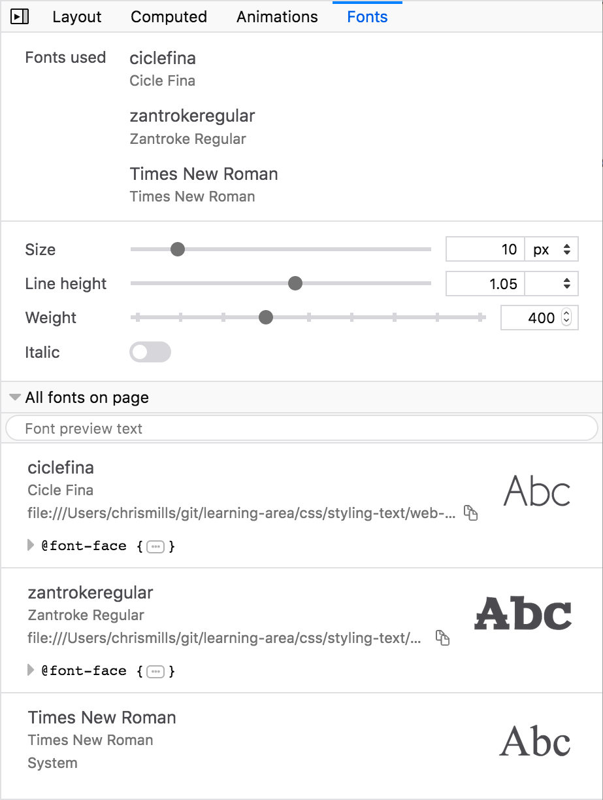

The Fonts tab has three major sections:

- "Fonts used" by the currently inspected element.
- The new Fonts Editor. In Firefox 61 and 62, this section does not exist.
- "All fonts on page" — This section lists all of the fonts in use on the page. In Firefox 61 and 62, this area is labeled "Other fonts in page" and doesn't include the fonts mentioned in the "Fonts used" section.

Fonts used
**********

The top section of the Font Editor shows the fonts used by the currently inspected element, grouped by font family.

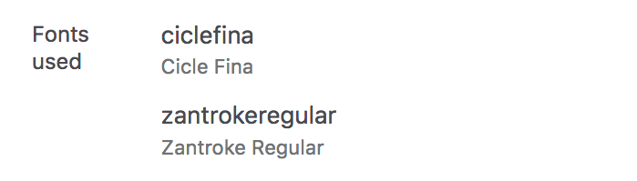

Fonts are considered "used" when there is text content in the inspected element that has the font applied to it. Empty elements will not have any fonts used and will display the message "No fonts were found for the current element."

Fonts will be included in this section for one of the following reasons:

- They are listed in the element's ``font-family`` CSS declaration value.
- They are applied to the element as part of the browser's default styling (Times New Roman for most browsers), and no author-defined font has been supplied.
- They are used by a descendant of the inspected element, for example, when it is a container for other elements which have text content with fonts applied.
- They are system fallback fonts used when nothing from the ``font-family`` CSS declaration has been applied.

Fonts Editor
************

Firefox 63 adds the Font Editor — a new area below "Fonts used" with additional controls for editing the fonts’ characteristics.

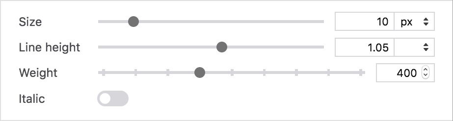

For standard (static) fonts, you will be able to change the settings listed below

Size
----

The `font-size <https://developer.mozilla.org/en-US/docs/Web/CSS/font-size>`_ for the inspected element.

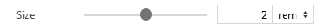

This can be set using ``em``, ``rem``, ``%``, ``px``, ``vh``, or ``vw`` units. You can select values using the slider or enter a numeric value directly into the text box.

.. note::
  If you want to use a different unit such as ``pt`` for ``font-size`` or ``line-height``, you can set the property value applied to the currently inspected element to use that unit via the :ref:`rules view <page_inspector_ui_tour_rules_view>`, and the font editor will automatically pick it up and make it available in the associated units dropdown menu.

Changing the unit of measure converts the numerical value to its equivalent in the new unit, so the same computed value is maintained.

Example: If ``1rem`` is equivalent to 10 pixels, when you change the unit of measurement from ``rem`` to ``px``, ``2rem`` becomes ``20px``.

Line height
-----------

The `line-height <https://developer.mozilla.org/en-US/docs/Web/CSS/line-height>`_ of the inspected element.

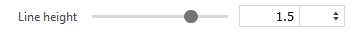

This can be set using unitless, ``em``, *%*, or ``px`` units. You can select values using the slider or enter a numeric value directly into the text box.

Changing the unit of measure changes the value relative to the ``font-size`` setting.

Example: If the font is 20 pixels high and the line-height is ``1.5em``, when you change the unit of measure from ``em`` to ``px``, the value will become ``30px``.

Weight
------

The `font-weight <https://developer.mozilla.org/en-US/docs/Web/CSS/font-weight>`_ for the inspected element.

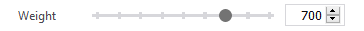

You can select values using the slider or enter a numeric value directly into the text box. For non-variable fonts the slider ranges from 100 to 900 in increments of 100.

.. note::
  For `variable fonts <https://developer.mozilla.org/en-US/docs/Web/CSS/CSS_Fonts/Variable_Fonts_Guide>`_ (see below) that define a ``wght`` variation axis, this range is custom.

Italic
------

The `font-style <https://developer.mozilla.org/en-US/docs/Web/CSS/font-style>`_ for the inspected element.

This setting toggles between ``italic`` and ``normal`` values for the ``font-style`` CSS property.

.. note::

  As you change settings, Firefox applies inline styles to the element to make the changes instantly visible on the page.

All fonts on page
*****************

The remaining area, at the bottom of the Fonts tab, shows an expandable list of all of the fonts in use on the page.

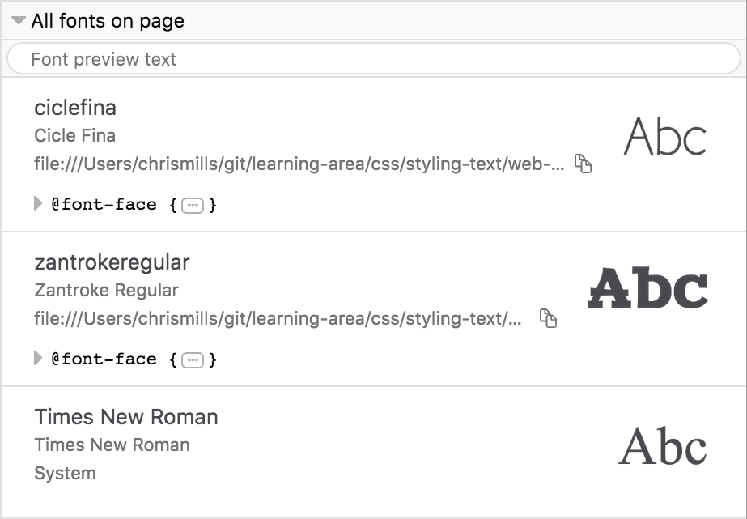

The list is useful because you can easily determine whether a font is a web font or a font hosted on your system.

Each font listed in this section shows you:

- The ``font-family`` identifier and full name of the font.
- The URL to the font file in the case of web fonts not available on your system, or "System" in the case of fonts loaded from your computer (either default system fonts, or web fonts that you've also got installed on your system). You can copy the URL to the font file by clicking on the icon to the right of the URL.
- The `@font-face <https://developer.mozilla.org/en-US/docs/Web/CSS/@font-face>`_ descriptor that loads the font into the page, in the case of web fonts. The descriptor is expandable — when opened it shows its full syntax as defined in the stylesheet.
- A text sample, to give you an idea of what the font looks like when rendered. The default text for the sample is "Abc" but the preview text can be edited by clicking on the input field at the top of the section and entering a new value. Once entered, all of the sample text will be set to the same custom value.

Variable font support in Firefox Developer Tools
************************************************

Firefox 62 added support for variable fonts and Firefox 63 features support for editing the properties of variable fonts in the Font Editor.

What are variable fonts?
------------------------

`Variable Fonts <https://developer.mozilla.org/en-US/docs/Web/CSS/CSS_Fonts/Variable_Fonts_Guide>`_, or **OpenType Font Variations**, define a new font file format that allows the font designer to include multiple variations of a typeface inside a single font file. That means you no longer have to apply several different web fonts to a single page to represent a complete typeface for which a variable font is available, provided it includes the desired values for the different characteristics you want to vary.

Variable fonts make it easy to vary font characteristics in a much more granular fashion because their allowable ranges are defined by **axes of variation** (see `Introducing the 'variation axis' <https://developer.mozilla.org/en-US/docs/Web/CSS/CSS_Fonts/Variable_Fonts_Guide#introducing_the_'variation_axis'>`_ for more information). For example, `font-weight <https://developer.mozilla.org/en-US/docs/Web/CSS/font-weight>`_ can be set to any value between 1 and 1000 in variable fonts (although it is not guaranteed that a variable font will support this entire range).

There are several registered axes. Although it isn't required that these axes be defined for every font, if the font designer *does* implement a registered axis, its behavior *must* follow the defined behavior.

All variable font axes have a four-character axis tag. The CSS `font-variation-settings <https://developer.mozilla.org/en-US/docs/Web/CSS/font-variation-settings>`_ property uses the tag as part of the key-value pair. For example, to set `font-weight <https://developer.mozilla.org/en-US/docs/Web/CSS/font-weight>`_ using ``font-variation-settings``, you could do something like this:

.. code-block:: css

  font-variation-settings: "wght" 350;

However, you should only use ``font-variation-settings`` as a last resort if there is no basic font property available for setting those characteristic values (e.g. custom axes).

.. note::
  Font characteristics set using ``font-variation-settings`` will always override those set using the corresponding basic font properties, e.g. ``font-weight``, no matter where they appear in the cascade.

Here are the registered axes along with their corresponding CSS properties:

.. list-table::
  :widths: 40 60
  :header-rows: 1

  * - Axis Tab
    - CSS Property

  * - "wght"
    - `font-weight <https://developer.mozilla.org/en-US/docs/Web/CSS/font-weight>`_

  * - "wdth"
    - `font-stretch <https://developer.mozilla.org/en-US/docs/Web/CSS/font-stretch>`_

  * - "slnt" (slant)
    - `font-style <https://developer.mozilla.org/en-US/docs/Web/CSS/font-style>`_: ``oblique + angle``

  * - "ital"
    - `font-style <https://developer.mozilla.org/en-US/docs/Web/CSS/font-style>`_: ``italic``

  * - "opsz"
    - `font-optical-sizing <https://developer.mozilla.org/en-US/docs/Web/CSS/font-optical-sizing>`_

Any axis that is not on the list of registered axes is considered a custom axis. Custom axes do not have corresponding CSS font properties. Font designers can define whatever axis they want; each one needs to be given a unique four-character tag. The axis name and its range is up to the font designer.

.. note::
  Registered axis tags are identified using lower-case tags, whereas custom axes should be given upper-case tags. Note that font designers aren't forced follow this practice in any way, and some won't. The important takeaway here is that axis tags are case-sensitive.

.. warning::
  In order to use variable fonts, you need to make sure that your operating system is up to date. For example Linux OSes need the latest Linux Freetype version, and macOS prior to 10.13 does not support variable fonts. If your operating system is not up to date, you will not be able to use variable fonts in web pages or the Firefox Developer Tools.

Working with Variable fonts in the Font Editor
~~~~~~~~~~~~~~~~~~~~~~~~~~~~~~~~~~~~~~~~~~~~~~

If the inspected element uses a variable font, the Fonts tab shows the axes that have been implemented for that particular font, providing control to alter the value of each one. This is very useful for quickly finding out what axes are available in a particular font — they can vary quite dramatically as font designers can implement basically anything they like.

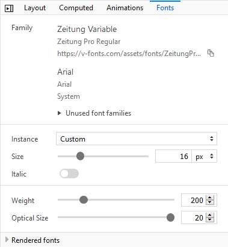

You can adjust the axes individually or, if the font designer has included defined instances, you can select one from the "Instance" drop-down list and view the updates live on your page.

Here are a couple of examples of fonts with different axes defined:

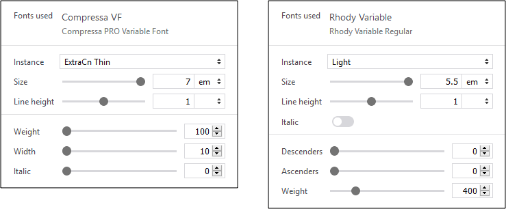

In the following example, you can see that the font "Cheee Variable" includes settings for Yeast and Gravity. These are custom axes defined by the font designer.

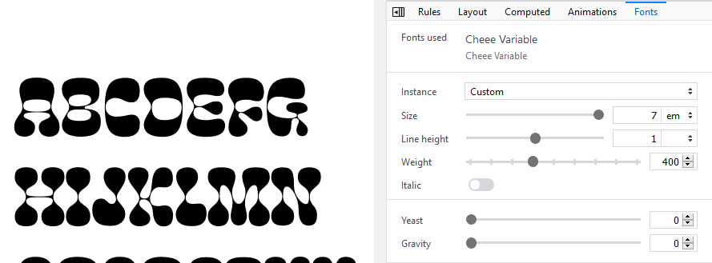

The first image shows the font as it is used on the page with default settings. The second image shows the same font after selecting the "Hi Yeast Hi Gravity" variation.

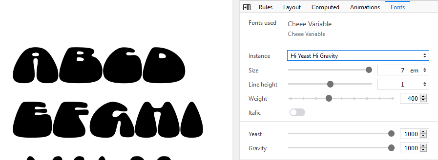

Tips
****

Finally, here are a few tips for making effective use of the Fonts tab:

- When using the Page Inspector's :doc:`3-pane mode <../../3-pane_mode/index>`, you can view the CSS rules for the inspected element simultaneously alongside the Fonts tab.
- If you hover over the `font-family <https://developer.mozilla.org/en-US/docs/Web/CSS/font-family>`_ property in the Rules view, a tooltip shows a sample of the font:

  .. image:: fonts_62_tooltip_cropped.png
    :class: border

- You'll also notice in the above screenshot that the font in the ``font-family`` font stack that is actually applied to the inspected element is underlined. This makes it easy to see exactly what is being applied where, when font stacks are specified.
