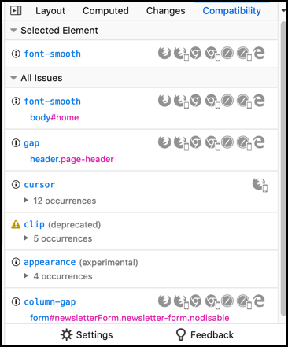
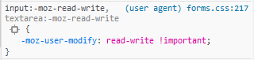
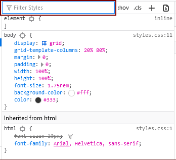
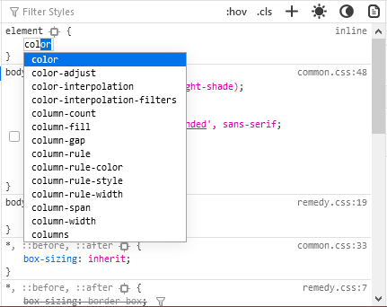
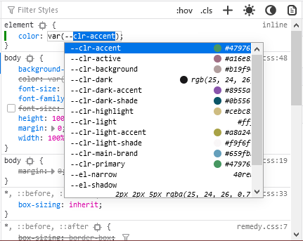
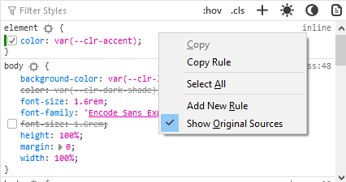
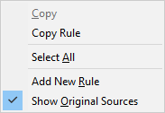

====================
Examine and edit CSS
====================

You can examine and edit CSS in the Inspector's :ref:`CSS pane <page_inspector_ui_tour_rules_view>`.

.. _page-inspector-how-to-examine-and-edit-css-examine-css-rules:

Examine CSS rules
*****************

The :ref:`Rules view <page_inspector_ui_tour_rules_view>` lists all the rules that apply to the selected element, ordered from most-specific to least-specific:

.. image:: rules_view_ff_87.png
  :alt: Rules view panel as of Firefox 87
  :class: border

The six buttons on the right top of the rules view allow you to change the display of certain CSS and rules view features. You can:

- :ref:`toggle pseudo-classes <page-inspector-how-to-examine-and-edit-css-viewing-common-pseudo-classes>`;
- :ref:`toggle classes <page-inspector-how-to-examine-and-edit-css-viewing-and-changing-classes-on-an-element>`
- add a new rule;
- change the display based on :ref:`prefers-color-scheme media rules <page-inspector-view-media-rules-for-prefers-color-scheme>`.
- change the display based on :ref:`print media rules <page-inspector-view-media-rules-for-print>`.

.. image:: rules_view_buttons_fx_72.png
  :alt: Toolbar buttons of the Rules view, as of Fx 72
  :class: center

Invalid value warnings
----------------------

A warning icon appears next to unsupported CSS properties or rules that have invalid values. This can help you understand why certain styles are not being applied. In the following example, a spelling error, "background-colour" instead of "background-color" has made the rule invalid:

.. image:: invalid_property.png
  :class: border

Browser compat warnings
-----------------------

CSS properties have varied level of support across different browsers. From Firefox 81, compatibility tooltips may be displayed next to any CSS properties that have known compatibility issues,as shown below.

.. image:: firefox_compatibility_tootips.jpg
  :alt: Tooltip displayed next to CSS element. Hover to find out browsers with compatibility issues.
  :class: center

The tooltips, which arepopulated from the MDN `browser compatibility project <https://github.com/mdn/browser-compat-data>`_, identify the *reason* for the incompatibility (not supported, deprecated, experimental etc.), display icons for incompatible browsers, and provide a link to the associated property page for more information.

CSS Compatibility
-----------------

In addition to compatibility tooltips, the *CSS Compatibility View* shows any CSS compatibility issues for both the selected element and for the current page (as a whole).

For more information see: :ref:`Page Inspector > CSS Compatibility View <page_inspector_ui_tour_compatibility_view>`.

Rule display
------------

It displays each rule as in a stylesheet, with a list of selectors followed by a list of ``property:value;`` declarations.

.. image:: rules_pane.png
  :class: center

- *Highlight matched elements*: next to the selector is a target icon: click this to highlight all nodes in the page that match this selector.
- *Overridden declaration*: declarations that are overridden by later rules are crossed out. See :ref:`overridden declarations <page-inspector-how-to-examine-and-edit-css-overridden-declarations>`.
- *Inactive rules* (not shown): if a rule is inactive (e.g., ``padding`` on a ``:visited`` pseudo-element), it is colored gray, with an info icon that gives more information when clicked.
- *Filter rules containing this property*: next to overridden declarations is an icon you can click to filter the rules list to show only those rules that include that property. See :ref:`overridden declarations <page-inspector-how-to-examine-and-edit-css-overridden-declarations>`.
- *Enable/disable*: if you hover over a declaration, a checkbox appears next to it: you can use this to toggle the declaration on or off.
- *Filename and line number*: on the right-hand side is a link to the rule. See :ref:`link to CSS file <page-inspector-how-to-examine-and-edit-css-link-to-css-file>`.

.. |image1| image:: screen_shot_2016-12-16_at_10.51.15_am.png
  :width: 20

If the element has a `display: grid <https://developer.mozilla.org/en-US/docs/Web/CSS/display>`_ declaration, then it gets a grid icon next to it, like this: |image1|. Click that icon to display the grid overlaid on the page, including grid lines and tracks. See :doc:`Examine grid layouts <../examine_grid_layouts/index>` for more on this.

To view `user-agent styles <https://developer.mozilla.org/en-US/docs/Web/CSS/Cascade>`_ (*i.e.,* browser-default CSS rules), enable "Inspector > Show Browser Styles" under the :doc:`developer tool settings <../../../settings/index>` panel. (Note that this setting is independent of the "Browser styles" checkbox in the :ref:`Computed view <page_inspector_how_to_examine_and_edit_css_examine_computed_css>`.)

User-agent styles are displayed against a different background, and the link to the filename and line number contains the prefix ``(user agent)``:

.. _page_inspector_how_to_examine_and_edit_css_element_rule:

element {} rule
---------------

The ``element {}`` rule at the top of the rules list isn't actually a CSS rule. It represents the CSS properties assigned to the element via its `style <https://developer.mozilla.org/en-US/docs/Web/HTML/Global_attributes#attr-style>`_ attribute.

This also gets the target icon: |image2|, giving you a convenient way to highlight the currently selected element in the page.

Filtering rules
---------------

There's a box at the top of the Rules view labeled "Filter Styles":

As you type:

- any rules which don't contain the typed string at all are hidden
- any declarations which contain the typed string are highlighted

.. image:: filtered_rules.png
  :class: border

Click the "X" at the end of the search box to remove the filter.

.. note::
  While in the Rules view, you can press :kbd:`Ctrl` / :kbd:`Cmd` + :kbd:`F` to focus the search field. Once you've typed in a filter, you can press :kbd:`Esc` to remove it again.

.. raw:: html

  <iframe width="560" height="315" src="https://www.youtube.com/embed/9w8vDIWqnAE" title="YouTube video player" frameborder="0" allow="accelerometer; autoplay; clipboard-write; encrypted-media; gyroscope; picture-in-picture" allowfullscreen></iframe>
   
   

Strict search
~~~~~~~~~~~~~

By default, the search box highlights all declarations which contain any part of the string. For example, searching for "color" will highlight declarations containing `border-bottom-color <https://developer.mozilla.org/en-US/docs/Web/CSS/border-bottom-color>`_ and `background-color <https://developer.mozilla.org/en-US/docs/Web/CSS/background-color>`_ as well as just `color <https://developer.mozilla.org/en-US/docs/Web/CSS/color>`_:

.. image:: filter_rules_2.png
  :class: border

If you enclose the search query in backticks, like this: `color`, the search is restricted to exact matches:

Expanding shorthand properties
------------------------------

`Shorthand properties <https://developer.mozilla.org/en-US/docs/Web/CSS/Shorthand_properties>`_ can be expanded to display their related longhand properties by clicking the arrow besides them.

Displaying pseudo-elements
--------------------------

The Rule view displays the following `pseudo-elements <https://developer.mozilla.org/en-US/docs/Web/CSS/Pseudo-elements>`_, if they are applied to the selected element:

- ``::after``
- ``::backdrop``
- ``::before``
- ``::first-letter``
- ``::first-line``
- ``::selection``
- ``:-moz-color-swatch``
- ``:-moz-number-spin-box``
- ``:-moz-number-spin-down``
- ``:-moz-number-spin-up``
- ``:-moz-number-text``
- ``:-moz-number-wrapper``
- ``:-moz-placeholder``
- ``:-moz-progress-bar``
- ``:-moz-range-progress``
- ``:-moz-range-thumb``
- ``:-moz-range-track``
- ``:-moz-selection``

If the selected element has pseudo-elements applied to it, they are displayed before the selected element but hidden by a disclosure triangle:

Clicking the triangle displays them:

.. image:: pseudo-elements_displayed.png
  :class: border

.. _page-inspector-how-to-examine-and-edit-css-viewing-common-pseudo-classes:

Viewing common pseudo-classes
-----------------------------

There's a button to the right of the filter box:

.. image:: show_pseudo_classes.png
  :class: border

Click the button to see checkboxes that you can use to enable the `:hover <https://developer.mozilla.org/en-US/docs/Web/CSS/:hover>`_, `:active <https://developer.mozilla.org/en-US/docs/Web/CSS/:active>`_ and `:focus <https://developer.mozilla.org/en-US/docs/Web/CSS/:focus>`_, `:focus-within <https://developer.mozilla.org/en-US/docs/Web/CSS/:focus-within>`_, `:focus-visible <https://developer.mozilla.org/en-US/docs/Web/CSS/:focus-visible>`_, `:visited <https://developer.mozilla.org/en-US/docs/Web/CSS/:visited>`_, and `:target <https://developer.mozilla.org/en-US/docs/Web/CSS/:target>`_ pseudo-classes for the selected element:

This feature can also be accessed from the :ref:`popup menu in the HTML view <page-inspector-how-to-element-popup-context-menu>`

If you enable one of these pseudo-classes for a node, an orange dot appears in the markup view next to all nodes to which the pseudo-class has been applied. In addition, the information that appears on the page itself show you what pseudo-class you are examining. For example:

.. image:: hover_indicators.png
  :class: border

.. _page-inspector-how-to-examine-and-edit-css-viewing-and-changing-classes-on-an-element:

Viewing and changing classes on an element
------------------------------------------

With an element selected in the HTML pane, you can click the **.cls** button in the Rules pane toolbar, to display the classes defined on that element.

- You can clear the checkbox for a particular class name, to see how the element would appear without that class applied to it.
- You can add a class to the element by typing a name in the *Add new class* field below the Rules toolbar. From Firefox 81, autocompletions based on existing classes are suggested as you type.

.. _page-inspector-how-to-examine-and-edit-css-link-to-css-file:

Link to CSS file
----------------

At the top right of each rule, the source filename and line number is displayed as a link: clicking it opens the file in the :doc:`Style Editor <../../../style_editor/index>`.

You can copy the location of the source file: right-click the link and select "Copy Location".

The Inspector understands CSS source maps. That means that if you are using a CSS preprocessor that has support for source maps, and you've enabled source map support in the :ref:`Style Editor settings <settings-style-editor>`, then the link will take you to the original source, not the generated CSS. Read more about CSS source map support in the :ref:`Style Editor documentation <style-editor-source-map-support>`.

.. _page-inspector-how-to-examine-and-edit-css-overridden-declarations:

Overridden declarations
-----------------------

If a CSS declaration is overridden by some other CSS rule with a greater weight, then the declaration is shown with a line through it.

Overridden declarations have a funnel next to them. Click the funnel to filter the rule view to show only the rules applying to the current node that try to set the same property: that is, the complete cascade for the given property.

This makes it easy to see which rule is overriding the declaration

.. _page-inspector-view-media-rules-for-print:

View @media rules for Print
---------------------------

You can toggle the display into a mode that emulates @media rules for print.

.. raw:: html

  <iframe width="560" height="315" src="https://www.youtube.com/embed/AEmq9hNDOGU" title="YouTube video player" frameborder="0" allow="accelerometer; autoplay; clipboard-write; encrypted-media; gyroscope; picture-in-picture" allowfullscreen></iframe>
   
   

When on, any rules defined for printing the page will be displayed similar to the "Print Preview" mode that many word processing applications provide.

.. _page-inspector-view-media-rules-for-prefers-color-scheme:

View @media rules for prefers-color-scheme
------------------------------------------

The color scheme simulator buttons can be used to test the rendering of styles based on the `prefers-color-scheme <https://developer.mozilla.org/en-US/docs/Web/CSS/@media/prefers-color-scheme>`_ media query (if any are defined for the page). There are two buttons, which enable the light and dark preference, respectively. Selecting either button deselects the other. If neither button is selected then the simulator does not set a preference, and the browser renders using the default feature value set by the operating system.

.. |image3| image:: color_scheme_null.png
  :class: border

.. list-table::
  :widths: 30 20 50
  :header-rows: 1

  * - Icon
    - Value
    - Description

  * - |image3|
    - null
    - The ``prefers-color-scheme`` media feature is not set by the simulator.

  * - |image4|
    - ``light``
    - The ``prefers-color-scheme`` media feature is set to ``light``.

  * - |image5|
    - ``dark``
    - The ``prefers-color-scheme`` media feature is set to ``dark``.

Note that if the operating system mode is set to a particular mode, then simulating that mode will not change page rendering (i.e. simulating dark mode when the operating system is using dark mode will not change the display).

.. note::
  If ``privacy.resistFingerprinting`` has been set **true**, the `prefers-color-scheme <https://developer.mozilla.org/en-US/docs/Web/CSS/@media/prefers-color-scheme>`_ preference is forced to ``light``. You must set``privacy.resistFingerprinting`` to **false** in order to use this feature.

.. note::
  Before Firefox 87 this feature is behind the preference ``devtools.inspector.color-scheme-simulation.enabled``.

.. _page_inspector_how_to_examine_and_edit_css_examine_computed_css:

Examine computed CSS
********************

To see the complete computed CSS for the selected element, select the :ref:`Computed panel <page_inspector_ui_tour_computed_view>` in the righthand pane.This panel shows the calculated value that each CSS property has for the selected element. (This calculated value is exactly the same as what `getComputedStyle <https://developer.mozilla.org/en-US/docs/Web/API/Window/getComputedStyle>`_ would return.)

.. image:: computed_css.png
  :class: border

You can :kbd:`Tab` through the stylesto select them, and you can find more information about each property— pressing :kbd:`F1` on a selected property will open up its MDN reference page.

Clicking the arrow next to the property name (or pressing :kbd:`Enter` or :kbd:`Space` while it is selected) shows the rule that set this value, along with a link to the source filename and line number:

.. image:: computed_css_details.png
  :class: border

By default, this view only shows values that have been explicitly set by the page: to see all values, click the "Browser styles" box. You can :kbd:`Tab` through the filenames/line numbers; pressing :kbd:`Enter`/:kbd:`Return` will open up the relevant file at that point in the :doc:`Style Editor <../../../style_editor/index>`.

Typing in the search box performs a live filtering of the list, so, for example, if you just want to see font-related settings, you can type "font" in the search box, and only properties with "font" in the name will be listed. You can also search for the values of properties: to find the rule responsible for setting the font to "Lucida Grande", type that in the search box.

.. note::
  While in the Computed view, you can press :kbd:`Ctrl` / :kbd:`Cmd` + :kbd:`F` to focus the search field. Once you've typed in a filter, you can press :kbd:`Esc` to remove it again.

Edit rules
**********

If you click on a declaration or a selector in the Rules view you can edit it and see the results immediately. You can also :kbd:`Tab` through the different existing properties and values, and start editing them by pressing :kbd:`Enter` or :kbd:`Space`. To add a new declaration to a rule, click on the last line of the rule (the line occupied by the closing brace).

As you start typing a property name, you'll see a list of autocomplete suggestions. Press:kbd:`Tab` to accept the current suggestion or :kbd:`Up` and :kbd:`Down` to move through the list. The default choice is the most common property that starts with the letters you've typed. For example, here the user has typed "c" and the default choice is "color":

If you enter an invalid value for a property when editing it, or an unknown property name, a yellow alert icon appears besides the declaration.

Edits that you make in the Rules view are reflected in the :doc:`Style Editor <../../../style_editor/index>`, and vice versa. Any changes you make are temporary: reloading the page will restore the original styling.

While you're editing CSS, the context menu you'll see is the normal one for working with editable text:

.. image:: editable-context-menu.png
  :class: center

CSS variable autocompletion
---------------------------

`CSS variable names <https://developer.mozilla.org/en-US/docs/Web/CSS/Using_CSS_custom_properties>`_ will auto-complete depending on the variables defined in the CSS. If you enter ``var(`` into a property value and then type a dash (``-``), any variables you have declared in your CSS will then appear in an autocomplete list, which shows a color swatch so you can see exactly what color each variable choice is storing (`bug 1451211 <https://bugzilla.mozilla.org/show_bug.cgi?id=1451211>`_)

In addition, hovering over a CSS variable name brings up a tooltip showing what color value is stored in that variable `bug 1431949 <https://bugzilla.mozilla.org/show_bug.cgi?id=1431949>`_.

.. image:: var_value.png
  :class: border

Editing keyboard shortcuts
--------------------------

You can use the arrow and page up/down keys (along with others) to increase/decrease numeric rules while editing:

- The :kbd:`Up` arrow increments values by 1 — for example, "1px" changes to "2px".
- :kbd:`Shift` + :kbd:`Up`/:kbd:`Down` increments or decrements values by 10.
- :kbd:`Ctrl` + :kbd:`Up`/:kbd:`Down` (on Linux and Windows) or :kbd:`Alt` + :kbd:`Up`/:kbd:`Down` (on Mac) increments or decrements values by 0.1.
- :kbd:`Shift` + :kbd:`Page up`/:kbd:`Page down` increments or decrements values by 100.

Track changes
-------------

When you are editing the rules in the rules view, you can see the changes you have made in the Changes pane.

.. image:: track_changes.png
  :class: border

.. note::
  You can view changes made to the rules view only. If you edit the CSS using the Style Editor, the changes will not be shown in the changes pane.

  Also remember, as noted above, that changes you make to the CSS rules are temporary and will be reset if you reload the page.

If you are satisfied with the changes you have made, you can copy the new settings to page the edited rule into your stylesheet. Right-click on the changes panel and select **Copy Rule** from the context menu.

.. image:: save_changes_panel.png
  :class: border

The Copy Rule command copies the entire element, class, or id definition, including any unchanged rules and the rules that describe your changes. For example, copying the changes in the preceding image, you get the following:

.. code-block:: css

  .text-content p {
    box-sizing:border-box;
    max-width:24rem;
    text-decoration: underline;
    color: cadetblue;
    font-weight: bold;
  }

.. _page_inspector_how_to_examine_and_edit_css_add_rules:

Add rules
*********

You can add new rules in the Rules view. Just right-click to show the context menu and select "Add rule". This will add a new CSS rule whose selector matches the currently selected node.

There's also a button that enables you to do the same thing:

Copy rules
**********

To copy rules, and pieces of rules, use one of the following context menu items in the Rules view:

- Copy Rule
- Copy Selector
- Copy Property Declaration
- Copy Property Name
- Copy Property Value

See also
********

- Complete list of Page Inspector :ref:`Keyboard shortcuts <keyboard-shortcuts-page-inspector>`.
- The Inspector also includes a number of specialized tools for working with particular CSS features, such as colors, fonts, and animations. To read about these see the list of :doc:`how to guides <../../index>`.
