=====================
Examine and edit HTML
=====================

You can examine and edit the page's HTML in the :ref:`HTML pane <page_inspector_ui_tour_html_pane>`.

Navigating the HTML
*******************

.. _page-inspector-how-to-examine-and-edit-html-breadcrumbs:

HTML breadcrumbs
----------------

At the bottom on the HTML pane is a breadcrumbs toolbar. This shows the complete hierarchy through the document for the branch containing the selected element:

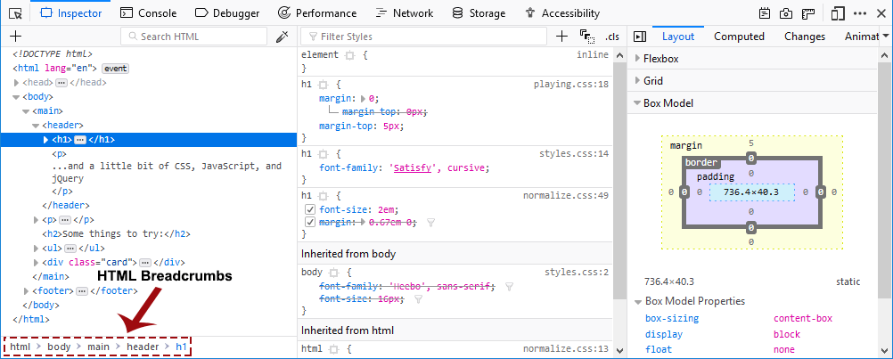

Hovering over a breadcrumb highlights that element in the page.

The breadcrumbs bar has its own :ref:`keyboard shortcuts <keyboard-shortcuts-breadcrumbs-bar>`.

.. _page_inspector_how_to_examine_and_edit_html_searching:

Searching
---------

The Page Inspector's search box matches all markup in the current document and in any frames.

To start searching the markup, click in the search box to expand it or press :kbd:`Ctrl` + :kbd:`F` , or :kbd:`Cmd` + :kbd:`F` on a Mac. There are three types of searches that are performed automatically depending on what you enter, a full text search, a CSS selector search, and an XPath search.

Full text search
~~~~~~~~~~~~~~~~

The full text search will always be executed, independently of what you enter. That allows you to find CSS selectors and XPath expressions occurring within the text.

CSS selector search
~~~~~~~~~~~~~~~~~~~

You can search elements by entering a `CSS selector <https://developer.mozilla.org/en-US/docs/Glossary/CSS_Selector>`_

As you type, an autocomplete popup shows any class or ID attributes that match the current search term:

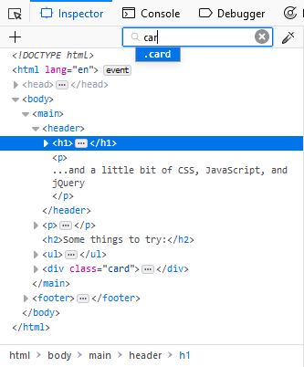

Press :kbd:`Up` and :kbd:`Down` to cycle through suggestions, :kbd:`Tab` to choose the current suggestion, then :kbd:`Enter` to select the first node with that attribute.

To cycle through matches, press :kbd:`Enter`. You can cycle backwards through matches using :kbd:`Shift` + :kbd:`Enter`.

XPath search
~~~~~~~~~~~~

It is also possible to search via `XPaths <https://developer.mozilla.org/en-US/docs/Web/XPath>`_. This allows you to search for specific elements without the conflict of matching words within the text. For example, ``//a`` matches all `a <https://developer.mozilla.org/en-US/docs/Web/HTML/Element/a>`_ elements but not the letter "a" within the text content. Furthermore it allows for some more advanced searches like finding elements that start with a specific text, for example.

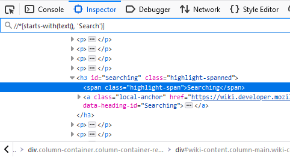

HTML tree
---------

The rest of the pane shows you the page's HTML as a tree (this UI is also called the Markup View). Just to the left of each node is an arrow: click the arrow to expand the node. If you hold the Alt key while clicking the arrow, it expands the node and all the nodes underneath it.

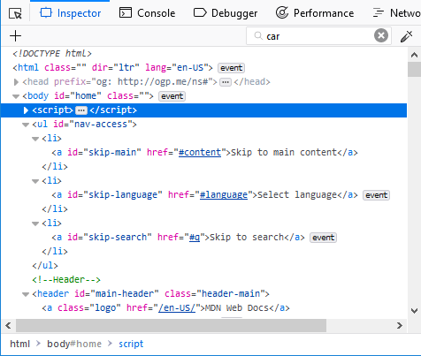

Moving the mouse over a node in the tree highlights that element in the page.

Nodes that are not visible are shown faded/desaturated. This can happen for different reasons such as using `display: none <https://developer.mozilla.org/en-US/docs/Web/CSS/display>`_ or that the element doesn't have any dimensions.

There is an ellipsis shown between the opening and closing tag of an element when the node is collapsed if it has larger contents. Now children are indicated in the tree with this icon: |image1|

Markers ("badges") are displayed to the right of some nodes. The table below explains the meaning of each badge:

.. |br| raw:: html

     

.. list-table::
  :widths: 25 75
  :header-rows: 0

  * - ``event``
    - The element has one or several event listeners attached to it. Clicking the marker opens a tooltip listing the event listeners and allows you for each listener to switch to the line of JavaScript code in the :doc:`Debugger <../../../debugger/index>` where the listener is defined.

  * - ``scroll``
    - The element is a `scroll container <https://developer.mozilla.org/en-US/docs/Glossary/Scroll_container>`_, i.e. it has either ``overflow: scroll`` applied, or ``overflow: auto`` and sufficient content to cause `scrollable overflow <https://developer.mozilla.org/en-US/docs/Web/CSS/CSS_Overflow>`_. |br| |br| If preference ``devtools.overflow.debugging.enabled`` is ``true``, toggling the ``scroll`` badge will highlight any elements causing the overflow, and these nodes will additionally display the ``overflow`` badge.

  * - ``overflow``
    - The element is causing `scrollable overflow <https://developer.mozilla.org/en-US/docs/Web/CSS/CSS_Overflow>`_ in a `scroll container <https://developer.mozilla.org/en-US/docs/Glossary/Scroll_container>`_ (either the current node or a parent node—the affected nodewill display the ``scroll`` badge). |br| |br| **Note**: The ``overflow`` badge is introduced in Firefox 83. In earlier versions it can be enabled using the preference ``devtools.overflow.debugging.enabled`` is ``true``.

  * - ``grid``
    - The element is a `grid container <https://developer.mozilla.org/en-US/docs/Glossary/Grid_Container>`_, i.e. it has `display: grid <https://developer.mozilla.org/en-US/docs/Web/CSS/display>`_ applied to it. Clicking the marker enables the grid highlighter.

  * - ``flex``
    - The element is a `flex container <https://developer.mozilla.org/en-US/docs/Glossary/Flex_Container>`_, i.e. it has `display: flex <https://developer.mozilla.org/en-US/docs/Web/CSS/display>`_ applied to it. Clicking the marker enables the flexbox highlighter.

  * - ``inline-grid``
    - The element is an inline grid container, i.e. it has `display: inline-grid <https://developer.mozilla.org/en-US/docs/Web/CSS/display>`_ or ``display: inline grid`` applied to it. Clicking the marker enables the grid highlighter.

  * - ``inline-flex``
    - The element is an inline flex container, i.e. it has `display: inline-flex <https://developer.mozilla.org/en-US/docs/Web/CSS/display>`_ or ``display: inline flex`` applied to it. Clicking the marker enables the flexbox highlighter.

  * - ``custom…``
    - The element is a custom element. Clicking the marker switches to the line of JavaScript code in the Debugger where the custom element got defined.

.. note::
  There are some useful keyboard shortcuts that can be used in the HTML tree — see the :ref:`HTML pane keyboard shortcuts list <keyboard-shortcuts-html-pane>`.

::before and ::after
--------------------

You can inspect pseudo-elements added using `::before <https://developer.mozilla.org/en-US/docs/Web/CSS/::before>`_ and `::after <https://developer.mozilla.org/en-US/docs/Web/CSS/::after>`_

.. raw:: html

  <iframe width="560" height="315" src="https://www.youtube.com/embed/ecfqTGvzsNc" title="YouTube video player" frameborder="0" allow="accelerometer; autoplay; clipboard-write; encrypted-media; gyroscope; picture-in-picture" allowfullscreen></iframe>
   
   

Custom element definition
-------------------------

When you open the Inspector on a page that includes custom elements, you can view the class definition for the custom element in the Debugger:

1. Inspect the element
2. Click on the word ``custom``

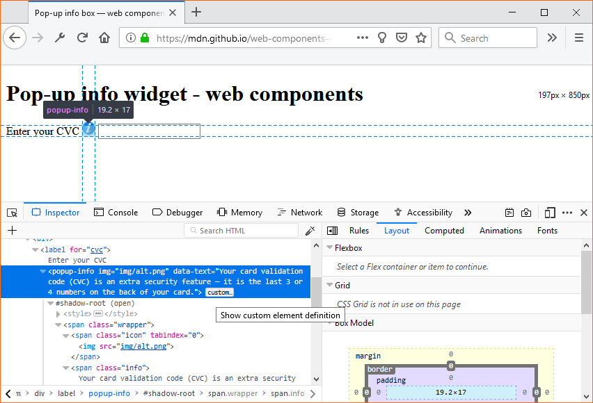

The source for the element's class will be displayed in the Debugger.

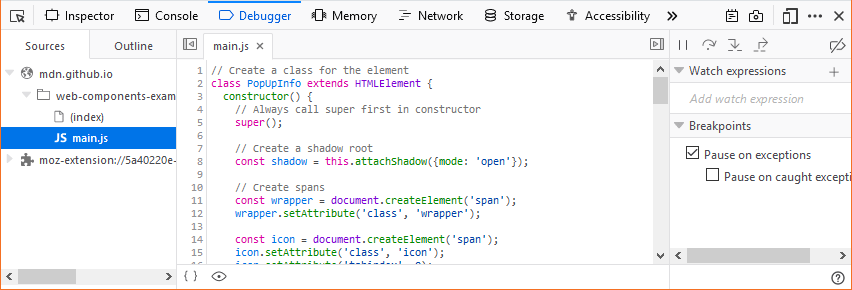

Whitespace-only text nodes
--------------------------

Web developers don’t write all their code in just one line of text. They use white space such as spaces, returns, or tabs between their HTML elements because it makes markup more readable.

Usually this white space seems to have no effect and no visual output, but in fact, when a browser parses HTML it will automatically generate anonymous text nodes for elements not contained in a node. This includes white space (which is after all a type of text).

If these auto generated text nodes are `inline level <https://developer.mozilla.org/en-US/docs/Web/CSS/Visual_formatting_model#inline-level_elements_and_inline_boxes>`_, browsers will give them a non-zero width and height. Then you will find strange gaps between elements, even if you haven’t set any margin or padding on them.

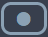

Since Firefox 52, the Inspector displays these whitespace nodes, so you can see where the gaps in your markup come from. Whitespace nodes are represented with a dot: |image2| and you get an explanatory tooltip when you hover over them:

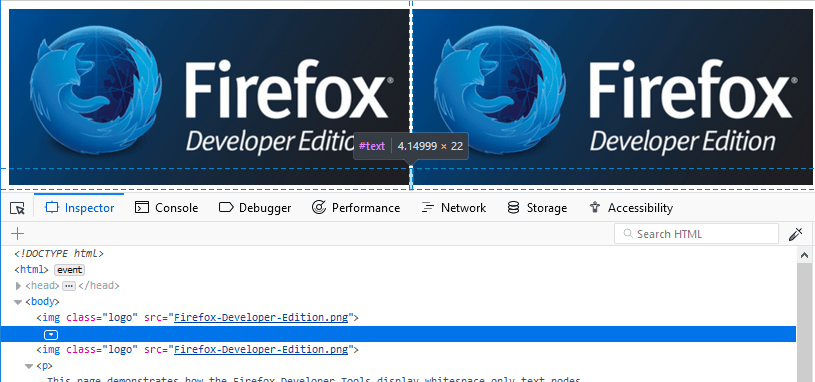

To see this in action, see the demo at https://firefox-devtools.github.io/devtools-examples/whitespace-only-demo/index.html.

Shadow roots
------------

Any shadow roots present in the DOM are exposed in the HTML page in the same manner as the regular DOM. The shadow root is signified by a node named ``#shadow-root`` — you can click its expansion arrow to see the full contents of the shadow DOM, and then manipulate the contained nodes in a similar way to other part of the page's DOM (although with a limited featureset — you can't, for example, drag and drop or delete shadow DOM nodes).

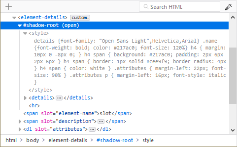

If a shadow DOM contains a "slotted" element (an element with a ``slot`` attribute after it has been inserted inside a `slot <https://developer.mozilla.org/en-US/docs/Web/HTML/Element/slot>`_ element — see `Adding flexibility with slots <https://developer.mozilla.org/en-US/docs/Web/Web_Components/Using_templates_and_slots#adding_flexibility_with_slots>`_ for an explanation of how these are used), the "slotted" element will be shown inside its corresponding `slot <https://developer.mozilla.org/en-US/docs/Web/HTML/Element/slot>`_ element, with a "reveal" link alongside it. Clicking the "reveal" link will highlight the element with the ``slot`` attribute as it exists outside the shadow DOM

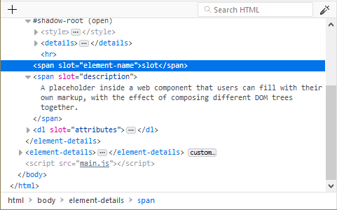

This is very useful when you've got a ``<slot>`` element and you can't find the source of its content.

.. note::

  Shadow DOM inspection was implemented in Firefox 61, but was hidden behind the ``dom.webcomponents.shadowdom.enabled`` pref until Firefox 63. It is now turned on by default.

.. _page-inspector-how-to-element-popup-context-menu:

Element popup context menu
--------------------------

You can perform certain common tasks on a specific node using a popup context menu. To activate this menu, context-click the element. The menu contains the following items — click on the links to find the description of each command in the :ref:`Context menu reference <page_inspector_how_to_examine_and_edit_html_context_menu_reference>`:

- Edit As HTML
- Create New Node
- Duplicate Node
- Delete Node
- Attributes

  - Add Attribute
  - Copy Attribute Value
  - Edit Attribute
  - Remove Attribute

- Break on ...

  - Subtree Modification
  - Attribute Modification
  - Node Removal

.. _page_inspector_how_to_examine_and_edit_html_use_in_console:

- Use in Console
- Show DOM Properties
- Show Accessibility Properties
- Change Pseudo-class

  - hover
  - active
  - focus
  - focus-visible
  - focus-within
  - visited

- Screenshot Node

.. _page_inspector_how_to_examine_and_edit_scroll_into_view:

- Scroll Into View
- Copy

  - Inner HTML
  - Outer HTML
  - CSS Selector
  - CSS Path
  - XPath
  - Image Data-URL
  - Attribute

- Paste

  - Inner HTML
  - Outer HTML
  - Before
  - After
  - As First Child
  - As Last Child

- Expand All
- Collapse All
- Open Link in New Tab [1]
- Open File in Debugger [1]
- Open File in Style-Editor [1]
- Copy Link Address [1]

[1] These options only appear in certain contexts, for example the "Open File in Style-Editor" option only appears when you context-click over the top of a link to a CSS file.

.. _page_inspector_how_to_examine_and_edit_html_context_menu_reference:

Context menu reference
----------------------

.. list-table::
  :widths: 30 70
  :header-rows: 0

  * - Edit as HTML
    - :ref:`Edit the element's HTML <page-inspector-how-to-examine-and-edit-html-editing_html>`.

  * - (Copy) Inner HTML
    - Copy the inner HTML for the element.

  * - (Copy) Outer HTML
    - Copy the outer HTML for the element.

      Pressing :kbd:`Ctrl` + :kbd:`C` (or :kbd:`Cmd` + :kbd:`C` on a Mac) also performs this action.

  * - (Copy) Unique Selector/CSS Selector
    - Copy a CSS selector that uniquely selects the element.

  * - (Copy) CSS Path
    - Copy a CSS selector that represents the full path to the element.

  * - (Copy) Image Data-URL
    - Copy image as a data:// URL, if the selected element is an image.

  * - (Copy) Attribute
    - Copy the attribute of the element.

  * - Show DOM Properties
    - Open the :doc:`split console <../../../web_console/split_console/index>` and enter the console command "``inspect($0)``" to :doc:`inspect <../../../web_console/index>` the currently selected element.

  * - Use in Console
    - Assigns the currently selected node to a variable named ``temp0`` (or ``temp1`` if ``temp0`` is already taken, and so on), then opens the :doc:`split console <../../../web_console/split_console/index>`, enabling you to interact with that node using the console's command line.

  * - Expand All
    - In the tree view, expand the current element and all the elements underneath it. This is equivalent to holding the :kbd:`Alt` key and clicking the disclosure triangle next to an element.

  * - Collapse
    - In the tree view, collapse the current element. This is equivalent to clicking the disclosure arrow next to an element that's expanded.

  * - (Paste) Inner HTML
    - Paste the clipboard contents into the node as its `innerHTML <https://developer.mozilla.org/en-US/docs/Web/API/Element/innerHTML>`_.

  * - (Paste) Outer HTML
    - Paste the clipboard contents into the node as its `outerHTML <https://developer.mozilla.org/en-US/docs/Web/API/Element/outerHTML>`_.

  * - (Paste) Before
    - Paste the clipboard contents into the document immediately before this node.

  * - (Paste) After
    - Paste the clipboard contents into the document immediately after this node.

  * - (Paste) As First Child
    - Paste the clipboard contents into the document as the first child of this node.

  * - (Paste) As Last Child
    - Paste the clipboard contents into the document as the last child of this node.

  * - Scroll Into View
    - Scrolls the web page so the selected node is visible.

      From Firefox 44, pressing the keyboard shortcut :kbd:`S` will also scroll the selected node into view.

  * - Screenshot Node
    - Takes a screenshot of the selected node, saved to your Downloads directory. See :doc:`Taking screenshots <../../../taking_screenshots/index>`.

  * - Create New Node
    - Create a new empty 
 as the last child of the currently selected element. See :ref:`Inserting new nodes <page-inspector-how-to-examine-and-edit-html-inserting-new-nodes>`.

  * - Duplicate Node
    - Create a copy of this element, and insert the copy immediately after this element.

  * - Delete Node
    - Delete the element from the DOM.

  * - Attribute/Add Attribute
    - Add an attribute to the element.

  * - Attribute/Edit Attribute
    - (only when invoked on an attribute) Edit the attribute.

  * - Attribute/Remove Attribute
    - (only when invoked on an attribute) Remove the attribute.

  * - Open Link in New Tab
    - (only when invoked over a link, such as an href attribute) Opens the linked item in a new tab.

  * - Open File in Debugger
    - (only when invoked over a link to a JS source) Opens the linked source in the Debugger.

  * - Open File in Style-Editor
    - (only when invoked over a link to a CSS source) Opens the linked source in the Style Editor.

  * - Copy Link Address
    - (only when invoked over a URL) Copy the URL.

  * - (Change Pseudo-class) hover
    - Set the `:hover <https://developer.mozilla.org/en-US/docs/Web/CSS/:hover>`_ CSS pseudo-class.

  * - (Change Pseudo-class) active
    - Set the `:active <https://developer.mozilla.org/en-US/docs/Web/CSS/:active>`_ CSS pseudo-class.

  * - (Change Pseudo-class) focus
    - Set the `:focus <https://developer.mozilla.org/en-US/docs/Web/CSS/:focus>`_ CSS pseudo-class.

  * - (Change Pseudo-class) focus-visible
    - Set the `:focus-visible <https://developer.mozilla.org/en-US/docs/Web/CSS/:focus-visible>`_ CSS pseudo-class.

  * - (Change Pseudo-class) focus-within
    - Set the `:focus-within <https://developer.mozilla.org/en-US/docs/Web/CSS/:focus-within>`_ CSS pseudo-class.

  * - (Change Pseudo-class) visited
    - Set the :visited CSS pseudo-class.

.. _page-inspector-how-to-examine-and-edit-html-editing_html:

Editing HTML
************

You can edit the HTML — tags, attributes, and content — directly in the HTML pane: double-click the text you want to edit, change it, and press Enter to see the changes reflected immediately.

To edit an element's `outerHTML <https://developer.mozilla.org/en-US/docs/Web/API/Element/outerHTML>`_, activate the element's popup menu and select "Edit As HTML". You'll see a text box in the HTML pane:

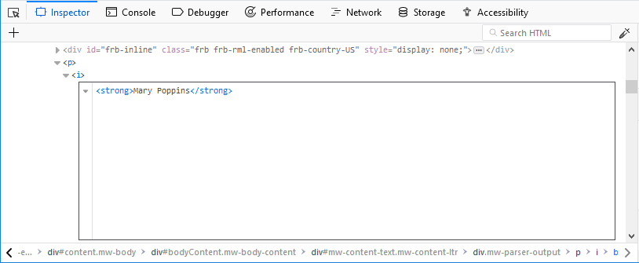

You can add any HTML in here: changing the element's tag, changing existing elements, or adding new ones. Once you click outside the box, the changes are applied to the page.

When you're editing HTML, the context menu you'll see is the normal one for working with editable text:

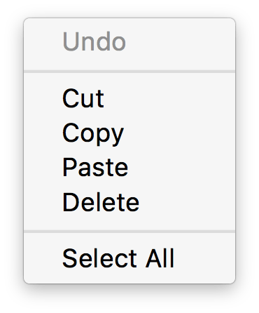

Copy and paste
--------------

You can use the :ref:`popup menu <page-inspector-how-to-element-popup-context-menu>` to copy nodes in the HTML tree and paste them into the desired location.

Drag and drop
-------------

You can reorganize the HTML content of a page by moving nodes in the HTML tree. Just click and hold on any element and drag it up or down in the tree. When you release the mouse button, the element will be inserted at the corresponding position:

.. raw:: html

  <iframe width="560" height="315" src="https://www.youtube.com/embed/oI-a035nfWk" title="YouTube video player" frameborder="0" allow="accelerometer; autoplay; clipboard-write; encrypted-media; gyroscope; picture-in-picture" allowfullscreen></iframe>
   
   

You can cancel the drag and drop by pressing the :kbd:`Esc` key.

.. _page-inspector-how-to-examine-and-edit-html-inserting-new-nodes:

Inserting new nodes
-------------------

There's a "+" icon at the top of the markup view:

Click this icon to insert an empty {{HTMLElement("div")}} into the document as the last child of the currently selected element. You can then edit the new node's content and styling just as you would any other node in the document.

.. raw:: html

  <iframe width="560" height="315" src="https://www.youtube.com/embed/NG5daffvVZM" title="YouTube video player" frameborder="0" allow="accelerometer; autoplay; clipboard-write; encrypted-media; gyroscope; picture-in-picture" allowfullscreen></iframe>
   
   

You can access the same functionality using the "Create New Node" popup menu item.

Note that this button is disabled if the selected element's type is such that adding a last-child would have no effect (for example, if it is an `html <https://developer.mozilla.org/en-US/docs/Web/HTML/Element/html>`_ or `iframe <https://developer.mozilla.org/en-US/docs/Web/HTML/Element/iframe>`_ element). However, it is enabled in places where it is not valid to insert a `div <https://developer.mozilla.org/en-US/docs/Web/HTML/Element/div>`_, such as `style <https://developer.mozilla.org/en-US/docs/Web/HTML/Element/style>`_ or `link <https://developer.mozilla.org/en-US/docs/Web/HTML/Element/link>`_. In these cases the element is added as text.
