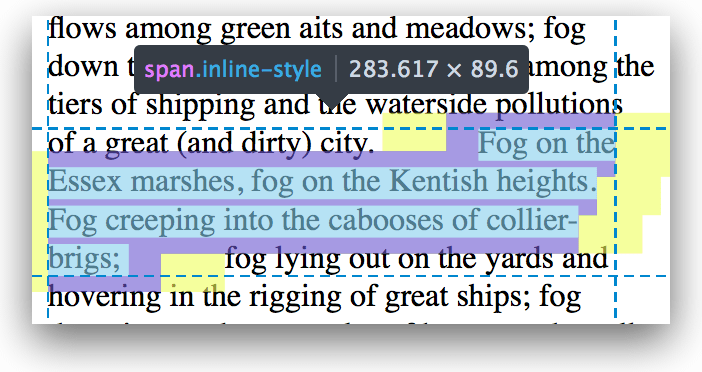
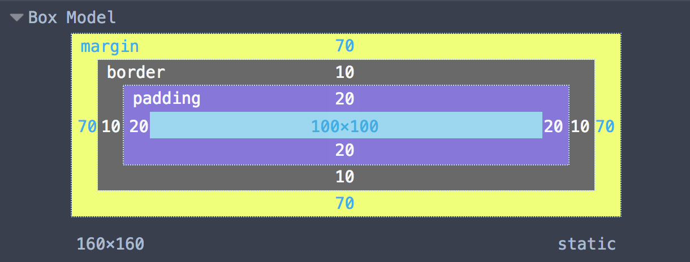
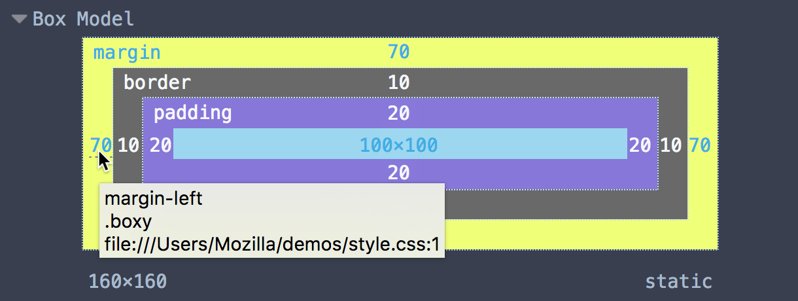

==============================
Examine and edit the box model
==============================

Viewing the box model
*********************

With the :ref:`Select Element button <page_inspector_select_element_button>` pressed, if you hover over an element in the page, the `box model <https://developer.mozilla.org/en-US/docs/Web/CSS/CSS_Box_Model/Introduction_to_the_CSS_box_model>`_ for the element is shown overlaid on the page:

.. raw:: html

  <iframe width="560" height="315" src="https://www.youtube.com/embed/vDRzN-svJHQ" title="YouTube video player" frameborder="0" allow="accelerometer; autoplay; clipboard-write; encrypted-media; gyroscope; picture-in-picture" allowfullscreen></iframe>
   
   

It's also shown overlaid if you hover over an element's markup in the HTML pane:

.. raw:: html

  <iframe width="560" height="315" src="https://www.youtube.com/embed/xA4IxTttNLk" title="YouTube video player" frameborder="0" allow="accelerometer; autoplay; clipboard-write; encrypted-media; gyroscope; picture-in-picture" allowfullscreen></iframe>
   
   

If the element is inline and is split over multiple line boxes, the highlighter shows each individual line box that together make up the element:

.. _page-inspector-how-to-examine-and-edit-the-box-model-view:

The Box Model view
------------------

When an element's selected, you can get a detailed look at the box model in the :ref:`Box Model view <page_inspector_ui_tour_computed_view>`:

If you hover over a value, you'll see a tooltip telling you which rule the value comes from:

Editing the box model
*********************

You can also edit the values in the :ref:`Box Model view <page-inspector-how-to-examine-and-edit-the-box-model-view>`, and see the results immediately in the page.
