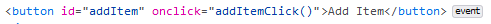
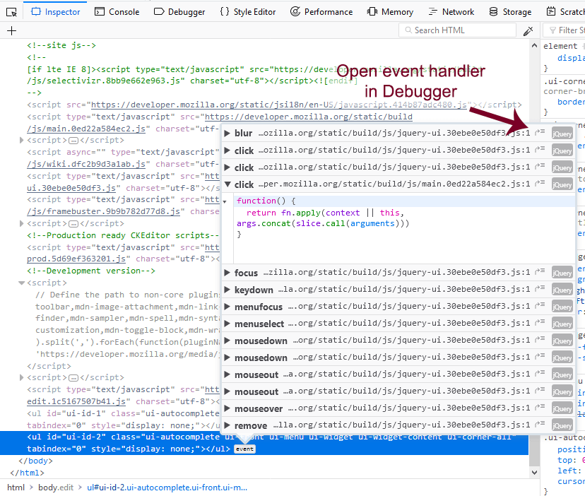

=======================
Examine Event Listeners
=======================

The inspector shows the word "event" next to elements in the :ref:`HTML Pane <page_inspector_ui_tour_html_pane>`, that have event listeners bound to them:

Click the icon, then you'll see a popup listing all the event listeners bound to this element:

Each line contains:

- a right-pointing arrowhead; click to expand the row and show the listener function source code
- the name of the event for which a handler was attached to this element
- the name and line number for the listener; you can also click here to expand the row and view the listener function source code
- a curved arrow pointing to a stack; click it to show the code for the handler in the debugger
- a label indicating whether the event bubbles
- a label indicating the system that defines the event. Firefox can display:

  - standard DOM events
  - `jQuery events <https://api.jquery.com/category/events/>`_
  - `React events <https://facebook.github.io/react/docs/events.html>`_
