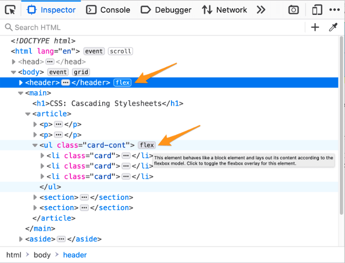
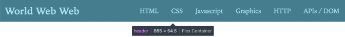
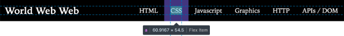
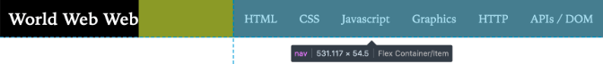
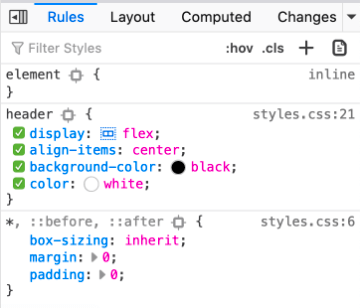
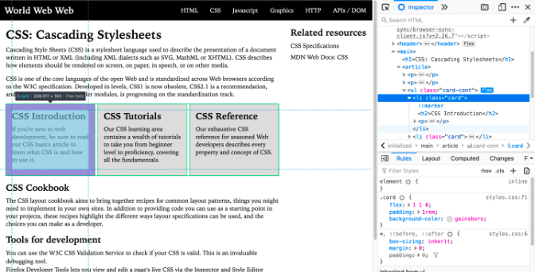
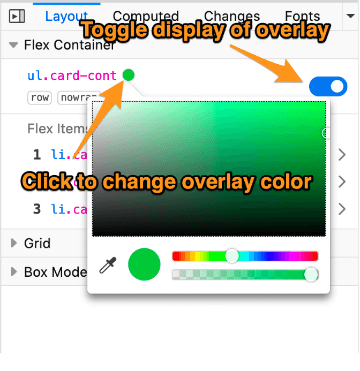
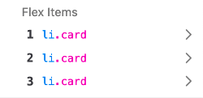
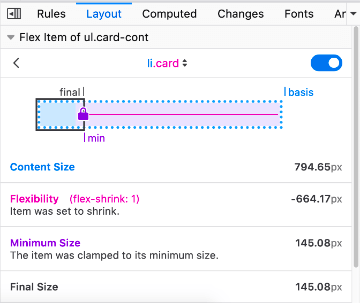
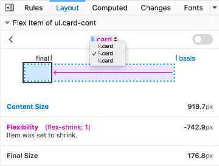

==============================================
CSS Flexbox Inspector: Examine Flexbox layouts
==============================================

The **Flexbox Inspector** allows you to examine `CSS Flexbox Layouts <https://developer.mozilla.org/en-US/docs/Web/CSS/CSS_Flexible_Box_Layout>`_ using the Firefox DevTools, which is useful for discovering flex containers on a page, examining and modifying them, debugging layout issues, and more.

Discovering Flex Containers
***************************

When an HTML element on your page has `display: flex <https://developer.mozilla.org/en-US/docs/Web/CSS/display>`_ applied to it, a number of features are made available in the DevTools to provide easy access to Flexbox layout features.

In the HTML pane
----------------

In the :ref:`HTML Pane <page_inspector_ui_tour_html_pane>`, an element laid out with Flexbox has the word ``flex`` next to it as shown in the following image:

Click the word ``flex`` in the HTML pane to keep the overlay visible when you move the mouse away from the container.

In the infobar
--------------

When you hover over an element in the HTML pane, you will see a tooltip that gives you more information about the element. When you hover over a flex container or flex item, the tooltip includes the appropriate information.

This header is a flex container:

Each navbar link is a flex item:

The ``nav`` element within the header is both a flex item and a flex container which holds the navigation links:

In the CSS pane
---------------

In the :ref:`CSS pane <page_inspector_ui_tour_rules_view>`'s Rules view, any instance of a `display: flex <https://developer.mozilla.org/en-US/docs/Web/CSS/display>`_ declaration gets a small Flexbox icon |image1| next to the word ``flex``.

Clicking the icon toggles the display of an overlay on the page, which appears over the selected flex container that displays an outline around each flex item:

The overlay will still be shown when you select other elements from the Inspector panel, so you can edit related CSS properties and see how the flex items are affected by your changes.

The Layout Flex Container section
---------------------------------

The CSS pane's Layout view includes a collapsible "Flex Container" section. If you expand the section without selecting a flexbox container, it will only display the message, "Select a Flex container or item to continue". Once you select an element whose display is defined as flex, the panel will include a number of options for viewing details about the flex container and flex items within it. You can find out more about those in the section below.

.. note::

  The Layout view can be found underneath the *Layout* tab on the right-hand pane of the Page Inspector. The above and below screenshots should give you further hints on how to get to this.

Flex Container options
**********************

The Flex Container section of the Layout view looks like this:

There are two settings you can change in the Flex Container section:

- You can control the color of the overlay by clicking on the small circle next to the selector. This will toggle a color picker so you can select a different color for the overlay.
- The switch on the right-hand side of the Flex Container section will also toggle the overlay on and off.

Flex item properties
********************

The flex items within the flex container are displayed as a numbered list in the Flex Items section. Each entry displays the item's selector. Hover over an element to highlight it on the page.

If you click on the item, the display shifts to show details about that element:

This view shows information about the calculations for the size of the selected flex item:

- A diagram visualizing the sizing of the flex item
- Content Size - the size of the component without any restraints imposed on it by its parent
- Flexibility - how much a flex item grew or shrunk based on its flex-grow value when there is extra free space or its flex-shrink value when there is not enough space
- Minimum Size (only appears when an item is clamped to its minimum size) - the minimum content size of a flex item when there is no more free space in the flex container
- Final Size - the size of the flex item after all sizing constraints imposed on it have been applied (based on the values of flex-grow, flex-shrink and flex-basis)

At the top of the section is a drop-down list of all the items in the selected flexbox container:

You can use this drop-down to select any of the other flex items in the flex container.
