========================================
CSS Grid Inspector: Examine grid layouts
========================================

The **Grid Inspector** allows you to examine `CSS Grid Layouts <https://developer.mozilla.org/en-US/docs/Web/CSS/CSS_Grid_Layout>`_ using the Firefox DevTools, discovering grids present on a page, examining and modifying them, debugging layout issues, and more.

.. note::

  The examples shown in the screenshots appearing in this article are Jen Simmons' `Futurismo <https://labs.jensimmons.com/2016/examples/futurismo-1.html>`_ and `Variations on a grid <https://labs.jensimmons.com/2017/01-003.html>`_ experiments, and a `live named grid area example <https://developer.mozilla.org/en-US/docs/Web/CSS/CSS_Grid_Layout/Grid_Template_Areas#naming_a_grid_area>`_ from Rachel Andrew.

Discovering CSS grids
*********************

When an HTML element on your page has `display: grid <https://developer.mozilla.org/en-US/docs/Web/CSS/display>`_ applied to it, a number of features are made available in the DevTools to provide easy access to grid features.

In the HTML pane
----------------

In the :ref:`HTML Pane <page_inspector_ui_tour_html_pane>`, elements laid out using a grid have a "grid" marker beside them.

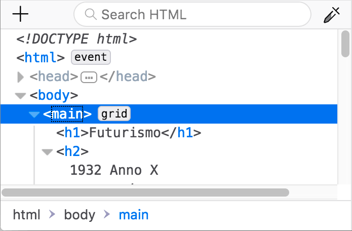

In the CSS pane
---------------

In the :ref:`CSS pane <page_inspector_ui_tour_rules_view>`'s Rules view, any instance of a `display: grid <https://developer.mozilla.org/en-US/docs/Web/CSS/display>`_ declaration gets a grid icon included within it: |image1|.

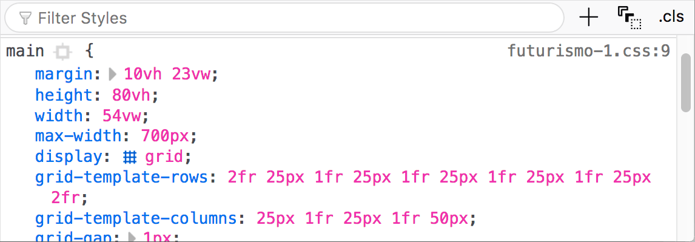

Clicking the icon toggles the display of a grid overlay on the page, which appears over the element, laid out like a grid to show the position of its grid lines and tracks:

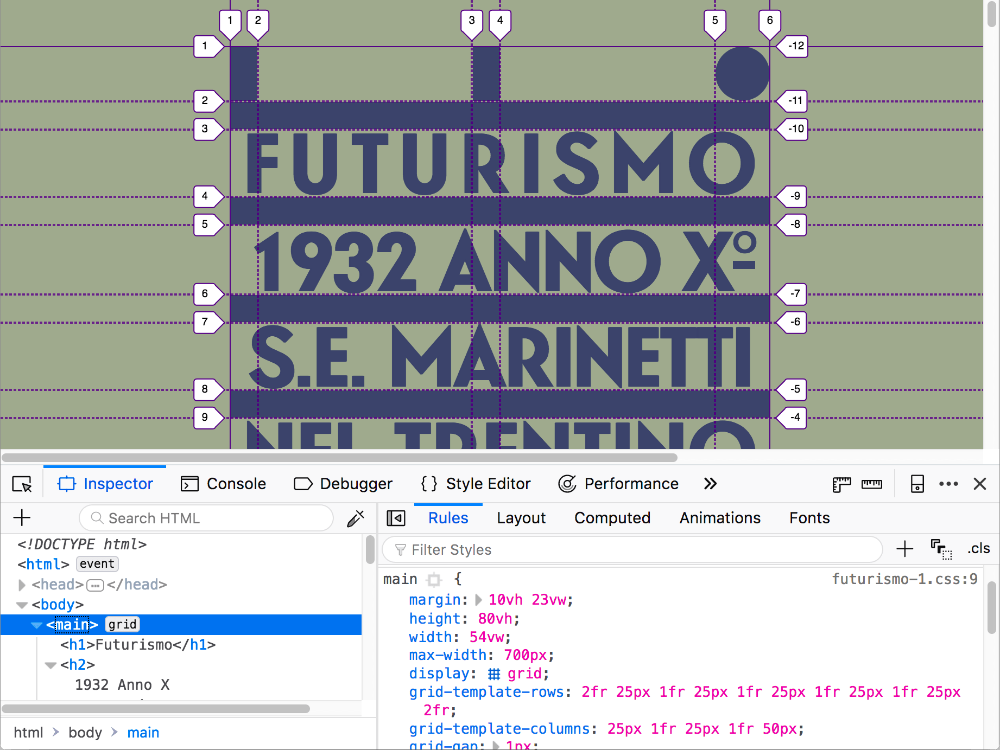

The overlay is still shown when you select other elements, so you can edit related CSS properties and see how the grid is affected.

The Layout view Grid section
----------------------------

When grids are included on a page, the CSS pane's Layout view includes a "Grid" section containing a number of options for viewing those Grids. You can find out more about those in the section below.

.. note::

  The Layout view can be found underneath the *Layout* tab on the right-hand pane of the Page Inspector. The above and below screenshots should give you further hints on how to get to this.

Grid options
************

The Grid section of the Layout view looks like this:

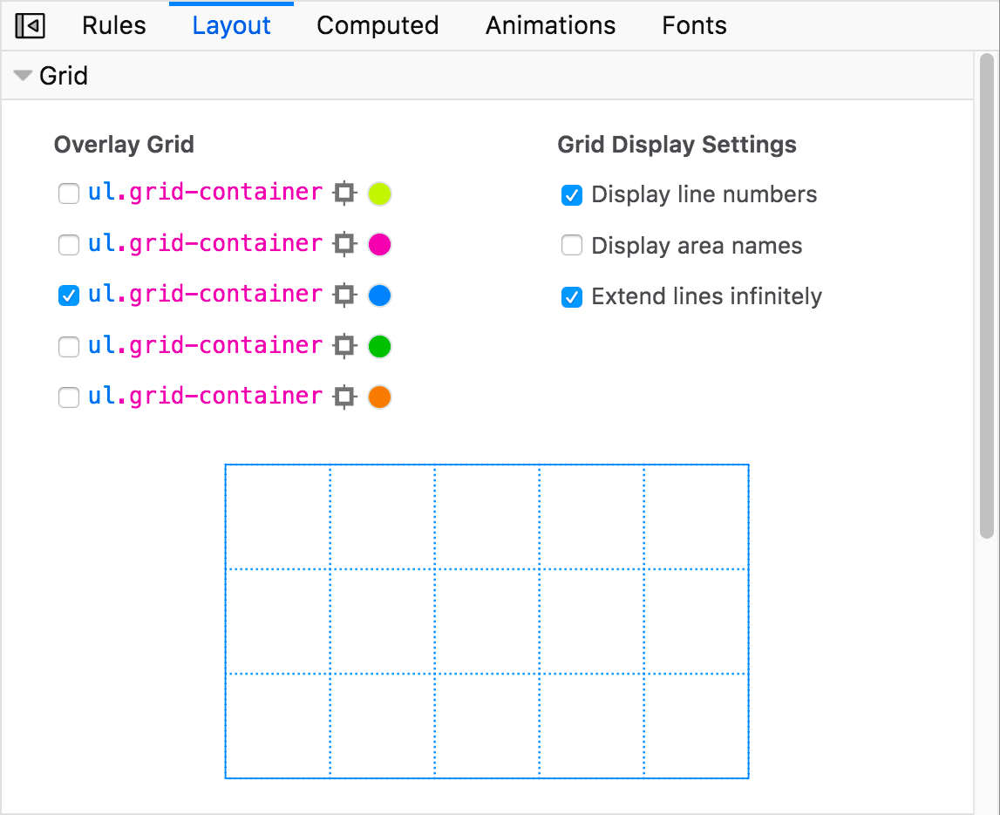

You'll see a number of options contained within:

- Overlay Grid: Contains a checkbox for each grid present on the page, along with various options. Allows overlay views to be toggled on and off.
- Grid Display Settings:

  - Display line numbers: Turn the line numbers shown for each grid overlay on and off (on by default).
  - Display area names: Turn area names on and off, in the case of grids with named grid areas (on by default, where relevant).
  - Extend lines infinitely: By default, grid lines/tracks are only shown inside the element with ``display: grid`` set on it; when toggling this option on, the grid lines extend to the edge of the viewport along each axis.

- Mini grid view: A smaller view of the currently overlaid grid.

.. note::

  Your grid preferences such as overlay color and display settings choices are persisted across page loads for each separate page.

Let's examine these features in more detail.

Overlay grid
------------

Each grid present on a page has an entry in the "Overlay grid" section:

Each entry consists of (from left to right):

- A checkbox allowing you to toggle the grid overlay for that grid on and off.
- A name label to represent the grid, consisting of a selector identifying the HTML element that has the grid applied to it. Clicking this also toggles the grid overlay on and off.
- A target icon that when clicked immediately selects the HTML element that this grid entry relates to, inside the HTML pane.
- A color picker icon that allows you to change the primary color of the grid overlay. This is useful for selecting different colors so you can easily tell your grids apart.

Inspecting a subgrid
--------------------

When the page contains a grid with a subgrid, the entry for the subgrid is indented under its parent in the Overlay grid section. When you select the checkbox for the subgrid, the lines for the parent grid are displayed also displayed; if the checkbox for the parent grid is unselected, then its lines are translucent.

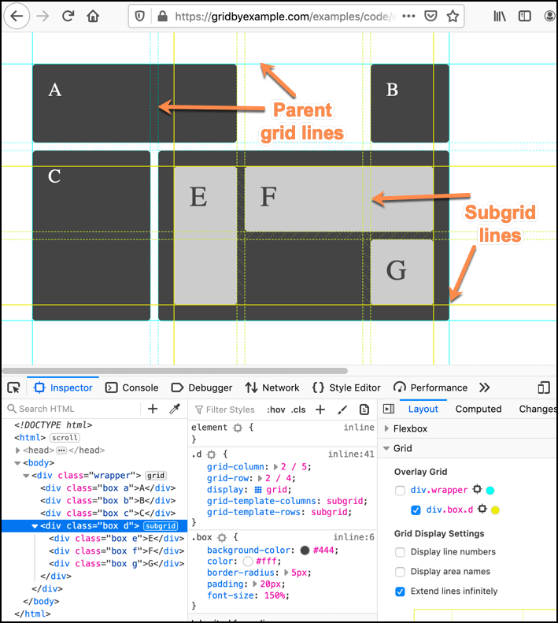

Display line numbers
--------------------

By default, the line numbers are displayed on the grid overlay.

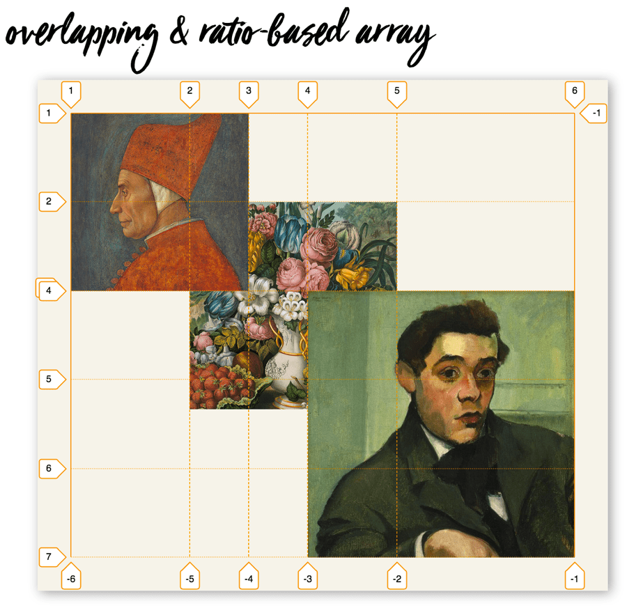

Unchecking the "Display line numbers" box turns them off.

Display area names
------------------

In a grid with named areas, the area names are shown on the grid overlay by default.

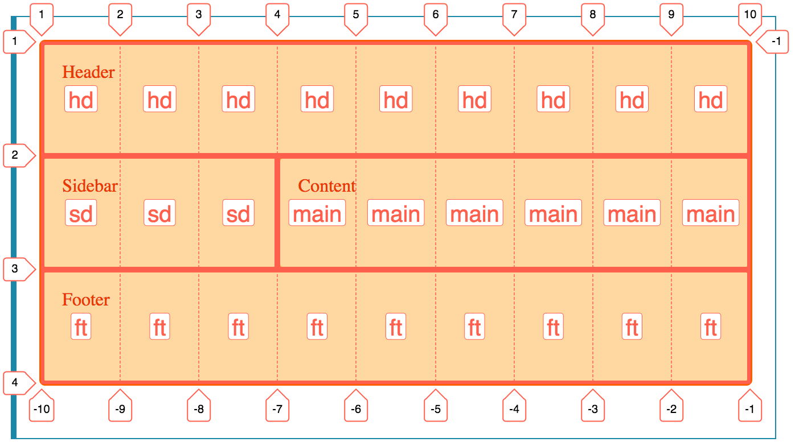

Unchecking the "Display area names" box turns them off.

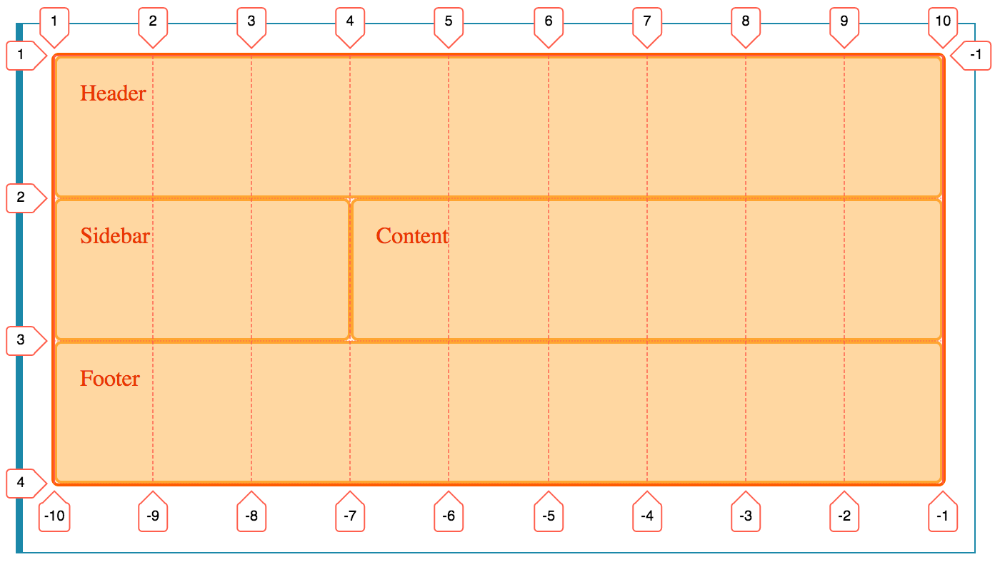

Extend lines infinitely
-----------------------

By default, the grid lines/tracks are only shown inside the element with ``display: grid`` set on it.

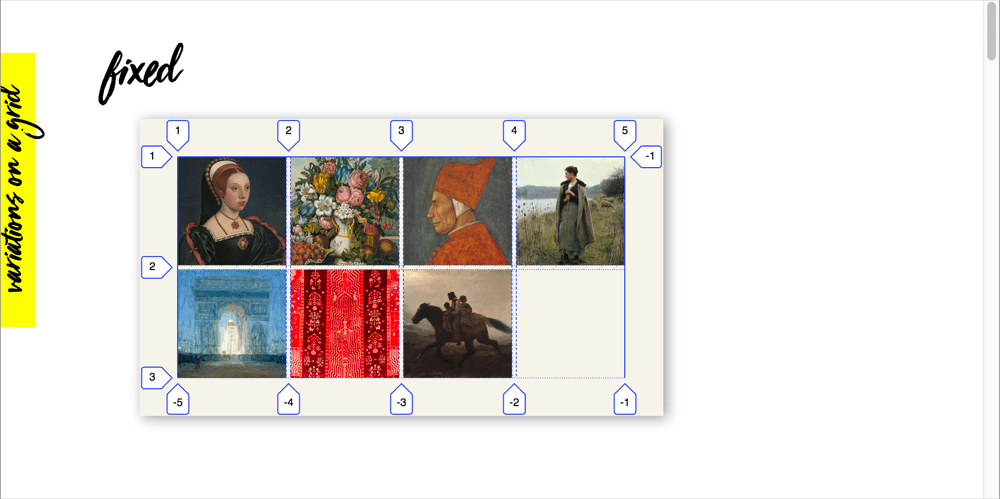

When you check the "Extend lines infinitely" option, the grid lines extend to the edge of the viewport along each axis.

Mini grid view
--------------

Shows a small version of the currently overlaid grid, which is in proportion to the real thing.

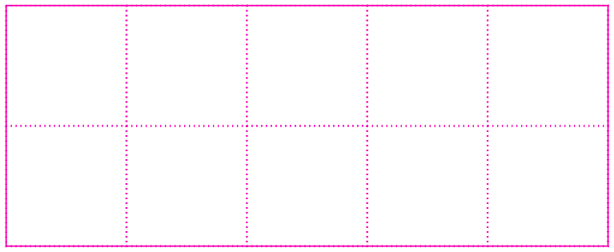

Hovering over the different areas of the mini grid causes the equivalent area on the grid overlay to also highlight, along with a tooltip containing useful information such as the dimensions of that area, its row and column numbers, etc.

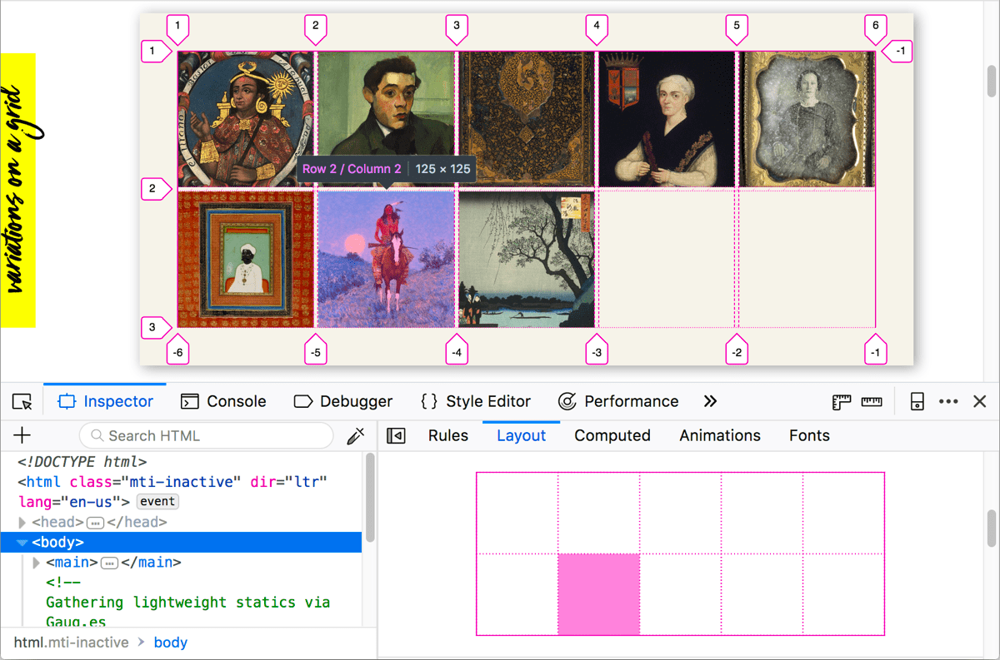

See also
********

- `labs.jensimmons.com <https://labs.jensimmons.com/>`_ — lots of interesting grid examples.
- `Grid by Example <https://gridbyexample.com/>`_ — CSS Grid learning resources from Rachel Andrew.
- `CSS Grid Layout <https://developer.mozilla.org/en-US/docs/Web/CSS/CSS_Grid_Layout>`_ — MDN CSS Grid Layout references and tutorials.
