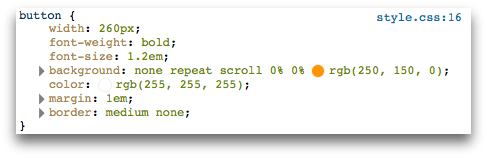
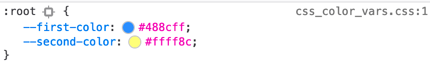
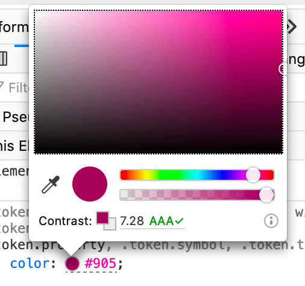
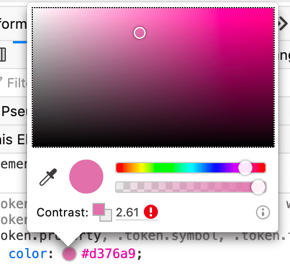

=========================
Inspect and select colors
=========================

In the CSS Pane's :ref:`Rules view <page_inspector_ui_tour_rules_view>`, if a rule contains a color value, you'll see a sample of the color next to the value:

A color sample is also shown for CSS custom properties (variables) that represent colors.

If you click on the color sample, you'll see a color picker popup, enabling you to change the color:

If the color is a foreground color, the color picker tells you whether its contrast with the background color meets accessibility guidelines. Hovering the mouse over the contrast message gives a more detailed explanation.

The color picker includes an eyedropper icon: clicking this icon enables you to use the eyedropper to select a new color for the element from the page:

.. raw:: html

  <iframe width="560" height="315" src="https://www.youtube.com/embed/0Zx1TN21QOo" title="YouTube video player" frameborder="0" allow="accelerometer; autoplay; clipboard-write; encrypted-media; gyroscope; picture-in-picture" allowfullscreen></iframe>
   
   
