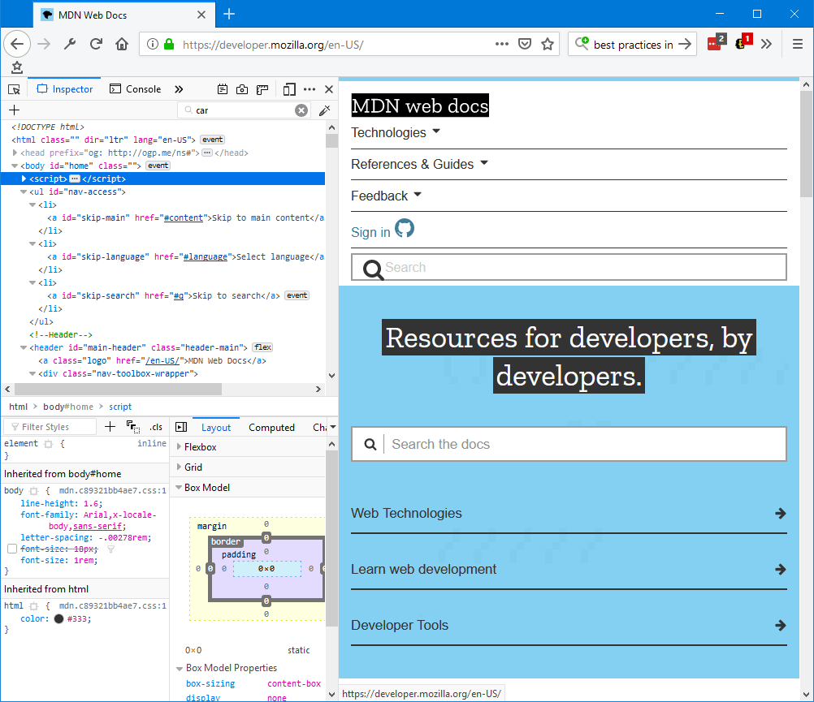
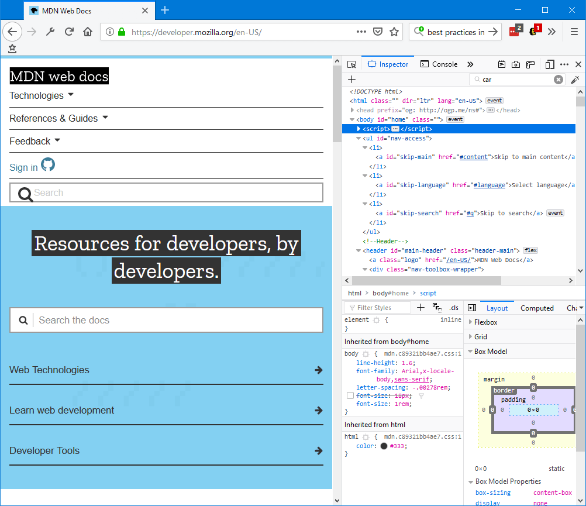
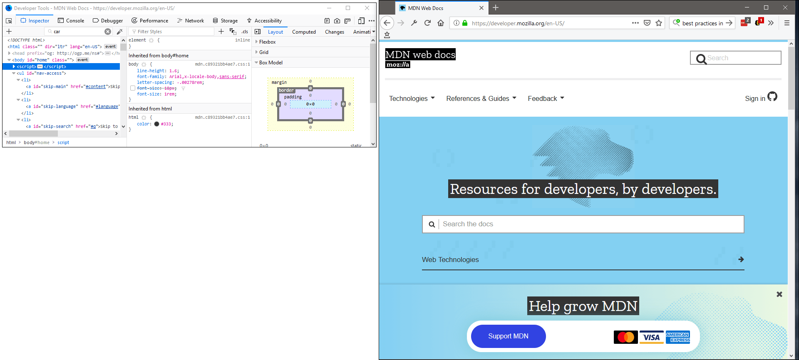

==================
Open the Inspector
==================

There are two main ways to open the Inspector:

- Select the *Inspector* panel in the Web Developer Tools, accessible from the Browser Tools submenu
- Right-click an element on a web page and select *Inspect Element*.

The Inspector will appear at the bottom of the browser window:

.. image:: pageinspector.png
  :alt: The all-new Inspector in Firefox 57 DevTools.
  :class: center

You can also set the pane to appear at the left side of the browser window:

To the right side of the browser window:

Or in a separate window:

To start finding your way around the Inspector, see the :doc:`UI tour <../../ui_tour/index>`.
