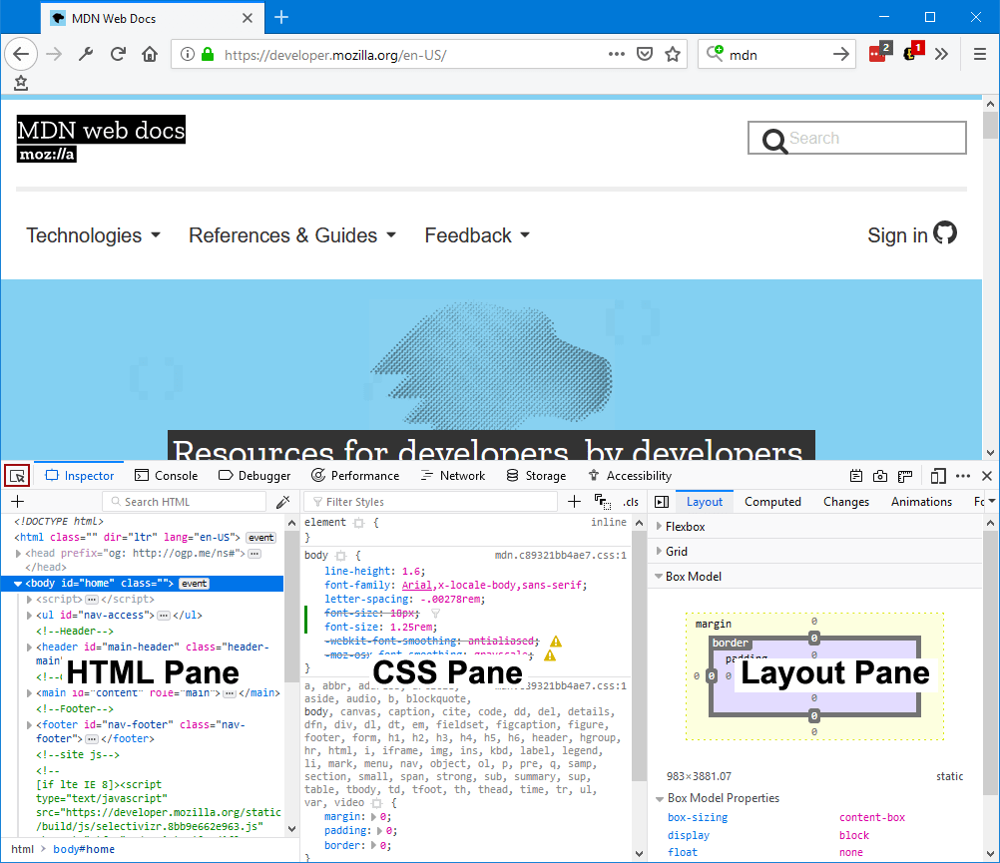

==================
Open the Inspector
==================

There are two main ways to open the Inspector:

- Choose *Tools > Web Developer > Inspector* from the Menu Bar or the equivalent :ref:`keyboard shortcut <keyboard-shortcuts-opening-and-closing-tools>`.
- Right-click an element on a web page and select *Inspect Element*.

The Inspector will appear at the bottom of the browser window:

You can also set the pane to appear at the left side of the browser window:

To the right side of the browser window:

.. image:: inspector_rightside.png
  :class: center

Or in a separate window:

.. image:: inspector_sidexside.png
  :class: center

To start finding your way around the Inspector, see the :doc:`UI tour <../../ui_tour/index>`.
