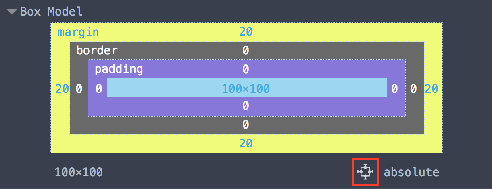
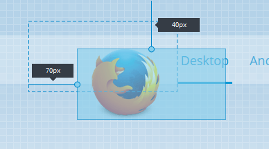

===============================
Reposition elements in the page
===============================

Starting in Firefox 48 you can move absolutely positioned elements by dragging them around the page.

If an element has its `position <https://developer.mozilla.org/en-US/docs/Web/CSS/Position>`_ property set to ``absolute``, ``relative`` or ``fixed`` and one or more of the `top <https://developer.mozilla.org/en-US/docs/Web/CSS/top>`_, `bottom <https://developer.mozilla.org/en-US/docs/Web/CSS/bottom>`_ , `left <https://developer.mozilla.org/en-US/docs/Web/CSS/left>`_ or `right <https://developer.mozilla.org/en-US/docs/Web/CSS/right>`_ properties, :ref:`Box Model view <page_inspector_ui_tour_computed_view>` displays a button:

If you click that button, two handles appear next to the element:

You can use these handles to drag the element around the page.

If the element is absolutely positioned, dashed lines are shown representing the offset parent. For relatively positioned elements the dashed lines indicate the original position of the node. The offsets are indicated by a line and a tooltip for each side.
