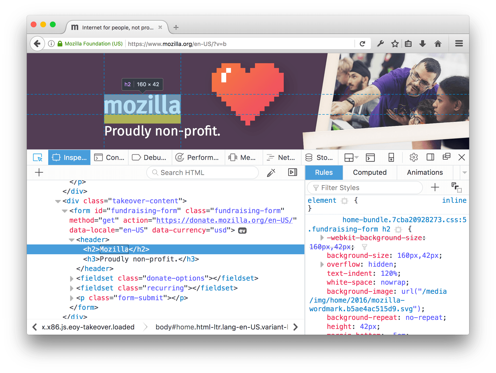
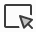

=================
Select an element
=================

The *selected element* is the element in the page that the Inspector is currently focused on. The selected element is shown in the :ref:`HTML pane <page_inspector_ui_tour_html_pane>` and its CSS is displayed in the :doc:`CSS pane <../../ui_tour/index>`.

The *highlighted element* is the element that's overlaid in the page with a graphic showing the box model, and a tooltip showing its tag and size:

With the context menu
*********************

To open the Inspector and select an element immediately, activate the context menu over the element in the page and select "Inspect Element"

With the HTML pane
******************

When the inspector is open, as you move the mouse around the elements listed in the HTML pane, the corresponding elements are highlighted in the page. Click an element in the HTML pane to select it.

You can also use the arrow keys to move around the DOM with the keyboard.

.. _page-inspector-how-to-select-an-element-with-the-node-picker:

With the node picker
********************

To select an element in the page itself, activate the "node picker" by clicking its icon: |image1| (also called the *Select Element* icon). After that, as you move the mouse around the page, the element under the mouse is highlighted. Click the element to select it:

Starting in Firefox 52, if you :kbd:`Shift` + click the element, then it is selected but the picker stays active. This lets you see the rules for the element in the CSS pane, but conveniently select another element in the page.
