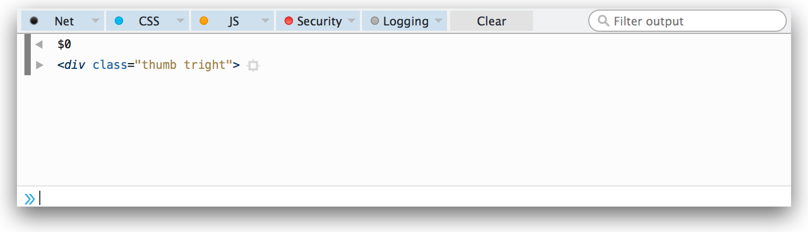
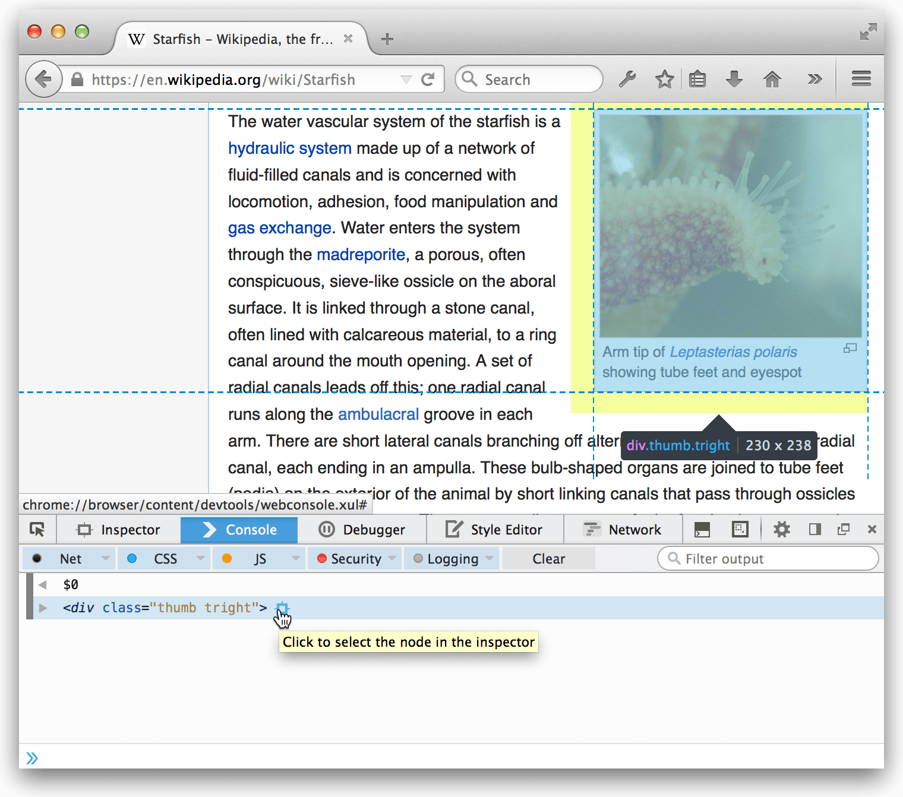

======================================
Use the Inspector from the Web Console
======================================

The element that's currently selected in the Page Inspector can be referenced in the Web Console using the variable ``$0``.

DOM elements in the Web Console output get a target next to them. If you hover over this target, the element is highlighted in the page, and if you click the target, the element is selected in the Inspector:

