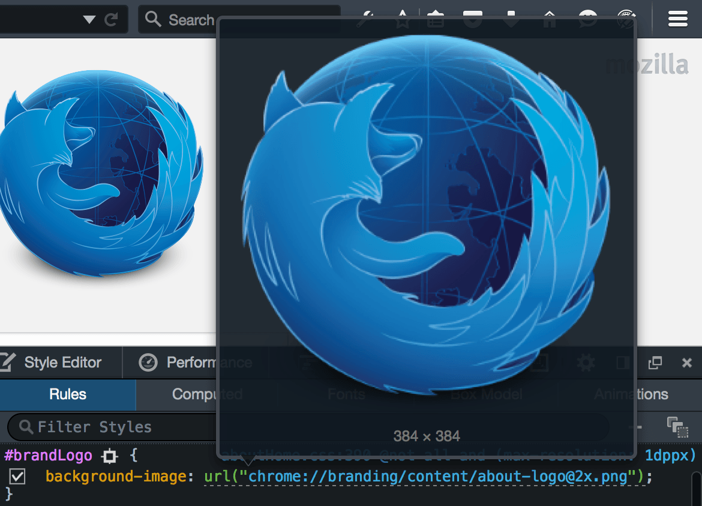
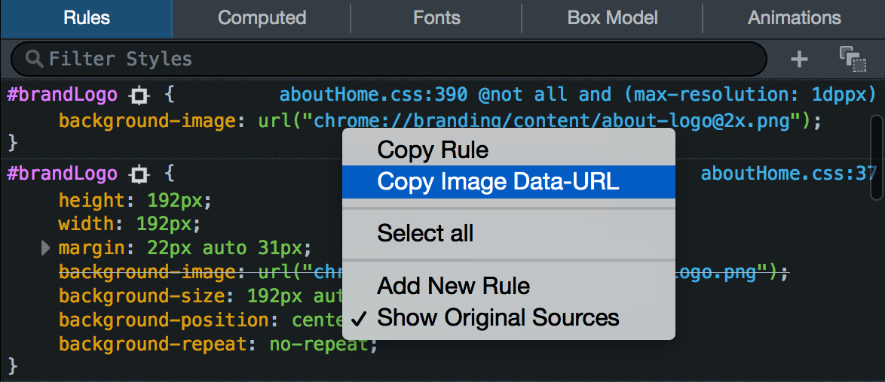

======================
View background images
======================

In the :ref:`Rules view <page_inspector_ui_tour_rules_view>`, you can see a preview of images specified using `background-image <https://developer.mozilla.org/en-US/docs/Web/CSS/background-image>`_. Just hover over the rule:

From Firefox 41, if you right-click the image declaration, you'll see an option to copy the image as a data: URL:

