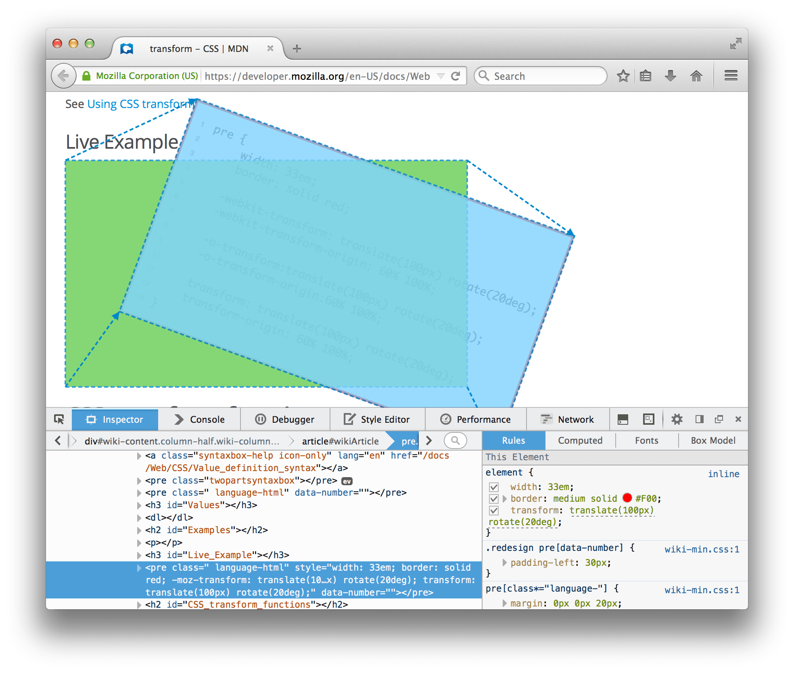

====================
Visualize transforms
====================

If you hover over a `transform <https://developer.mozilla.org/en-US/docs/Web/CSS/transform>`_ property in the :ref:`Rules view <page_inspector_ui_tour_rules_view>`, you'll see the transformation overlaid in the page:

