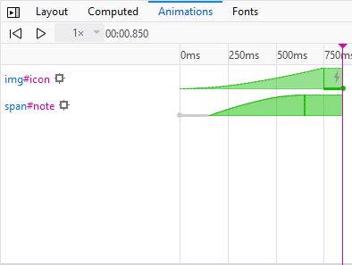
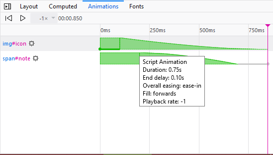
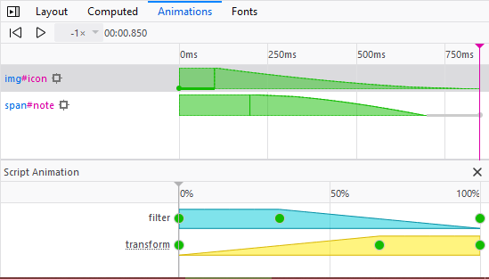
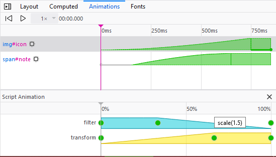
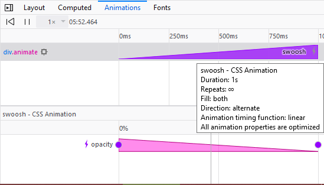
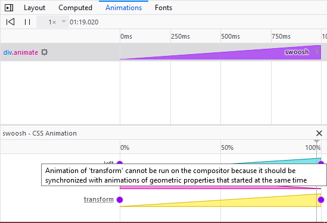

====================
Work with animations
====================

This article covers three tools you can use to visualize and edit animations:

- :ref:`the animation inspector <page-inspector-how-to-work-with-animations-animation-inspector>`

- :ref:`diting @keyframes <page-inspector-how-to-work-with-animations-edit-keyframes>`

- :ref:`editing timing functions <page-inspector-how-to-work-with-animations-edit-timing-functions>`

.. _page-inspector-how-to-work-with-animations-animation-inspector:

Animation inspector
*******************

The Page Inspector's :ref:`Animations view <page_inspector_ui_tour_animations_view>` displays animations in the page synchronized along a timeline, with a draggable widget you can use to move to any point in the timeline and see the page at that point.

It displays animations created using `CSS transitions <https://developer.mozilla.org/en-US/docs/Web/CSS/CSS_Transitions>`_, `CSS @keyframes rules <https://developer.mozilla.org/en-US/docs/Web/CSS/CSS_Animations/Using_CSS_animations>`_, or the `Web Animations API <https://developer.mozilla.org/en-US/docs/Web/API/Web_Animations_API>`_. Starting in Firefox 48, it will show animations applied to the `::before <https://developer.mozilla.org/en-US/docs/Web/CSS/::before>`_ and `::after <https://developer.mozilla.org/en-US/docs/Web/CSS/::after>`_ pseudo-elements.

To see how it works, we'll walk through an example. The box below contains a grayscale icon, representing `Firefox Developer Edition <https://www.mozilla.org/en-US/firefox/developer/>`_. If you click the icon, it enlarges and changes to color, and the name of the browser appears. Click the icon again to reverse the effect.

These animations are made using the `Web Animations API <https://developer.mozilla.org/en-US/docs/Web/API/Web_Animations_API>`_.

Let's use the animation inspector to see what's going on in this example.

1. Right-click in the box and select "Inspect Element"
2. Make sure the selected element is the ``
``
3. Switch over to the "Animations" tab
4. Play the animation

.. raw:: html

  <iframe width="560" height="315" src="https://www.youtube.com/embed/XmKeAKryE5I" title="YouTube video player" frameborder="0" allow="accelerometer; autoplay; clipboard-write; encrypted-media; gyroscope; picture-in-picture" allowfullscreen></iframe>
   
   

Let's take a closer look at the contents of the animation inspector here:

It shows a synchronized timeline for every animation applied to the selected element or its children. The timeline starts at the start of the first animation, ends at the end of the last animation, and is labeled with markers every 250 milliseconds (this depends on the time scale of the animations currently displayed).

Animation bars
--------------

Each animation or transition is shown as a horizontal bar laid across the timeline. The bar is:

- blue if a `transition <https://developer.mozilla.org/en-US/docs/Web/CSS/transition>`_) was used to animate a property
- orange if a `@keyframes animation <https://developer.mozilla.org/en-US/docs/Web/CSS/CSS_Animations/Using_CSS_animations>`_ was used
- green if the `Web Animations API <https://developer.mozilla.org/en-US/docs/Web/API/Web_Animations_API>`_ was used

The bar contains a lightning bolt icon |image1| if the property was animated using the compositor thread (see more about the :ref:`cost of animating different CSS properties <performance-scenarios-animating_css_properties-css-property-cost>`).

The bar is shaped to reflect the easing effect used for the animation. In the example above you can see that the first bar is concave, representing ease-in, and the second is convex, representing ease-out.

If the animation used CSS transitions, there is one bar for each property transitioned, and it is labeled with the name of the property being transitioned. If the animation used CSS ``@keyframes``, there is one bar for each animation, labeled with its name.

If the animation or transition had a delay, this is shown as a cross-hatched portion of the bar. `delay and endDelay <https://developer.mozilla.org/en-US/docs/Web/API/KeyframeEffect/KeyframeEffect>`_ are both represented.

If you hover over the bar, a tooltip appears, giving you more detailed information about the animation or transition, including:

- the type of animation: CSS transition, CSS animation, or Web Animations API
- the duration of the animation
- the animation's start and end delay
- the animation's easing (or timing function).
- the animation's fill
- the Playback rate of the animation

Information about the animated element
--------------------------------------

To the left of each bar is a selector for the element that the animation applies to. If you hover over this selector, the element is highlighted in the page. Click the selector to select the element in the inspector.

To the left of the selector is a "target" icon (|image2|). Clicking this icon locks the highlighter on the element.

Animation details
-----------------

If you click one of the bars, you'll see details of all the properties that were changed in the animation. For example, try clicking on the bar for ``img#icon`` animation:

This is telling us that two properties were modified: `filter <https://developer.mozilla.org/en-US/docs/Web/CSS/filter>`_ and `transform <https://developer.mozilla.org/en-US/docs/Web/CSS/transform>`_. Each dot represents an entry for that property in the set of keyframes used for the animation. Both properties were initialized at 0ms and finalized at 750ms. ``filter`` was given a value at 250ms and ``transform`` at 500ms. If you hover over a dot, you'll see the value assigned to that property at that point in the timeline:

This is essentially a visual representation of the animation's
:ref:`keyframes <page-inspector-work-with-animations-web-example-js-content>`:

.. code-block:: JavaScript

  var iconKeyframeSet = [
    { transform: 'scale(1)',   filter: 'grayscale(100%)'                },
    {                          filter: 'grayscale(100%)', offset: 0.333 },
    { transform: 'scale(1.5)',                            offset: 0.666 },
    { transform: 'scale(1.5)', filter: 'grayscale(0%)'                  }
  ];

Application to the example
--------------------------

Applying all this to our example, we can see that:

- The animation involved two elements, ``span#note`` and ``img#icon``. Hovering over these selectors, we can see that those elements are, respectively, the browser name "Firefox Developer Edition" and the browser icon.
- The ``img#icon`` animation:

  - animated the `filter <https://developer.mozilla.org/en-US/docs/Web/CSS/filter>`_ and `transform <https://developer.mozilla.org/en-US/docs/Web/CSS/transform>`_ properties, to scale the icon and color it
  - lasted 750ms, had an ``endDelay`` of 100ms
  - used the compositor thread
  - was given an `easing <https://developer.mozilla.org/en-US/docs/Web/API/KeyframeEffect/KeyframeEffect>`_ value of ``ease-in``: you can see this by the concave shape of the green bar.

- The ``span#note`` animation:

  - animated the `width <https://developer.mozilla.org/en-US/docs/Web/CSS/width>`_ and `opacity <https://developer.mozilla.org/en-US/docs/Web/CSS/opacity>`_ properties, to make the name gradually appear
  - lasted 500ms, and had a ``delay`` of 150ms
  - was given an `easing <https://developer.mozilla.org/en-US/docs/Web/API/KeyframeEffect/KeyframeEffect>`_ value of ``ease-out``: you can see this by the convex shape of the green bar.

Animation playback
------------------

At the top of the animation inspector:

- there are buttons to play/pause and restart the animation
- there's a dropdown to change the animation playback rate
- the current time in the animation is displayed.

Finally, if you click inside the bar at the top of the timeline, you get a scrubber that you can drag left and right to move backwards and forwards through the animation, and pinpoint exactly what's happening when.

Further information about animation compositing
-----------------------------------------------

If you open `animation-inspector-compositing.html <https://firefox-devtools.github.io/devtools-examples/animation-inspector/animation-inspector-compositing.html>`_ and click the red rectangle, a simple `opacity <https://developer.mozilla.org/en-US/docs/Web/CSS/opacity>`_ animation will start. If you look at this in the Animation Inspector in Firefox 49+, you'll see that:

- The white lightning bolt icon now indicates whether all the animation properties have been optimized by running them through the compositor, where possible.
- The bar tooltip also includes this information, as a further reminder. You'll get a message of "All animation properties are optimized."
- The expanded animation information now includes a lightning bolt icon next to the properties whose animation has been optimized via the compositor.

Let's now look at `animation-inspector-compositing-silly.html <https://firefox-devtools.github.io/devtools-examples/animation-inspector/animation-inspector-compositing-silly.html>`_ — this is the same example, except that now once the red rectangle is clicked we animate both the `left <https://developer.mozilla.org/en-US/docs/Web/CSS/left>`_ and `transform <https://developer.mozilla.org/en-US/docs/Web/CSS/transform>`_ (with a translation) properties at the same time as `opacity <https://developer.mozilla.org/en-US/docs/Web/CSS/opacity>`_. It doesn't make much sense to try to animate a geometric property and a translation at the same time — the two effects won't be synchronized — so the ``transform`` property is deliberately not handed over to the compositor to handle. The Animation Inspector will tell you this — look at it now and you'll see that:

- The white lightning bolt icon in the bar has been replaced with a grey lightning bolt icon, to indicate that only some of the relevant properties are being optimized by the compositor.
- The bar tooltip also includes this information, as a further reminder. You'll get a message of "Some animation properties are optimized."
- Properties whose animation is **not** being optimized, but could be if you improved your code, are now given a dotted underline — see transform in the screenshot below. Hovering over this gives you a tooltip that explains why. In this case, the message is "Animations of 'transform' cannot be run on the compositor when geometric properties are animated on the same element at the same time."

.. _page-inspector-how-to-work-with-animations-edit-keyframes:

Edit @keyframes
***************

Any `@keyframes rules <https://developer.mozilla.org/en-US/docs/Web/CSS/CSS_Animations/Using_CSS_animations>`_ associated with the currently selected element are displayed in the :ref:`Rules view <page_inspector_ui_tour_rules_view>` and are editable:

.. raw:: html

  <iframe width="560" height="315" src="https://www.youtube.com/embed/mDHtLK88ZW4" title="YouTube video player" frameborder="0" allow="accelerometer; autoplay; clipboard-write; encrypted-media; gyroscope; picture-in-picture" allowfullscreen></iframe>
   
   

.. _page-inspector-how-to-work-with-animations-edit-timing-functions:

Edit timing functions
*********************

When you `create a CSS animation <https://developer.mozilla.org/en-US/docs/Web/CSS/CSS_Animations/Using_CSS_animations>`_ you can specify a `timing function <https://developer.mozilla.org/en-US/docs/Web/CSS/animation-timing-function>`_: this determines the rate at which the animation progresses. One way to specify the timing function is with a cubic Bézier curve.

Timing functions defined as cubic Bézier curves get an icon in the Rules view. If you click the icon you get a visual editor for the curve, enabling you to drag `P1 and P2 <https://developer.mozilla.org/en-US/docs/Web/CSS/easing-function#the_cubic-bezier()_class_of_timing-functions>`_, and see the results in the page:

.. raw:: html

  <iframe width="560" height="315" src="https://www.youtube.com/embed/GW5-R2ewaqA" title="YouTube video player" frameborder="0" allow="accelerometer; autoplay; clipboard-write; encrypted-media; gyroscope; picture-in-picture" allowfullscreen></iframe>
   
   

This feature uses open source code from `Lea Verou’s cubic-bezier.com <https://cubic-bezier.com/>`_.

The cubic Bézier editor includes a number of presets, grouped under "Ease-in", "Ease-out", and "Ease-in-out":

.. raw:: html

  <iframe width="560" height="315" src="https://www.youtube.com/embed/Jx-J2Yy0aSg" title="YouTube video player" frameborder="0" allow="accelerometer; autoplay; clipboard-write; encrypted-media; gyroscope; picture-in-picture" allowfullscreen></iframe>
   
   
