=======
UI Tour
=======

This article is a quick tour of the main sections of the Page Inspector's user interface.

It covers the three top-level components of the Inspector's UI:

- the "Select element" button
- the HTML pane
- the CSS pane

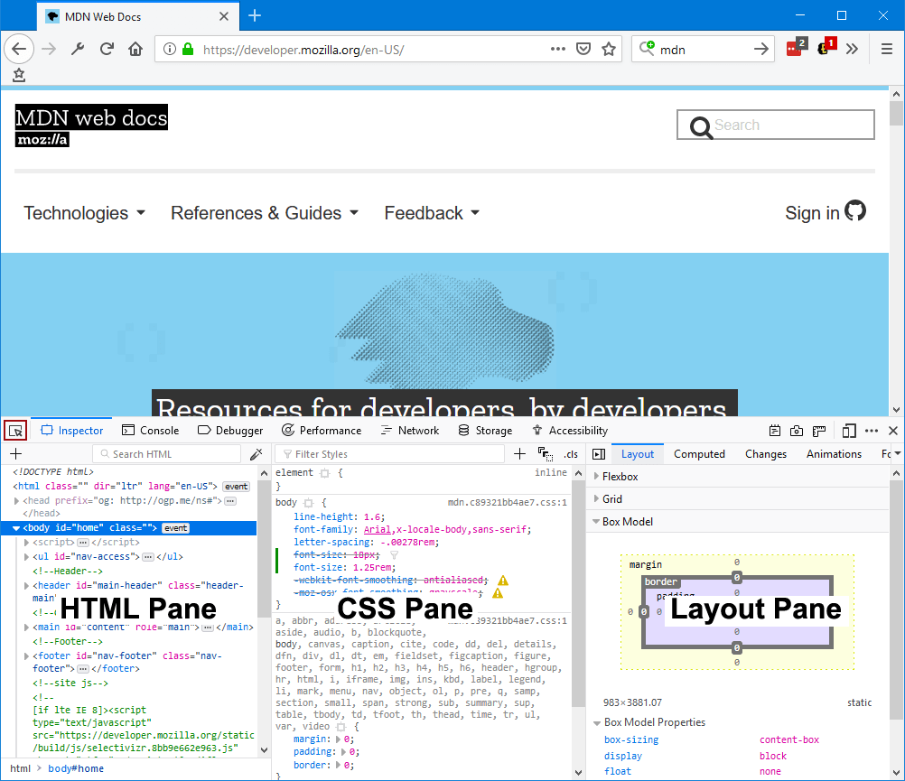

This guide is intentionally kept as short as possible. It links to various how to guides for the details of how to work with the Inspector.

.. _page_inspector_select_element_button:

Select element button
*********************

The Inspector gives you detailed information about the currently selected element. The Select element button is one way you can select an element for inspection:

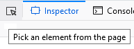

Note that it's actually part of the :ref:`main toolbox toolbar <tools-toolbox-toolbar>`, so it's immediately accessible from any tool, not just the Inspector.

To learn how to select an element, see the guide to :doc:`selecting an element <../how_to/select_an_element/index>`.

.. _page_inspector_ui_tour_html_pane:

HTML pane
*********

The Inspector is split into two or three sections, depending on your settings. You can toggle the 3-pane view of the Inspector. The following image shows the 2-pane layout:

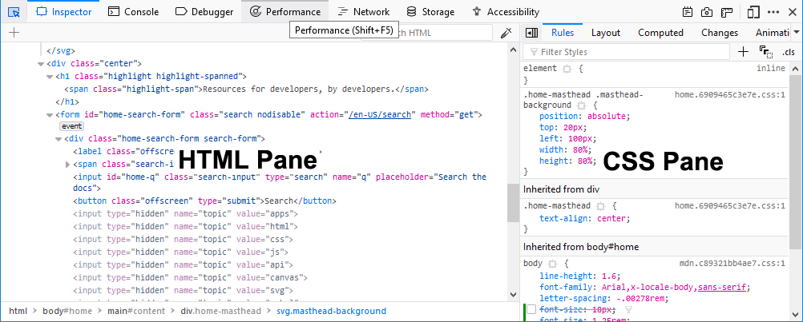

In 2-pane mode, the Inspector includes the HTML Pane, and the CSS Pane, which can contain one of six tools:

- Rules view
- Layout view
- Computed view
- Changes view
- Compatibility view (Firefox Developer Edition 77 and later)
- Fonts view
- Animations view

The following image shows the 3-pane mode (available from Firefox 62 onwards) which moves the CSS Rules view into a separate pane in the center of the Inspector. The following image shows 3-pane mode:

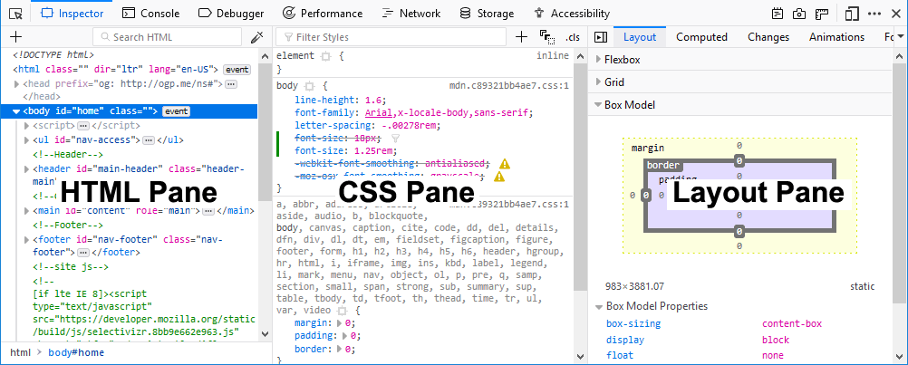

As you can see, the CSS pane has moved into the center of the Inspector. To learn more about the structure of the HTML pane, see the guide to :doc:`examining and editing HTML <../how_to/examine_and_edit_html/index>`.

.. _page_inspector_ui_tour_rules_view:

Rules view
**********

The Rules view lists all the rules that apply to the selected element, ordered from most-specific to least-specific. See above.

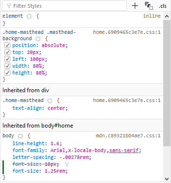

See :doc:`Examine and edit CSS <../how_to/examine_and_edit_css/index>` for more details.

Layout view
***********

The Layout view displays the box model of the page. If the page includes any sections using either the Flexbox display model or CSS Grids, this view shows the Flexbox or Grid settings used on the page.

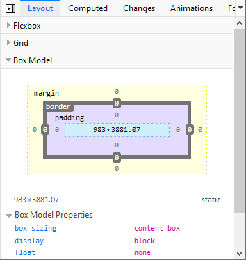

To learn more about the Layout view, see :doc:`Examine and edit the box model <../how_to/examine_and_edit_the_box_model/index>`. Note that before Firefox 50, the box model view did not appear in the "Layout view" tab, but had its own tab.

Changes view
************

When you are editing in the Rules view, you can see the changes you have made in the Changes view.

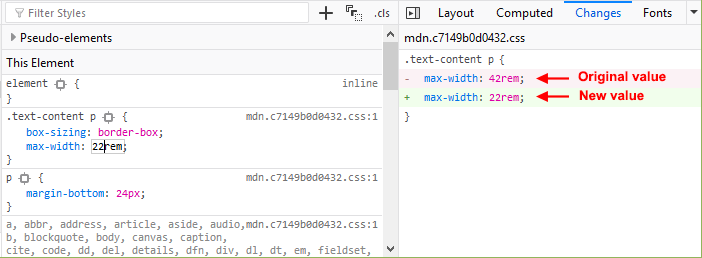

.. _page_inspector_ui_tour_computed_view:

Computed view
*************

The Computed view shows you the complete computed CSS for the selected element (The computed values are the same as what `getComputedStyle <https://developer.mozilla.org/en-US/docs/Web/API/Window/getComputedStyle>`_ would return):

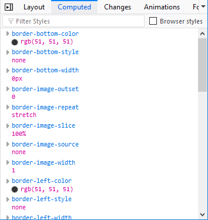

To learn more about the CSS declarations listed in this view, see :ref:`Examine computed CSS <page_inspector_how_to_examine_and_edit_css_examine_computed_css>`.

.. _page_inspector_ui_tour_compatibility_view:

Compatibility view
******************

Starting with Firefox Developer Edition version 77, the Compatibility view shows CSS compatibility issues, if any, for properties applied to the selected element, and for the current page as a whole. It shows icons for the browsers that *do* support the properties, and notes properties that are experimental or deprecated.

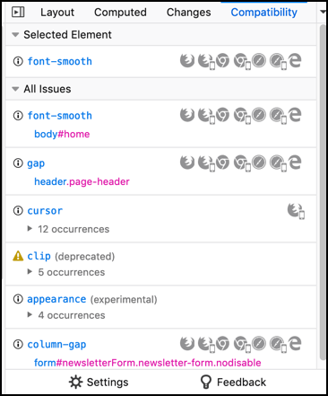

- Click the name of the property to open the reference article for that property on *MDN Web Docs*. The "Browser compatibility" section of the article gives details of browser support for the property.

- In the **All Issues** section, click the name of the element that uses the property to select that element in the inspector. If more than one element has a given property applied to it, click the triangle to show all the occurrences.

- To configure the set of browsers you want the Compatibility view to check for, click **Settings** at the bottom of the panel.

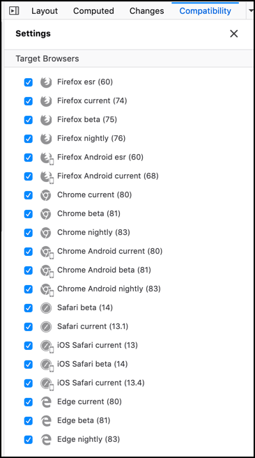

Untick the checkbox for any browser you are not interested in. As new browser versions are released, the version numbers in this list will be updated.

Fonts view
**********

The Fonts view shows all the fonts in the page along with editable samples.

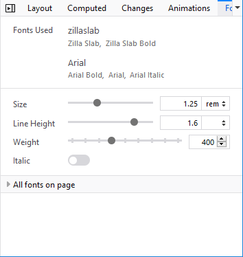

See :doc:`View fonts <../how_to/edit_fonts/index>` for more details.

.. _page_inspector_ui_tour_animations_view:

Animations view
***************

The Animations view gives you details of any animations applied to the selected element, and a controller to pause them:

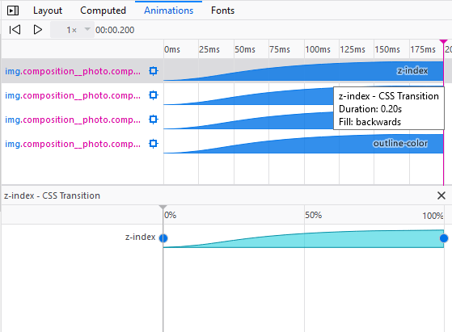

See :doc:`Work with animations <../how_to/work_with_animations/index>` for more details.
