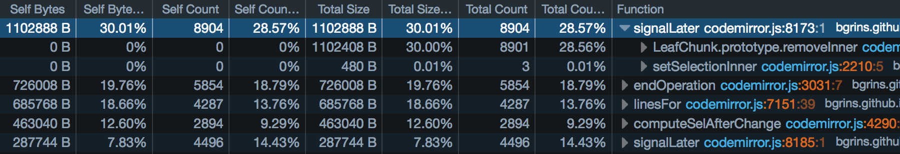
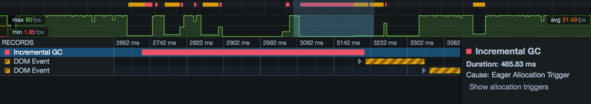

===========
Allocations
===========

The Allocations view in the Performance tool shows you which functions in your page are allocating the most memory over the course of the profile.

For performance this is important mostly because allocating a lot of memory, or making a lot of allocations, can trigger :ref:`garbage collection <performance-allocations-and-garbage-collection>`. This in turn can hurt the responsiveness of a page.

The Allocations view is new in Firefox 46.

To enable the Allocations view, you must check "Record Allocations" in the Performance tool settings, *before* recording a profile. Then :ref:`record a profile <performance-how-to-record-a-profile>` as usual, and you will see a new tab labeled "Allocations" in the toolbar:

.. raw:: html

  <iframe width="560" height="315" src="https://www.youtube.com/embed/WBmttwfA_k8" title="YouTube video player" frameborder="0" allow="accelerometer; autoplay; clipboard-write; encrypted-media; gyroscope; picture-in-picture" allowfullscreen></iframe>
   
   

Anatomy of the allocations view
*******************************

The allocations view looks something like this:

.. image:: allocations-view-1.png
  :class: border

The allocations view periodically samples allocations that are made over the recording. Each row represents a function in which at least one allocation-sample was taken during the recording.

It includes the following columns:

- Self Count: the number of allocation-samples that were taken in this function (also shown as a percentage of the total)
- Self Bytes: the total number of bytes allocated in the allocation-samples in this function (also shown as a percentage of the total)

Rows are sorted by the "Self Bytes" column.

So in the example above:

- 8904 samples were taken in ``signalLater()``, which is 28.57% of the total number of samples taken
- those samples allocated 1102888 bytes, which is 30.01% of the total memory allocated in all samples

Next to each function name is a disclosure arrow. Click this to see the places this function was called from:

Here you can see that ``signalLater()`` was called from two places: ``removeInner()`` and ``setSelectionInner()``. In this way you can walk back up the call stack, and understand better the context for these allocations.

Self Cost and Total Cost
------------------------

You'll see that there are separate sets of columns for "Self" and for "Total". "Self" records samples taken only in this function. "Total" records samples taken in this function or in functions called by this function. At the top level, these are always the same, since the view presents "leaf" functions at the top level (that is, it presents an inverted view of the call stack). But if you start walking back up the call stack, you'll see the difference:

Here, 8904 samples were taken in ``signalLater()``. But ``signalLater()`` was called from two places: ``removeInner()`` and ``setSelectionInner()``. Both these functions have 0 in Self Count, meaning that no allocations were seen directly in these functions. However, ``removeInner()`` has 8901 in Total Count, while``setSelectionInner()`` has just 3 in Total Count. This is telling us that, of the 8904 allocations seen in ``signalLater()``, all but three came through the ``removeInner()`` branch.

.. _performance-allocations-and-garbage-collection:

Allocations and garbage collection
**********************************

Of course, the memory allocated by a site is in itself useful information to know. But the main connection between the allocation profile of a site and its responsiveness is the cost of garbage collection (GC).

With a garbage-collected language, like JavaScript, the runtime periodically needs to walk the heap looking for objects that are no longer :ref:`reachable <memory-dominators-reachability>`, and then freeing the memory they occupy. While GC events like this are executing, the JavaScript engine must be paused, so your program is suspended and will be completely unresponsive.

To reduce the impact on responsiveness, `SpiderMonkey <https://spidermonkey.dev/>`_ (the JavaScript engine in Firefox) can perform GC in small increments, letting the program run in between. Sometimes, though, it needs to perform a full non-incremental collection, and the program has to wait for it to finish.

GC events are shown as red markers in the :doc:`Waterfall <../waterfall/index>` view, and are a big red flag for responsiveness, sometimes running for hundreds of milliseconds:

If you're seeing GC events in your site's performance profile, what can you do? SpiderMonkey uses a `complex set of heuristics <https://dxr.mozilla.org/mozilla-central/rev/584870f1cbc5d060a57e147ce249f736956e2b62/js/src/gc/GCRuntime.h#192>`_ to decide when to do what sort of garbage collection.

In general, though: *allocation pressure - allocating a lot of memory, or allocating memory at a high rate - makes SpiderMonkey more likely to run garbage collection, and more likely to run full, non-incremental garbage collection.*

If a GC event was caused by allocation pressure, then the sidebar on the right of the marker in the Waterfall view contains a link labeled "Show allocation triggers". If you click this link, the devtools switches to the allocations view, and selects the region of time from the end of the last GC cycle to the start of the one you clicked on. This shows you all the allocations that collectively triggered this GC event.

If you're seeing these problems, consider whether you can reduce the number or size of the allocations you're making here. For example:

- can you allocate memory lazily, when it is actually needed, instead of up front?
- if allocating memory in a loop, can you reuse a single allocation in every loop iteration?

