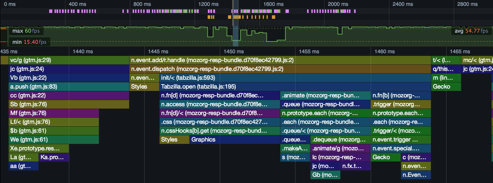
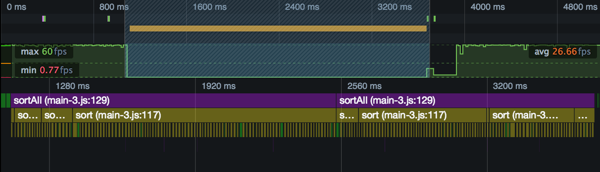
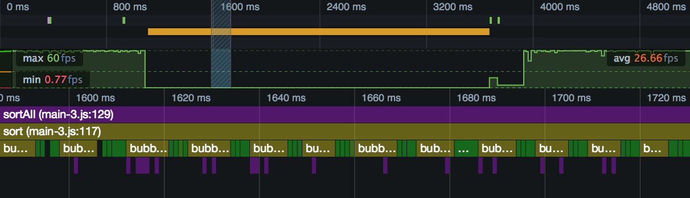
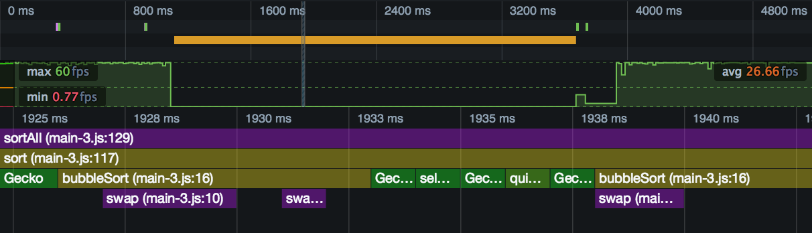

===========
Flame Chart
===========

The Flame Chart shows you the state of the JavaScript stack for your code at every millisecond during the performance profile.

This gives you a way to know exactly which function was executing at any point during the recording, how long it ran for, and where it was called from.

The Call Tree and the Flame Chart are both used to analyze your site's JavaScript, and they both use the same data: a sample of the JavaScript engine's stack, taken periodically during the recording.

But while the Call Tree organizes this data to show you where your program is spending most time in aggregate across the recording, the Flame Chart uses it to show you when in the recording particular functions are executing. Essentially it shows you the state of the call stack at any given point during the recording.

Here's a screenshot showing the Flame Chart for a section of a profile:

First of all, you'll see that, in the :ref:`recording overview pane <performance-ui-tour-recording-overview>`, we've selected a small slice of the recording to view in the Flame Chart. The Flame Chart displays a lot of data, so to get readable results, it's usually necessary to zoom in.

In the Flame Chart view itself, along the X-axis is time. The screenshot above covers the period from 1435ms to a little past 1465ms. Along the Y-axis are the functions on the call stack at that point in time, with the top-level at the top, and the leaf function at the bottom. Functions are color-coded to make them easier to distinguish.

This gives you a way to know exactly which function was executing at any point during the recording, how long it ran for, and where it was called from.

Zooming and panning
*******************

To work effectively with the Flame Chart, you'll need to be able to navigate it. There are two main controls you can use to navigate the Flame Chart:

.. list-table::
    :widths: 50 50
    :header-rows: 0

    * - **Zoom**: increase/decrease the selected portion of the complete profile that's displayed in the Flame Chart
      - 1) Mouse wheel up/down in the Flame Chart.
        2) Trackpad 2 fingers up/down in the Flame Chart.

    * - **Pan**: move the selected portion of the complete profile left and right

      - 1) Click and drag the selected portion in the :ref:`recording overview pane <performance-ui-tour-recording-overview>`.
        2) Click and drag anywhere in the Flame Chart.

An example
**********

To see how the Flame Chart can reveal the behavior of your program, we'll look at a simple example. We'll use the same example as in the :doc:`Call Tree <../call_tree/index>` page: a program that compares three different sorting algorithms. There's a :doc:`separate page <../examples/sorting_algorithms_comparison/index>` that gives an overview of this program's structure.

We'll use the same profile file as that used in the Call Tree page. In the call tree page, we figured out that the program call graph in that profile, and the associated sample count, looked like this:

.. code-block:: JavaScript

    sortAll()                   //    8
     -> sort()                  //   37
        -> bubbleSort()         // 1345
          -> swap()             //  252
        -> selectionSort()      //  190
          -> swap()             //    1
        -> quickSort()          //  103
          -> partition()        //   12

First, we'll just select the whole section in which the program was active:

At the top, colored purple, is the ``sortAll()`` call, running throughout the program from start to finish. Underneath that, colored olive-green, are the calls it's making to ``sort()``. Underneath that, like the teeth of a comb, are all the calls being made to each sorting algorithm.

Let's zoom in:

This slice is about 140 ms long, and shows us more details of the functions being called by ``sort()``. The ``sort()`` code is just this:

.. code-block:: JavaScript

    function sort(unsorted) {
      console.log(bubbleSort(unsorted));
      console.log(selectionSort(unsorted));
      console.log(quickSort(unsorted));
    }

The markers labeled "bubb..." and colored olive-green are presumably ``bubbleSort()``. The ones colored plain green are presumably the other sort functions. Even at a glance, we can see that the bubble sort blocks are much wider (of a longer duration) than the others.

We can also see some functions being called from ``bubbleSort()``, colored purple.

Let's zoom in one more time:

This slice is about 20ms long. We can see that the purple markers underneath ``bubbleSort()`` are the calls to ``swap()``. If you counted them all, the Call Tree view tells us that you'd see 253 of them. All the ones in this zoom are underneath ``bubbleSort()``, but according to the Call Tree view, the profile does contain one under ``selectionSort()``.

We can also see that two of the green markers are for ``selectionSort()`` and ``quickSort()``, but we're also seeing calls to platform (Gecko) code in between our calls to the sorting functions. It seems very likely that this is from the ``console.log()`` calls in ``sort()``.
