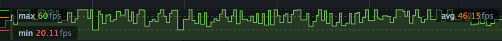
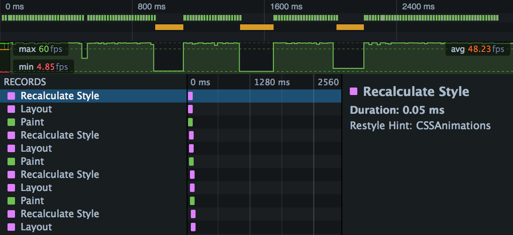
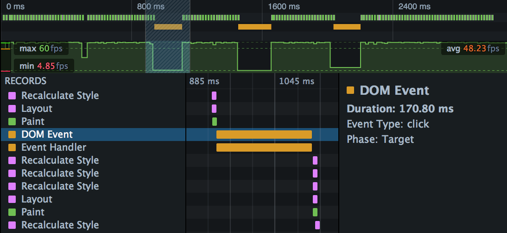
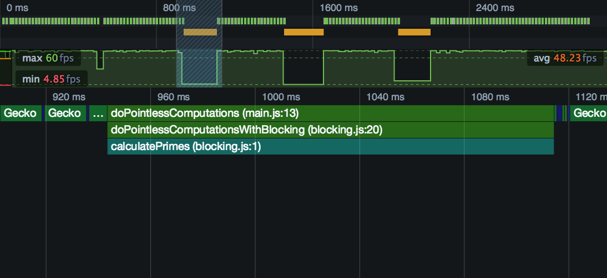

==========
Frame rate
==========
Frame rate is a measure of awebsite's responsiveness. A low or inconsistent frame rate can make a site appear unresponsive or janky, making for a bad user experience.

**A frame rate of 60fps is the target for smooth performance, giving you a time budget of 16.7ms for all the updates needed in response to some event.**

The frame rate graph in the Performance tool shows you the frame rate over the course of a recording. It gives you a quick indication of where your site might be having problems, enabling you to use the other tools for a more in-depth analysis.

Frame rate and responsiveness
*****************************

Frame rate is the rate at which a video device can produce images (or frames). It's most familiar from film and gaming, but is now widely used as a performance measure for websites and web apps.

In web performance, a frame encapsulates the work the browser needs to do in order to update and repaint the screen. Frame rate is most obviously applicable to animations: if the frame rate is too low, an animation will have a jerky appearance, while a faster frame rate will be smoother. But frame rate is also useful as a general measure of a site's responsiveness as the user interacts with it.

For example, if moving the mouse over some page element triggers some JavaScript that changes the element's appearance, and that triggers a reflow and a repaint, then all this work needs to be completed in that frame. If it takes too long for the browser to process the frame, then the browser will appear momentarily unresponsive (janky).

Similarly, if scrolling through a page involves a lot of complex page updates and the browser can't keep up an acceptable frame rate, scrolling the page will appear sluggish or will occasionally freeze.

In general, a high and consistent frame rate will make the user's interaction with the site more enjoyable and engaging.

.. note::
  A frame rate of 60fps is reckoned to be the target for smooth performance, giving you a time budget of 16.7ms for all the updates that need to be made synchronously in response to some event.

  However, consistency is especially important: if you can't deliver 60fps, it's better to deliver lower frame rates more consistently, and avoid sudden dips in the frame rate which cause the site to freeze.

Frame rate graph
****************

The frame rate graph is found in the :ref:`Recording overview <performance-ui-tour-recording-overview>` part of the Performance tool. It takes a timestamp when the browser finishes a frame, and uses this to keep track of the frame rate over the course of the recording.

The x-axis is time over the profile period, and there are three annotations: the maximum frame rate, the average frame rate, and the lowest frame rate.

Using the frame rate graph
**************************

The great value of the frame rate graph is that, like the :doc:`Web Console <../../web_console/index>`, it gives you a quick indication of where your site might be having problems, enabling you to use the other tools for more in-depth analysis. For example, here's a screenshot of a performance profile:

You can see that the average frame rate is reasonably healthy, but there are three spots where frame rate collapses for tens of milliseconds. This would certainly cause a noticeable stutter for any animations that were playing in the page.

The frame rate graph is correlated with the :ref:`waterfall summary <performance-ui-tour-waterfall-overview>` directly above it, and there we can see that the first two drops in the frame rate are correlated with orange bars, which denote time spent executing JavaScript.

If we select one of these slices of the recording, the main :doc:`Waterfall view <../waterfall/index>` underneath it is zoomed into it, and we can see the function that's causing the problem:

We have a JavaScript function from a click event that's blocking the main thread for 170 milliseconds.

Which function, though? Switch to the :doc:`Flame Chart <../flame_chart/index>` to see the call stack at that point:

The offending function is called ``doPointlessComputations()``, and it's defined in "main.js". To fix it, we might consider splitting it into pieces and running the pieces inside `requestAnimationFrame <https://developer.mozilla.org/en-US/docs/Web/API/window/requestAnimationFrame>`_, or even running the entire function in a `worker <https://developer.mozilla.org/en-US/docs/Web/API/Web_Workers_API/Using_web_workers>`_. The :doc:`Intensive JavaScript <../scenarios/intensive_javascript/index>` article shows how you can use strategies like this to fix responsiveness problems caused by long-running synchronous JavaScript.
