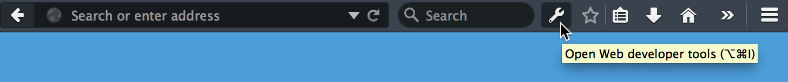
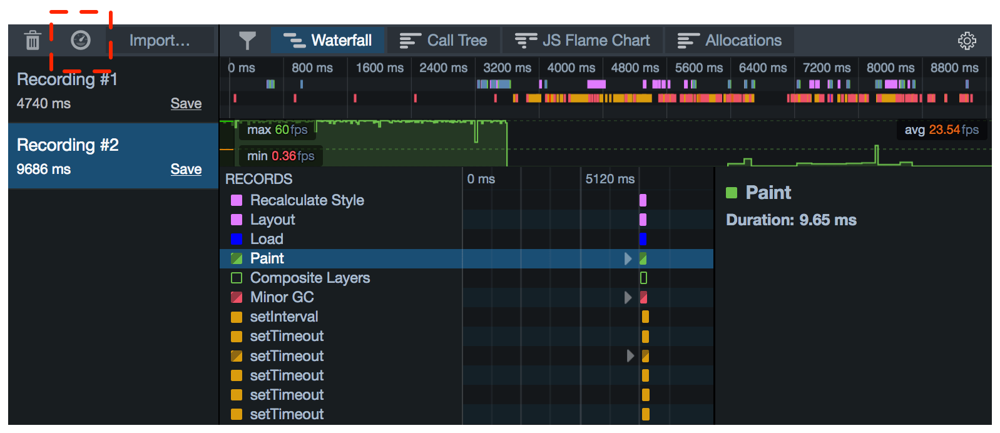
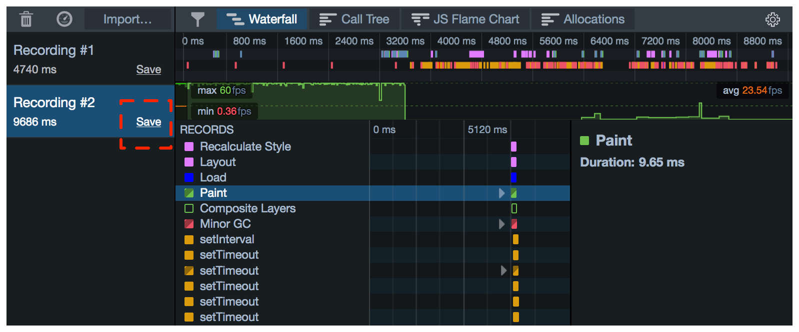
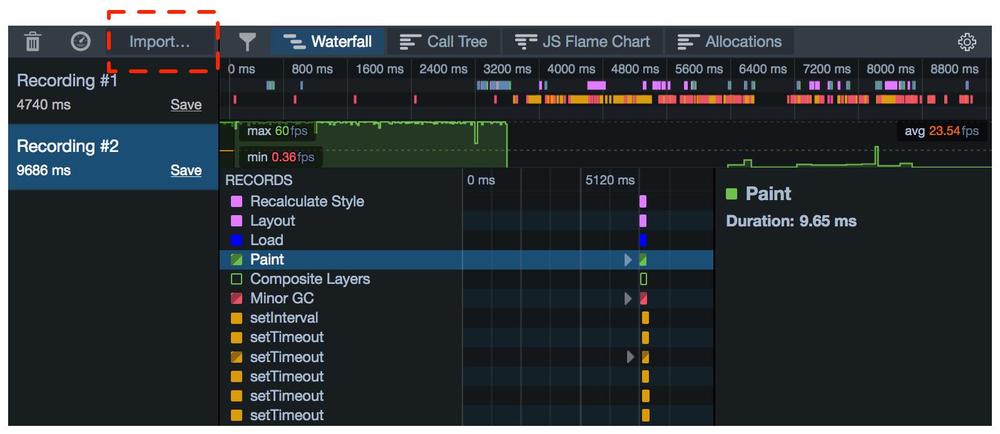
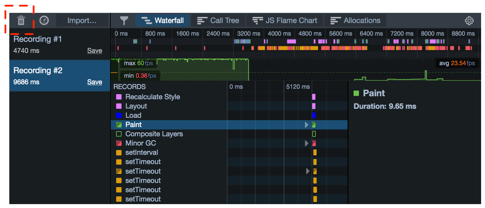
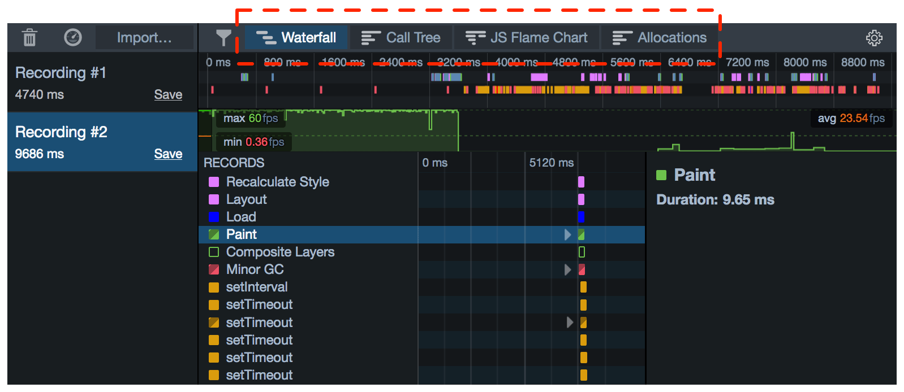
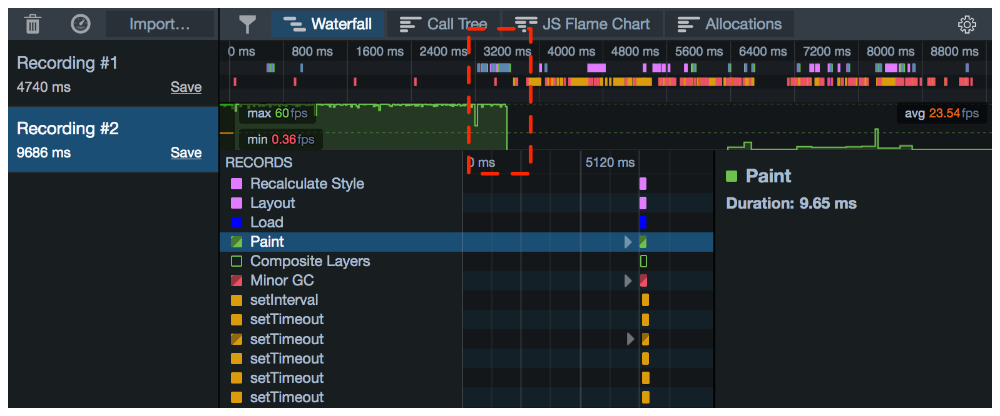

======
How to
======

Open the Performance tools
**************************

To open the Performance tools:

- press :kbd:`Shift` + :kbd:`F5`
- select "Performance" from the Web Developer submenu in the Firefox Menu (or Tools menu if you display the menu bar or are on OSX)
- select "Performance" from Tools button, in the Toolbar, if you have one:

.. _performance-how-to-record-a-profile:

Record a profile
****************

To start a new recording, press the stopwatch icon in the Recordings pane. To stop, press it again:

You can also start and stop recording from the Web Console, using `console.profile() <https://developer.mozilla.org/en-US/docs/Web/API/console/profile>`_ and `console.profileEnd() <https://developer.mozilla.org/en-US/docs/Web/API/console/profileEnd>`_.

Save a profile
**************

To save a profile, click the link labeled "Save" in the Recordings pane:

Load a profile
**************

To load a profile, click "Import..." and choose the file:

Clear all loaded profiles
*************************

To clear all loaded profiles, click "Clear".

.. note::

  If you do this, you'll lose any loaded profiles that you have not saved.

Select a tool
*************

To switch between the :doc:`Waterfall <../waterfall/index>`, :doc:`Call Tree <../call_tree/index>`, and :doc:`Flame Chart <../flame_chart/index>` tools, use the buttons in the toolbar:

Configure markers displayed
***************************

To control which markers are shown in the :doc:`Waterfall <../waterfall/index>`, use the button in the toolbar:

.. image:: perf-markers.png
  :class: center

Zoom in
*******

To zoom into a slice of the recording, select that slice in the recording overview:

