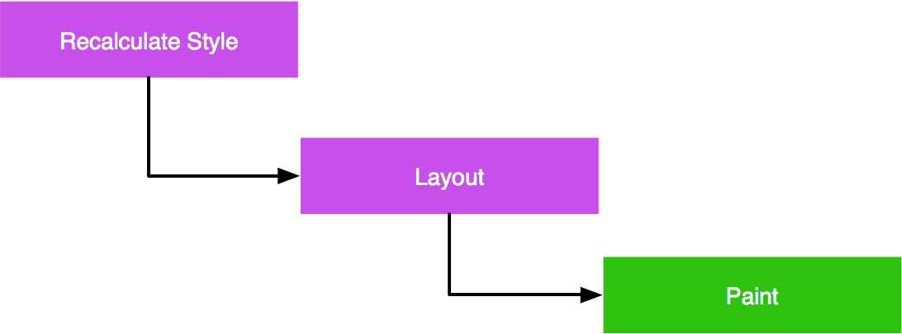
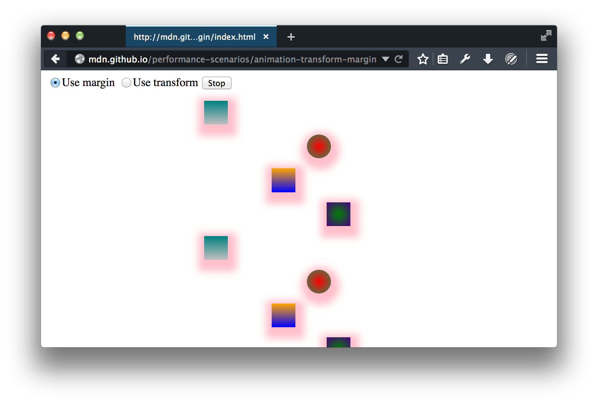
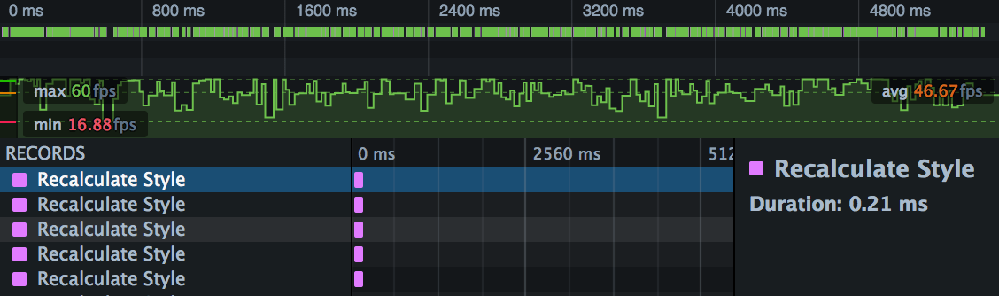
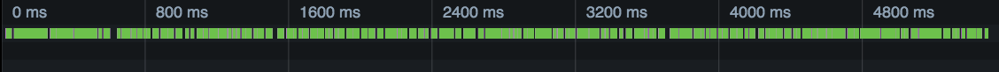
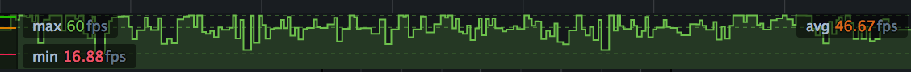
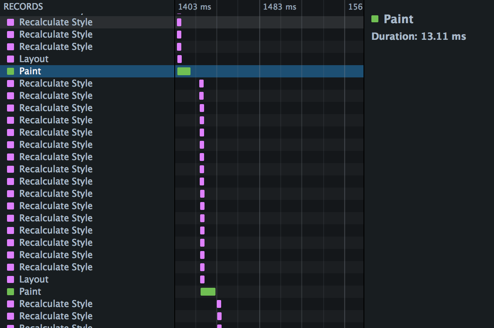
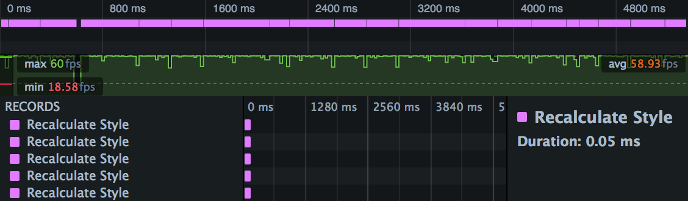
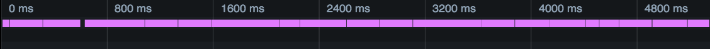
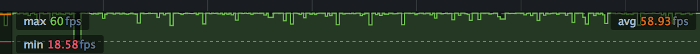
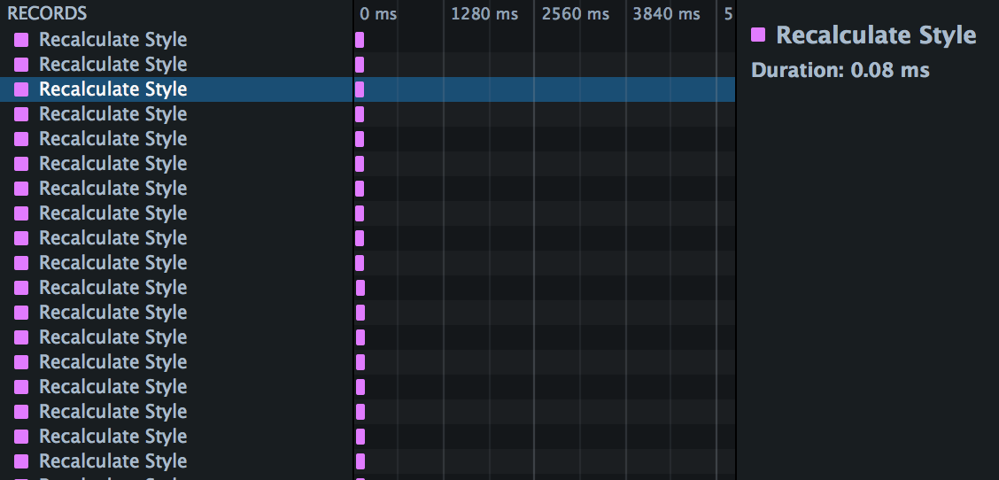

========================
Animating CSS properties
========================
The performance cost of animating a CSS property can vary from one property to another, and animating expensive CSS properties can result in `jank <https://developer.mozilla.org/en-US/docs/Glossary/Jank>`_ as the browser struggles to hit a smooth frame rate.

The :doc:`Frame rate <../../frame_rate/index>` and :doc:`Waterfall <../../waterfall/index>` can give you insight into the work the browser's doing in a CSS animation, to help diagnose performance problems.

With `CSS animations <https://developer.mozilla.org/en-US/docs/Web/CSS/CSS_Animations/Using_CSS_animations>`_ you specify a number of `keyframes <https://developer.mozilla.org/en-US/docs/Web/CSS/@keyframes>`_, each of which uses CSS to define the appearance of the element at a particular stage of the animation. The browser creates the animation as a transition from each keyframe to the next.

Compared with animating elements using JavaScript, CSS animations can be easier to create. They can also give better performance, as they give the browser more control over when to render frames, and to drop frames if necessary.

However, the performance cost of modifying a CSS property can vary from one property to another. Animating expensive CSS properties can result in `jank <https://developer.mozilla.org/en-US/docs/Glossary/Jank>`_ as the browser struggles to hit a smooth frame rate.

.. _performance-scenarios-animating_css_properties-rendering-waterfall:

The CSS rendering waterfall
***************************

The process the browser uses to update the page when a CSS property has changed can be described as a waterfall consisting of the following steps:

- **Recalculate Style**: every time a CSS property for an element changes, the browser must recalculate computed styles.
- **Layout**: next, the browser uses the computed styles to figure out the position and geometry for the elements. This operation is labeled "layout" but is also sometimes called "reflow".
- **Paint**: finally, the browser needs to repaint the elements to the screen. One last step is not shown in this sequence: the page may be split into layers, which are painted independently and then combined in a process called "Composition".

This sequence needs to fit into a single frame, since the screen isn't updated until it is complete. It's commonly accepted that 60 frames per second is the rate at which animations will appear smooth. For a rate of 60 frames per second, that gives the browser 16.7 milliseconds to execute the complete flow.

.. _performance-scenarios-animating_css_properties-css-property-cost:

CSS property cost
*****************

In the context of the rendering waterfall, some properties are more expensive than others:

.. |br| raw:: html

   

.. list-table::
  :widths: 60 20 20
  :header-rows: 1

  * - Property type
    - Cost
    - Examples

  * - Properties that affect an element's *geometry* or *position* trigger a style recalculation, a layout and a repaint.
    - .. image:: recalculate-style.png
      .. image:: layout.png
      .. image:: paint.png
    - `left <https://developer.mozilla.org/en-US/docs/Web/CSS/left>`_ |br|
      `max-width <https://developer.mozilla.org/en-US/docs/Web/CSS/max-width>`_ |br|
      `border-width <https://developer.mozilla.org/en-US/docs/Web/CSS/border-width>`_ |br|
      `margin-left <https://developer.mozilla.org/en-US/docs/Web/CSS/margin-left>`_ |br|
      `font-size <https://developer.mozilla.org/en-US/docs/Web/CSS/font-size>`_

  * - Properties that don't affect geometry or position, but are not rendered in their own layer, do not trigger a layout.
    - .. image:: recalculate-style.png
      .. image:: layout-faint.png
      .. image:: paint.png
    - `color <https://developer.mozilla.org/en-US/docs/Web/CSS/color>`_

  * - Properties that are rendered in their own layer don't even trigger a repaint, because the update is handled in composition.
    - .. image:: recalculate-style.png
      .. image:: layout-faint.png
      .. image:: paint-faint.png
    - `transform <https://developer.mozilla.org/en-US/docs/Web/CSS/transform>`_ |br|
      `opacity <https://developer.mozilla.org/en-US/docs/Web/CSS/opacity>`_

.. note::

  The `CSS Triggers <https://csstriggers.com/>`_ website shows how much of the waterfall is triggered for each CSS property, with information for most CSS properties by browser engine.

An example: margin versus transform
***********************************

In this section we'll see how the :doc:`Waterfall </../../waterfall/index>` can highlight the difference between animating using `margin <https://developer.mozilla.org/en-US/docs/Web/CSS/margin>`_ and animating using `transform <https://developer.mozilla.org/en-US/docs/Web/CSS/transform>`_.

The intention of this scenario isn't to convince you that animating using ``margin`` is always a bad idea. It's to demonstrate how the tools can give you insight into the work the browser is doing to render your site, and how you can apply that insight to diagnose and fix performance problems.

If you want to play along, the demo website is `here <https://mdn.github.io/performance-scenarios/animation-transform-margin/index.html>`_. It looks like this:

It has two controls: a button to start/stop the animation, and a radio group to choose to animate using ``margin``, or to animate using ``transform``.

There are a number of elements, and we've added a `linear-gradient <https://developer.mozilla.org/en-US/docs/Web/CSS/gradient/linear-gradient()>`_ background and a `box-shadow <https://developer.mozilla.org/en-US/docs/Web/CSS/box-shadow>`_ to each element, because they are both relatively expensive effects to paint.

Animating using margin
----------------------

Leaving the "Use margin" option set, start the animation, open the Performance tool, and make a recording. You'll only need to record a few seconds.

Open up the first recording. Exactly what you'll see depends a lot on your machine and system load, but it will be something like this:

This is showing three distinct views: (a) an overview of the Waterfall, (b) the frame rate, and (c) the timeline details.

.. _performance-scenarios-animation-css-properties-margin-waterfall-overview:

Waterfall overview
~~~~~~~~~~~~~~~~~~

This is showing a compressed view of the :doc:`Waterfall <../../waterfall/index>`. The predominance of green is telling us that :ref:`we're spending a lot of time painting <performance-waterfall-markers>`.

.. _performance-scenarios-animation-css-properties-margin-frame-rate:

Frame rate
~~~~~~~~~~

This is showing :doc:`frame rate <../../frame_rate/index>`. Average frame rate here is 46.67fps, well below the target of 60fps. Worse, though, is that the frame rate is very jagged, with lots of dips into the twenties and teens. It's unlikely you'll see a smooth animation here, especially when you add in user interaction.

.. _performance-scenarios-animation-css-properties-margin-waterfall:

Waterfall
~~~~~~~~~

The rest of the recording shows the Waterfall view. If you scroll through this, you'll see a pattern like this:

This is showing us the :ref:`rendering waterfall <performance-scenarios-animating_css_properties-rendering-waterfall>`. In each animation frame, we recalculate styles for every element, then perform a single layout, then a repaint.

You can see that paint especially is hurting performance here. In the screenshot above we've highlighted a paint operation, and the box on the right tells us it took 13.11ms. With only 16.7ms in our total budget, it's not surprising we are missing a consistently high frame rate.

You can experiment with this: try removing the box shadow :doc:`using the Page Inspector <../../../page_inspector/how_to/examine_and_edit_css/index>`, and see how that affects paint time. But next, we'll see how using `transform <https://developer.mozilla.org/en-US/docs/Web/CSS/transform>`_ instead of `margin <https://developer.mozilla.org/en-US/docs/Web/CSS/margin>`_ eliminates those expensive paints entirely.

Animating using transform
-------------------------

Now switch the radio button in the web page to "Use transform", and make a new recording. It will look something like this:

Waterfall overview
~~~~~~~~~~~~~~~~~~

Compared with :ref:`the version that uses margin <performance-scenarios-animation-css-properties-margin-waterfall-overview>`, we're seeing a lot less green and a lot more pink, which :ref:`could be either layout or style recalculation <performance-waterfall-markers>`.

Frame rate
~~~~~~~~~~

Compared with :ref:`the version that uses margin <performance-scenarios-animation-css-properties-margin-frame-rate>`, this is looking pretty good. We're averaging nearly 60fps, and apart from one dip near the start, we're getting a consistently high frame rate.

Waterfall
~~~~~~~~~

The timeline view shows the reason for the improved frame rate. Compared with :ref:`the version that uses margin <performance-scenarios-animation-css-properties-margin-waterfall>`, we're not spending any time in layout or (more importantly in this case) in paint:

In this case, using ``transform`` significantly improved the site's performance, and the performance tools were able to show how and why it did.
