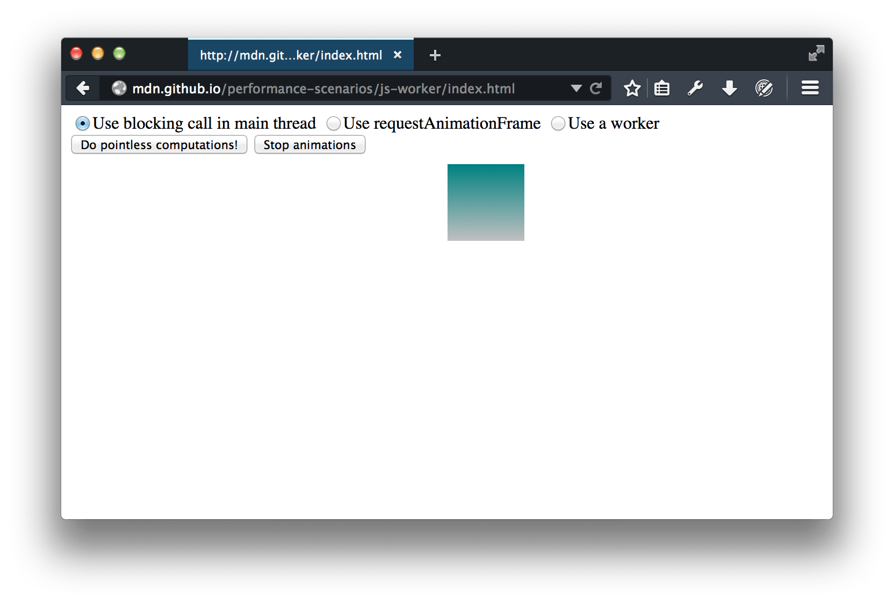
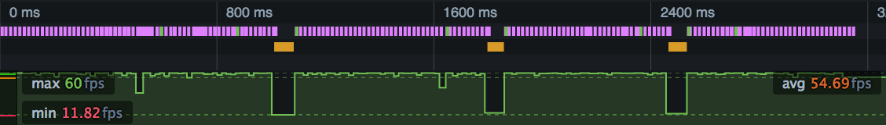
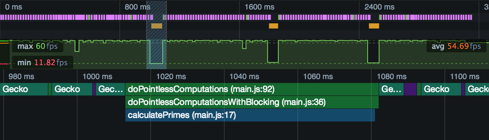
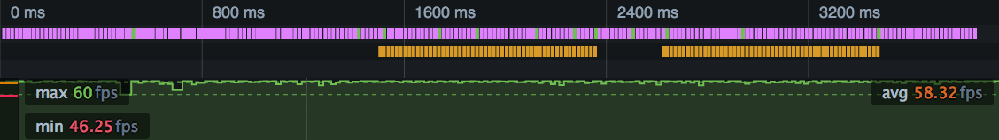
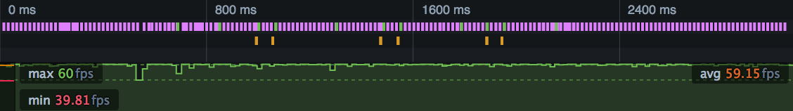

====================
Intensive JavaScript
====================

By default the browser uses a single thread to run all the JavaScript in your page as well as to perform layout, reflows, and garbage collection. This means that long-running JavaScript functions can block the thread, leading to an unresponsive page and a bad user experience.

You can use the :doc:`Frame rate <../../frame_rate/index>` and :doc:`Waterfall <../../waterfall/index>` tools to see when JavaScript is causing performance problems, and to single out the particular functions that need attention.

In this article we'll take an example site whose long-running JavaScript causes responsiveness problems, and apply two different approaches to fixing them. The first is to split long-running functions into pieces and use `requestAnimationFrame <https://developer.mozilla.org/en-US/docs/Web/API/window/requestAnimationFrame>`_ to schedule each piece, and the second is to run the whole function in a separate thread using a `web worker <https://developer.mozilla.org/en-US/docs/Web/API/Web_Workers_API/Using_web_workers>`_.

If you want to play along you can find the demo website `here <https://mdn.github.io/performance-scenarios/js-worker/index.html>`_.

The demo website looks like this:

It has three controls:

- a radio button group to control how to run the JavaScript: as a single blocking operation in the main thread, as a series of smaller operations in the main thread using ``requestAnimationFrame()``, or in another thread using a worker.
- a button to run the JavaScript, labeled "Do pointless computations!".
- a button to start and stop some CSS animations. This just gives the browser some background tasks to perform.

Leaving the radio button set to "Use blocking call in main thread", make a recording:

- press the "Start animations" button
- start recording a performance profile
- press "Do pointless computations!" two or three times
- stop recording the profile

.. _performance-scenarios-intensive-javascript-js-blocking-overview:

Exactly what you see will vary from one machine to another, but it will be something like this:

The top half of this is the :ref:`waterfall overview <performance-ui-tour-waterfall-overview>`. It gives us a compressed view of the :doc:`Waterfall <../../waterfall/index>`, which tells us what kinds of operations the browser is doing during the recording. :ref:`The pink says that we are mostly performing CSS calculations and possibly reflow <performance-waterfall-markers>`: this is the CSS animation that's running throughout the profile. Then there are three solid blocks of orange, representing JavaScript execution, one for each time we pressed the button.

The bottom half, which is correlated with the timeline summary in time, shows :doc:`frame rate <../../frame_rate/index>`. We can see that frame rate is pretty healthy for most of the recording, but collapses completely whenever we press the button.

We can select one of these periods and have a closer look at it in the main Waterfall view:

.. image:: perf-js-blocking-waterfall.png
  :class: center

Here, when we pressed the button, the browser ran a JavaScript function, or series of functions, that blocked the main thread for 71.73ms, or more than four times our frame budget.

Which function, though? By switching to the :doc:`Flame Chart <../../flame_chart/index>` view we can find out:

This shows us the JS call stack at this point in the execution. At the top of the stack is a function called ``calculatePrimes()``, and we can see its filename and line number. Here's the code, together with its immediate caller:

.. code-block:: JavaScript

  const iterations = 50;
  const multiplier = 1000000000;

  function calculatePrimes(iterations, multiplier) {
    var primes = [];
    for (var i = 0; i < iterations; i++) {
      var candidate = i * (multiplier * Math.random());
      var isPrime = true;
      for (var c = 2; c <= Math.sqrt(candidate); ++c) {
        if (candidate % c === 0) {
            // not prime
            isPrime = false;
            break;
         }
      }
      if (isPrime) {
        primes.push(candidate);
      }
    }
    return primes;
  }

  function doPointlessComputationsWithBlocking() {
   var primes = calculatePrimes(iterations, multiplier);
   pointlessComputationsButton.disabled = false;
   console.log(primes);
  }

We're just running a (very inefficient) primality test 50 times, for some quite large numbers.

Using requestAnimationFrame
***************************

In the first attempt at fixing this, we'll split up the function into a number of much smaller self-contained functions, and schedule each one using `requestAnimationFrame() <https://developer.mozilla.org/en-US/docs/Web/API/window/requestAnimationFrame>`_.

``requestAnimationFrame()`` tells the browser to run the given function in each frame, just before it performs a repaint. As long as each function is reasonably small, the browser should be able to keep inside its frame budget.

It's pretty simple to split up ``calculatePrimes()``: we will just calculate primality for each number in a separate function:

.. code-block:: javascript

  function doPointlessComputationsWithRequestAnimationFrame() {

    function testCandidate(index) {
      // finishing condition
      if (index == iterations) {
        console.log(primes);
        pointlessComputationsButton.disabled = false;
        return;
      }
      // test this number
      var candidate = index * (multiplier * Math.random());
      var isPrime = true;
      for (var c = 2; c <= Math.sqrt(candidate); ++c) {
        if (candidate % c === 0) {
            // not prime
            isPrime = false;
            break;
         }
      }
      if (isPrime) {
        primes.push(candidate);
      }
      // schedule the next
      var testFunction = testCandidate.bind(this, index + 1);
      window.requestAnimationFrame(testFunction);
    }

    var primes = [];
    var testFunction = testCandidate.bind(this, 0);
    window.requestAnimationFrame(testFunction);
  }

Let's test this version out: select the radio button labeled "Use requestAnimationFrame" and capture another profile. This time, the recording should look something like this:

This is exactly what we might have expected to see. Instead of :ref:`a single solid orange block <performance-scenarios-intensive-javascript-js-blocking-overview>`, each button-press shows up as a long sequence of very short orange blocks. The orange blocks appear one frame apart, and each one represents one of the functions called from ``requestAnimationFrame()``. Note that there are only two button-presses in this profile.

The function calls are interleaved with the pink blocks from the CSS animation, and each function is short enough that the browser can handle it without the overall frame rate dropping.

Using ``requestAnimationFrame`` worked to solve the responsiveness problem here, but there are a couple of potential problems with it:

- it can be difficult to split up a long-running function into separate self-contained functions. Even this very simple case produced more complex code.
- the split-up version takes much longer to run. In fact we can be quite precise about how long it takes: there are 50 iterations, and the browser is producing about 60 frames per second. So it will take almost a second to run all the computations, and that's visible in both the user experience and in the profile.

Using web workers
*****************

In this version we'll try to fix the problem using a web worker. Web workers enable you to run JavaScript in a separate thread. The main thread and the worker thread can't call each other directly, but communicate using an asynchronous messaging API.

The main thread code would look something like this:

.. code-block:: javascript

  const iterations = 50;
  const multiplier = 1000000000;

  var worker = new Worker("js/calculate.js");

  function doPointlessComputationsInWorker() {

    function handleWorkerCompletion(message) {
      if (message.data.command == "done") {
        pointlessComputationsButton.disabled = false;
        console.log(message.data.primes);
        worker.removeEventListener("message", handleWorkerCompletion);
      }
    }

    worker.addEventListener("message", handleWorkerCompletion, false);

    worker.postMessage({
      "multiplier": multiplier,
      "iterations": iterations
    });
  }

The main difference here, compared with the original, is that we need to:

- create a worker
- send it a message when we are ready to calculate
- listen for a message called "done", which indicates that the worker has finished.

Then we need a new file "calculate.js", that looks like this:

.. code-block:: javascript

  self.addEventListener("message", go);

  function go(message) {
    var iterations = message.data.iterations;
    var multiplier = message.data.multiplier;
    primes = calculatePrimes(iterations, multiplier);

    self.postMessage({
      "command":"done",
      "primes": primes
    });
  }

  function calculatePrimes(iterations, multiplier) {
    var primes = [];
    for (var i = 0; i < iterations; i++) {
      var candidate = i * (multiplier * Math.random());
      var isPrime = true;
      for (var c = 2; c <= Math.sqrt(candidate); ++c) {
        if (candidate % c === 0) {
            // not prime
            isPrime = false;
            break;
         }
      }
      if (isPrime) {
        primes.push(candidate);
      }
    }
    return primes;
  }

In the worker, we have to listen for a message telling us to start, and send a "done" message back when we are done. The code that actually performs the computations is exactly the same as the original code.

So how does this version perform? Switch the radio button to "Use a worker", and capture a new profile. You should see something like this:

In this profile we pushed the button three times. :ref:`Compared with the original <performance-scenarios-intensive-javascript-js-blocking-overview>`, each button-press is visible in the overview as two very short orange markers:

- the ``doPointlessComputationsInWorker()`` function that handles the click event and starts the worker's processing
- the ``handleWorkerCompletion()`` function that runs when the worker calls "done".

In between, the worker runs all the primality tests, and it doesn't seem to have any effect at all on the responsiveness of the main thread. This might seem unlikely, but because workers run in a separate thread, they can take advantage of multi-core processors, which a single-threaded web site can't.

The main limitation of web workers is that DOM APIs are not available to code running in a worker.
