=======
UI Tour
=======

The performance tool's UI consists of 4 main pieces:

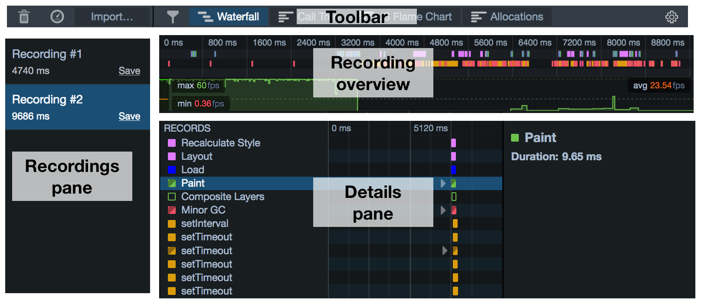

- :ref:`Toolbar <performance-ui-tour-toolbar>`
- :ref:`Recordings pane <performance-ui-tour-recordings-pane>`
- :ref:`Recording overview <performance-ui-tour-recording-overview>`
- :ref:`Details pane <performance-ui-tour-details-pane>`

   - :ref:`Waterfall <performance-ui-tour-waterfall>`
   - :ref:`Call Tree <performance-ui-tour-call-tree>`
   - :ref:`Flame Chart <performance-ui-tour-flame-chart>`

.. _performance-ui-tour-toolbar:

Toolbar
*******

The toolbar contains buttons to:

- start and stop a recording
- import a recording you previously saved
- clear the Recordings pane. *Note that if you do this, you lose any recordings you have not saved.*
- filter the :ref:`markers <performance-waterfall-markers>` that are displayed in the Waterfall view
- switch the active tool in the :ref:`Details pane <performance-ui-tour-details-pane>`
- access the Settings popup

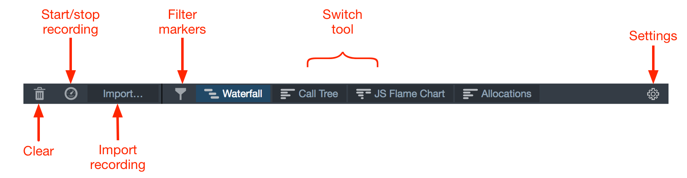

.. _performance-ui-tour-recordings-pane:

Recordings pane
***************

The recordings pane lists all the recordings you have loaded, including any you have made in this session and any you have imported.

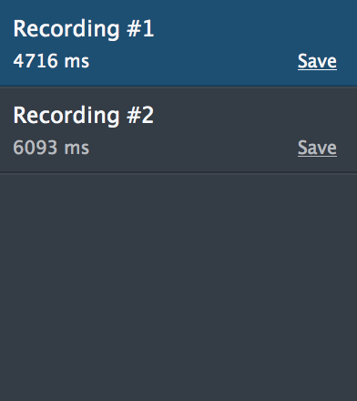

At any given time, one recording is selected, and that recording is displayed in the rest of the tool. To select a different recording, click its entry in the pane. To save the recording as a JSON file click "Save".

.. _performance-ui-tour-recording-overview:

Recording overview
******************

This displays an overview of the entire recording, with the x-axis representing time.

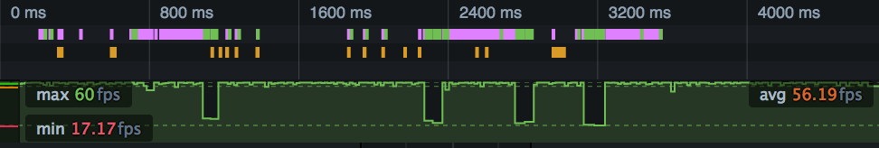

It contains two elements: an overview of the Waterfall and a frame rate graph.

.. _performance-ui-tour-waterfall-overview:

Waterfall overview
------------------

This presents a compressed view of the :doc:`Waterfall <../waterfall/index>`:

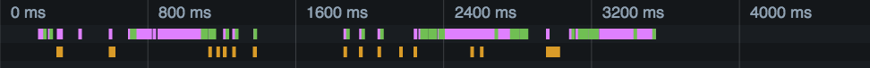

Recorded operations are color-coded using :ref:`the same scheme as in the main Waterfall view <performance-waterfall-markers>`.

Frame rate graph
----------------

The frame rate gives you an overview of the browser's responsiveness during the recording:

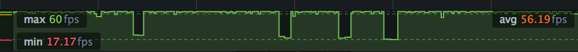

See the separate article on :doc:`frame rate <../frame_rate/index>`.

Correlating events
------------------

Because these elements are synchronized, you can correlate events in one element with events in another.

For example, in the screenshot below a long-running paint operation (:ref:`shown as a green bar <performance-waterfall-markers>` in the waterfall overview) corresponds to a drop in the frame rate:

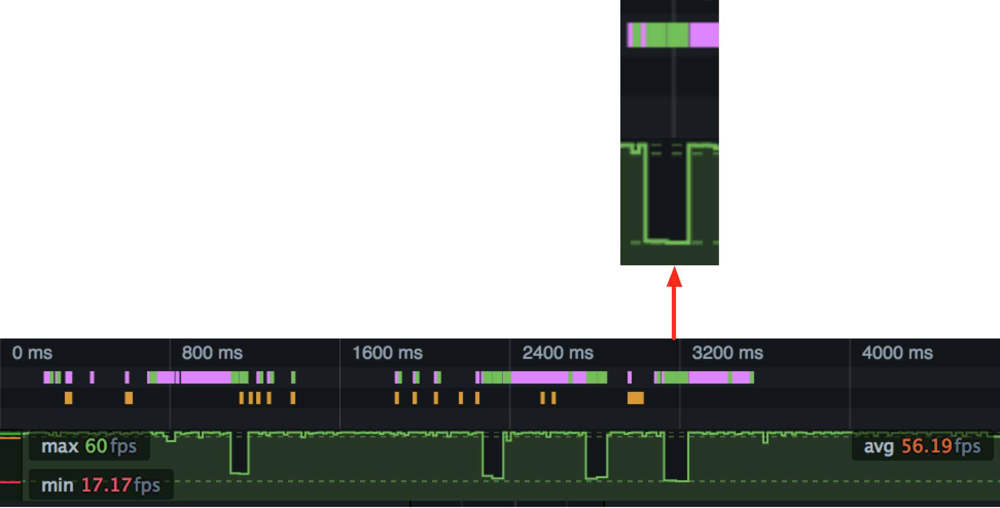

.. _performance-ui-tour-zooming-in:

Zooming in
----------

You can use the overview to select a slice of the recording to examine in more detail. Select a slice, and the main view will be updated to contain just the part selected. In the screenshot below we've selected that drop in the frame rate, and can see the long-running paint operation in more detail:

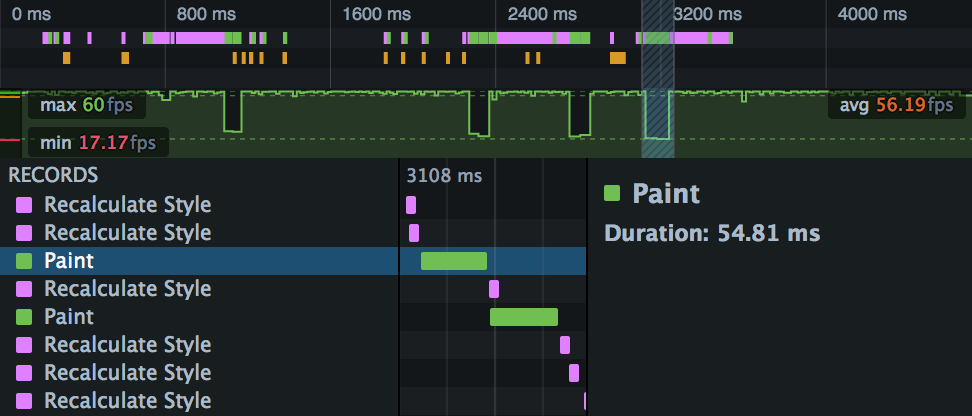

.. _performance-ui-tour-details-pane:

Details pane
************

The Details pane shows whichever tool is currently selected. To switch to a different tool, use the buttons in the :ref:`Toolbar <performance-ui-tour-toolbar>`.

.. _performance-ui-tour-waterfall:

Waterfall
---------

The Waterfall presents a view of the work the browser is doing during the recording: executing JavaScript, updating the CSS, updating the page layout, and performing repaints. The x-axis represents time, and the recorded operations are laid out as a waterfall, reflecting the serial nature of the browser's execution.

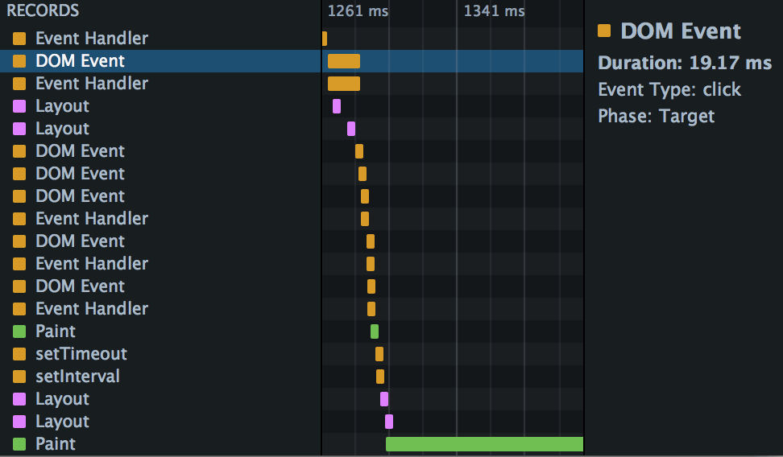

To learn much more about the Waterfall, see the separate :doc:`Waterfall <../waterfall/index>` page.

.. _performance-ui-tour-call-tree:

Call Tree
---------

The Call Tree is a sampling profiler for JavaScript running in the page. It periodically samples the state of the JavaScript engine, and records the stack for the code executing at the time the sample was taken. Statistically, the number of samples taken in which we were executing a particular function corresponds to the amount of time the browser is spending executing it, so you can identify bottlenecks in your code.

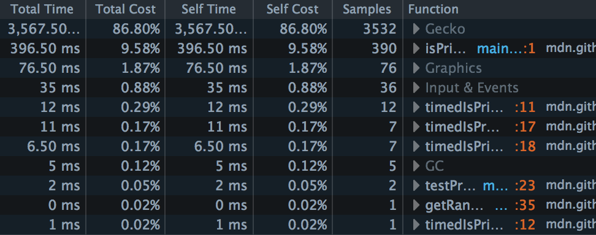

To learn much more about the Call Tree, see the separate :doc:`Call Tree <../call_tree/index>` page.

.. _performance-ui-tour-flame-chart:

Flame Chart
-----------

If the Call Tree tells you, statistically, which functions your site is spending most time executing across the whole recording, the Flame Chart tells you the call stack at any given point during the recording:

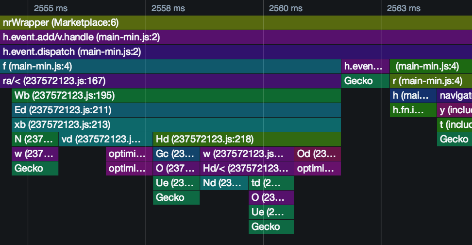

To learn much more about the Flame Chart, see the separate :doc:`Flame Chart <../flame_chart/index>` page.

Allocations
-----------

The Allocations view is new in Firefox 46.

The Allocations view is like the Call Tree view, but for allocations: it shows you which functions in your page are allocating the most memory over the course of the profile.

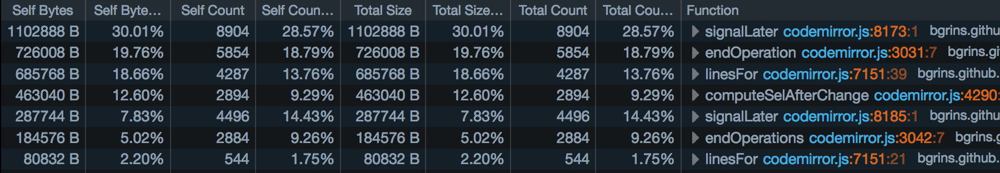

The Allocations view only appears if you checked "Record Allocations" in the Performance tool settings, before recording a profile

To learn much more about the Allocations view, see the separate :doc:`Allocations <../allocations/index>` page.
