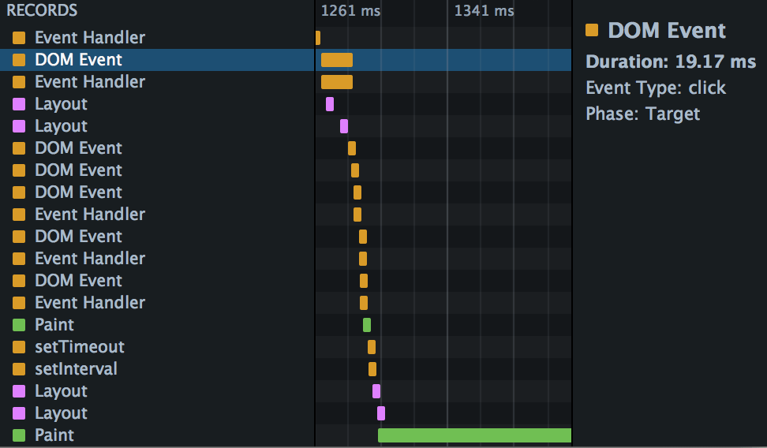
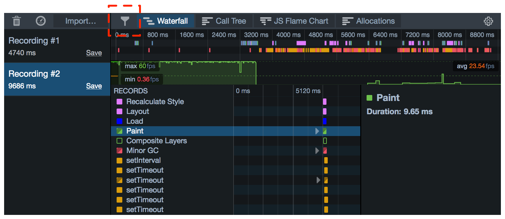
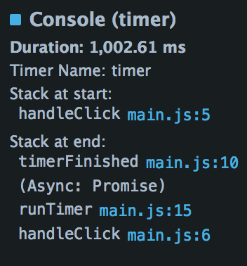

=========
Waterfall
=========

The Waterfall gives you insight into the sorts of things the browser is doing as it runs your site or app. It's based on the idea that the things a browser does when running a site can be divided into various types - running JavaScript, updating layout, and so on - and that at any given point in time, the browser is doing one of those things.

So if you see a sign of a performance problem - a drop in the frame rate, for example - you can go to the Waterfall to see what the browser was doing at that point in the recording.

Along the X-axis is time. Recorded operations, called markers, are shown as horizontal bars, laid out in a waterfall to reflect the serial nature of the browser's execution.

When a marker is selected you'll see more information about it in a sidebar on the right.This includes the marker's duration and some more information that's specific to the :ref:`marker type <performance-waterfall-markers>`.

.. _performance-waterfall-markers:

Markers
*******

The markers for operations are color-coded and labeled. The following operations are recorded:

.. |br| raw:: html

   

.. list-table::
  :widths: 40 20 40
  :header-rows: 1

  * - Name and description
    - Color
    - Detailed Information

  * - **DOM Event** |br| |br|
      JavaScript code that's executed in response to a DOM event.
    - .. image:: orange.png
    - **Event Type**
        For example, "click" or "message".
      **Event Phase**
        For example, "Target" or "Capture".

  * - JavaScript functions executed in the page are labeled with the reason the function was called: |br| |br|
      **Script Tag** |br|
      **setInterval** |br|
      **setTimeout** |br|
      **requestAnimationFrame** |br|
      **Promise Callback** |br|
      **Promise Init** |br|
      **Worker** |br|
      **JavaScript URI** |br|
      **Event Handler** |br|
    - .. image:: orange.png
    - **Stack**
        Call stack, with links to functions.

  * - **Parse HTML** |br| |br|
      Time spent parsing the page's HTML.
    - .. image:: orange.png
    - **Stack**
         Call stack, with links to functions.

  * - **Parse XML** |br| |br|
      Time spent parsing the page's XML.
    - .. image:: orange.png
    - **Stack**
         Call stack, with links to functions.

  * - **Recalculate Style** |br| |br|
      Calculating the computed styles that apply to page elements.
    - .. image:: purple.png
    - **Restyle Hint** |br| |br|
      A string indicating what kind of restyling is needed. The hint may be any of:

        - Self
        - Subtree
        - LaterSiblings
        - CSSTransitions
        - CSSAnimations
        - SVGAttrAnimations
        - StyleAttribute
        - StyleAttribute_Animations
        - Force
        - ForceDescendants

  * - **Layout** |br| |br|
      Calculating the position and size of page elements. This operation is sometimes called "reflow".
    - .. image:: purple.png
    -

  * - **Paint** |br| |br|
      Drawing pixels to the screen.
    - .. image:: green.png
    -

  * - **Garbage Collection** |br| |br|
      :ref:`Garbage collection event <performance-waterfall-garbage_collection>`. Non-incremental GC events are labeled "(Non-incremental)".
    - .. image:: red.png
    - **Reason**
        A string indicating the reason GC was performed.
        |br|
      **Non-incremental Reason**
        If the GC event was non-incremental, the string indicates the reason non-incremental GC was performed.

      New in Firefox 46: if the GC event was caused by allocation pressure, a link appears, labeled "Show Allocation Triggers". Click the link to see the allocation profile leading up to this GC event. |br| |br|

      See :ref:`Allocations and Garbage Collection <performance-allocations-and-garbage-collection>` for more details.

  * - **Cycle Collection** |br| |br|
      Reclaiming C++ reference-counted data structures. |br| |br|
      Like garbage collection, but for C++ objects. See `Kyle Huey's blog post about cycle collection <https://blog.kylehuey.com/post/27564411715/cycle-collection>`_.
    - .. image:: red.png
    - **Type**
        Always "Collect".

  * - **CC Graph Reduction** |br| |br|
      Preparation/pre-optimization for Cycle Collection.
    - .. image:: red.png
    - **Type**
        Always "ForgetSkippable".

  * - **Console** |br| |br|
      The period between matching calls to ``console.time()`` and ``console.timeEnd()``.
    - .. image:: gray.png
    - **Timer name**
        The argument passed to the ``console`` functions.
      **Stack at start**
        Call stack ``console.time()``, with links to functions.
      **Stack at End**
        (New in Firefox 41). Call stack at ``console.timeEnd()``. If this is inside a callback from a `Promise <https://developer.mozilla.org/en-US/docs/Web/JavaScript/Reference/Global_Objects/Promise>`_, this will also show the :ref:`Async stack <performance-waterfall-async-stack>`.

  * - **Timestamp** |br| |br|
        A single call to `console.timeStamp() <https://developer.mozilla.org/en-US/docs/Web/API/console/timeStamp>`_.
    - .. image:: blue.png
    - **Label**
        The argument passed to ``timeStamp()``.

  * - **DOMContentLoaded** |br| |br|
      The document's `DOMContentLoaded <https://developer.mozilla.org/en-US/docs/Web/API/Window/DOMContentLoaded_event>`_ event.
    - .. image:: red.png
    -

  * - **Load** |br| |br|
      The document's `load <https://developer.mozilla.org/en-US/docs/Web/API/Window/load_event>`_ event.
    - .. image:: blue.png
    -

  * - **Worker event in main thread** |br| |br|
      Shown when the main thread sends a message to a worker, or receives a message from a worker.
    - .. image:: orange.png
    - **Serialize data on the main thread**
        The main thread is serializing a message to be sent to the worker.
      **Deserialize data on the main thread**
        The main thread is deserializing a message received from the worker.

  * - **Worker event in worker thread**
      Shown when a worker receives a message from the main thread, or sends a message to the main thread.
    - .. image:: orange2-hollow.png
    - One of: |br| |br|

      **Serialize data in Worker**
        The worker is serializing a message to be sent to the main thread.

      **Deserialize data in Worker**
        The worker is deserializing a message received from the main thread.

The markers, and their colors, are the same in the Waterfall tool as in the :ref:`Waterfall overview <performance-ui-tour-waterfall-overview>`, making is easy to correlate from one to the other.

Filtering markers
-----------------

You can control which markers are displayed using a button in the :ref:`Toolbar <performance-ui-tour-toolbar>`:

Waterfall patterns
******************

Exactly what you'll see in the Waterfall is very dependent on the kind of thing your site is doing: JavaScript-heavy sites will have a lot of orange, while visually dynamic sites will have a lot of purple and green. But there are common patterns which can alert you to possible performance problems.

Rendering waterfall
-------------------

One pattern that you'll often see in the Waterfall view is something like this:

This is a visualization of the basic algorithm the browser uses to update the page in response to some event:

1. **JavaScript Function Call**: some event - for example, a DOM event - causes some JavaScript in the page to run. The JavaScript changes some of the page's DOM or CSSOM.
2. **Recalculate Style**: if the browser thinks the computed styles for page elements have changed, it must then recalculate them.
3. **Layout**: next, the browser uses the computed styles to figure out the position and geometry for the elements. This operation is labeled "layout" but is also sometimes called "reflow".
4. **Paint**: finally, the browser needs to repaint the elements to the screen. One last step is not shown in this sequence: the page may be split into layers, which are painted independently and then combined in a process called "Composition".

This sequence needs to fit into a single frame, since the screen isn't updated until it is complete. It's commonly accepted that 60 frames per second is the rate at which animations will appear smooth. For a rate of 60 frames per second, that gives the browser 16.7 milliseconds to execute the complete flow.

Importantly for responsiveness, the browser doesn't always have to go through every step:

- `CSS animations <https://developer.mozilla.org/en-US/docs/Web/CSS/CSS_Animations/Using_CSS_animations>`_ update the page without having to run any JavaScript.
- Not all CSS property changes cause a reflow. Changing properties that can alter an object's geometry and position, such as `width <https://developer.mozilla.org/en-US/docs/Web/CSS/width>`_, `display <https://developer.mozilla.org/en-US/docs/Web/CSS/display>`_, `font-size <https://developer.mozilla.org/en-US/docs/Web/CSS/font-size>`_, or `top <https://developer.mozilla.org/en-US/docs/Web/CSS/top>`_, will cause a reflow. However, changing properties that don't alter geometry or position, such as `color <https://developer.mozilla.org/en-US/docs/Web/CSS/color>`_ or `opacity <https://developer.mozilla.org/en-US/docs/Web/CSS/opacity>`_, will not.
- Not all CSS property changes cause a repaint. In particular, if you animate an element using the `transform <https://developer.mozilla.org/en-US/docs/Web/CSS/transform>`_ property, the browser will use a separate layer for the transformed element, and doesn't even have to repaint when the element is moved: the new position of the element is handled in composition.

The :doc:`Animating CSS properties <../scenarios/animating_css_properties/index>` article shows how animating different CSS properties can give different performance outcomes, and how the Waterfall can help signal that.

Blocking JavaScript
-------------------

By default, a site's JavaScript is executed in the same thread that the browser uses for layout updates, repaints, DOM events, and so on. This means that long-running JavaScript functions can cause unresponsiveness (jank): animations may not be smooth, or the site might even freeze.

Using the frame rate tool and the Waterfall together, it's easy to see when long-running JavaScript is causing responsiveness problems. In the screenshot below, we've zoomed in on a JS function that's caused a drop in the frame rate:

The :doc:`Intensive JavaScript <../scenarios/intensive_javascript/index>` article shows how the Waterfall can highlight responsiveness problems caused by long JavaScript functions, and how you can use asynchronous methods to keep the main thread responsive.

Expensive paints
----------------

Some paint effects, such as `box-shadow <https://developer.mozilla.org/en-US/docs/Web/CSS/box-shadow>`_, can be expensive, especially if you are applying them in a transition where the browser has to calculate them in every frame. If you're seeing drops in the frame rate, especially during graphically-intensive operations and transitions, check the Waterfall for long green markers.

.. _performance-waterfall-garbage_collection:

Garbage collection
------------------

Red markers in the Waterfall represent garbage collection (GC) events, in which `SpiderMonkey <https://spidermonkey.dev/>`_ (the JavaScript engine in Firefox) walks the heap looking for memory that's no longer reachable and subsequently releasing it. GC is relevant to performance because while it's running the JavaScript engine must be paused, so your program is suspended and will be completely unresponsive.

To help reduce the length of pauses, SpiderMonkey implements *incremental GC*: this means that it can perform garbage collection in fairly small increments, letting the program run in between. Sometimes, though, it needs to perform a full non-incremental collection, and the program has to wait for it to finish.

In trying to avoid GC events, and especially non-incremental GC events, it's wise not to try to optimize for the specific implementation of the JavaScript engine. SpiderMonkey uses a complex set of heuristics to determine when GC is needed, and when non-incremental GC in particular is needed. In general, though:

- GC is needed when a lot of memory is being allocated
- non-incremental GC is usually needed when the memory allocation rate is high enough that SpiderMonkey may run out of memory during incremental GC

When the Waterfall records a GC marker it indicates:

- whether the GC was incremental or not
- the reason the GC was performed
- if the GC was non-incremental, the reason it was non-incremental
- starting in Firefox 46, if the GC event was caused by allocation pressure, a link appears, labeled "Show Allocation Triggers". Click the link to see the allocation profile leading up to this GC event. See :ref:`Allocations and Garbage Collection <performance-allocations-and-garbage-collection>` for more details.

Adding markers with the console API
***********************************

Two markers are directly controlled by `console API <https://developer.mozilla.org/en-US/docs/Web/API/console>`_ calls: "Console" and "Timestamp".

Console markers
---------------

These enable you to mark a specific section of the recording.

To make a console marker, call ``console.time()`` at the start of the section, and ``console.timeEnd()`` at the end. These functions take an argument which is used to name the section.

For example, suppose we have code like this:

.. code-block:: JavaScript

  var iterations = 70;
  var multiplier = 1000000000;

  function calculatePrimes() {

    console.time("calculating...");

    var primes = [];
    for (var i = 0; i < iterations; i++) {
      var candidate = i * (multiplier * Math.random());
      var isPrime = true;
      for (var c = 2; c <= Math.sqrt(candidate); ++c) {
        if (candidate % c === 0) {
            // not prime
            isPrime = false;
            break;
         }
      }
      if (isPrime) {
        primes.push(candidate);
      }
    }

    console.timeEnd("calculating...");

    return primes;
  }

The Waterfall's output will look something like this:

The marker is labeled with the argument you passed to ``console.time()``, and when you select the marker, you can see the program stack in the right-hand sidebar.

.. _performance-waterfall-async-stack:

Async stack
~~~~~~~~~~~

New in Firefox 41.

Starting in Firefox 41, the right-hand sidebar will also show the stack at the end of the period: that is, at the point ``console.timeEnd()`` was called. If ``console.timeEnd()`` was called from the resolution of a `Promise <https://developer.mozilla.org/en-US/docs/Web/JavaScript/Reference/Global_Objects/Promise>`_, it will also display "(Async: Promise)", under which it will show the "async stack": that is, the call stack at the point the promise was made.

For example, consider code like this:

.. code-block:: JavaScript

  var timerButton = document.getElementById("timer");
  timerButton.addEventListener("click", handleClick, false);

  function handleClick() {
    console.time("timer");
    runTimer(1000).then(timerFinished);
  }

  function timerFinished() {
    console.timeEnd("timer");
    console.log("ready!");
  }

  function runTimer(t) {
    return new Promise(function(resolve) {
      setTimeout(resolve, t);
    });
  }

The Waterfall will display a marker for the period between ``time()`` and ``timeEnd()``, and if you select it, you'll see the async stack in the sidebar:

Timestamp markers
-----------------

Timestamps enable you to mark an instant in the recording.

To make a timestamp marker, call `console.timeStamp() <https://developer.mozilla.org/en-US/docs/Web/API/console/timeStamp>`_. You can pass an argument to label the timestamp.

For example, suppose we adapt the code above to make a timestamp every 10 iterations of the loop, labeled with the iteration number:

.. code-block:: JavaScript

  var iterations = 70;
  var multiplier = 1000000000;

  function calculatePrimes() {
    console.time("calculating...");

    var primes = [];
    for (var i = 0; i < iterations; i++) {

      if (i % 10 == 0) {
        console.timeStamp(i.toString());
      }

      var candidate = i * (multiplier * Math.random());
      var isPrime = true;
      for (var c = 2; c <= Math.sqrt(candidate); ++c) {
        if (candidate % c === 0) {
            // not prime
            isPrime = false;
            break;
         }
      }
      if (isPrime) {
        primes.push(candidate);
      }
    }
    console.timeEnd("calculating...");
    return primes;
  }

In the Waterfall you'll now see something like this:

