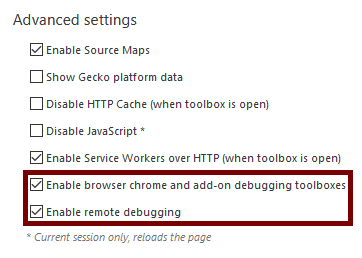

=========================
Debugging Firefox Desktop
=========================

.. warning::

  Draft: this page is not complete

This guide explains how you can use the Firefox Developer Tools to debug a different instance of desktop Firefox running on the same machine. In this guide, the instance of Firefox being debugged is called the *debuggee*, and the instance of Firefox doing the debugging is called the *debugger*.

Enable remote debugging
***********************

First, you'll need to ensure that both debugger and debuggee have the "Enable browser chrome and add-on debugging toolboxes" and "Enable remote debugging" settings checked in the :ref:`Developer Tools Settings <tool-toolbox-settings>`. If you're using `Firefox Developer Edition <https://www.mozilla.org/firefox/developer/>`_, they are checked by default.

You only need to do this once: the setting values persist across restarts.

Start the debugger server
*************************

Next, you need to start the debugger server in the debuggee.

Run the debuggee from the command line, passing it the ``--start-debugger-server`` option:

.. code-block::

  /path/to/firefox --start-debugger-server

Passed with no arguments, ``--start-debugger-server`` makes the debugger server listen on port 6000. To use a different port, pass the desired port number:

.. code-block::

  /path/to/firefox --start-debugger-server 1234

Note: in Windows, the ``start-debugger-server`` call will only have one dash:

.. code-block::

  firefox.exe -start-debugger-server 1234

.. note::

  By default, and for security reasons, the ``devtools.debugger.force-local`` option is set. If you want to debug a Firefox instance from an external machine, you can change this option, but only do this on a trusted network or set a strong firewall rule to lock down which machines can access it.

