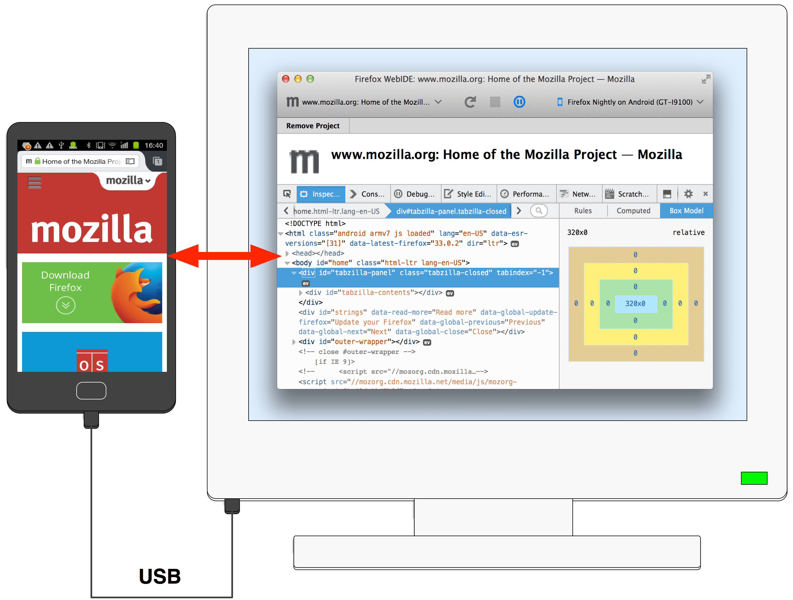
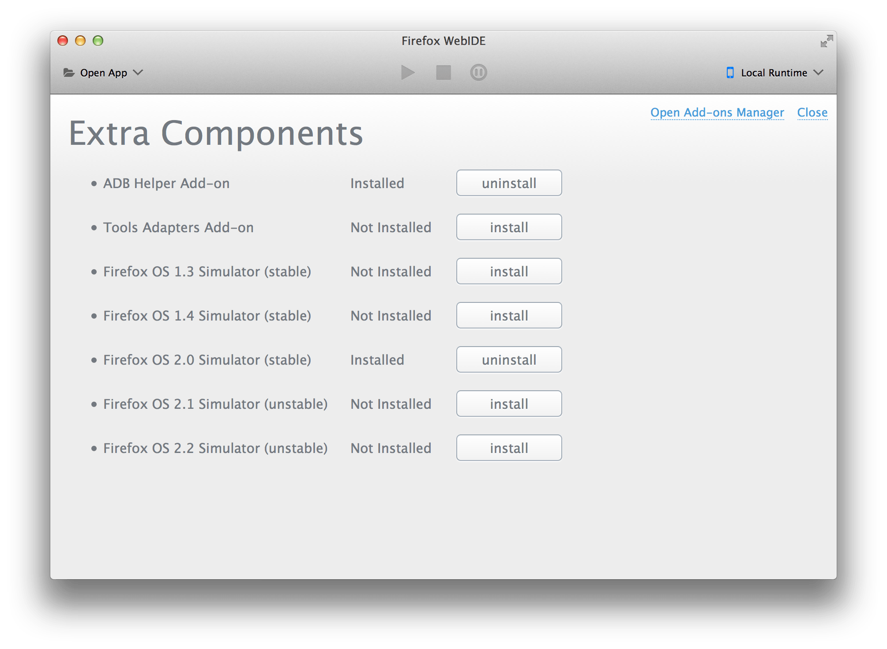
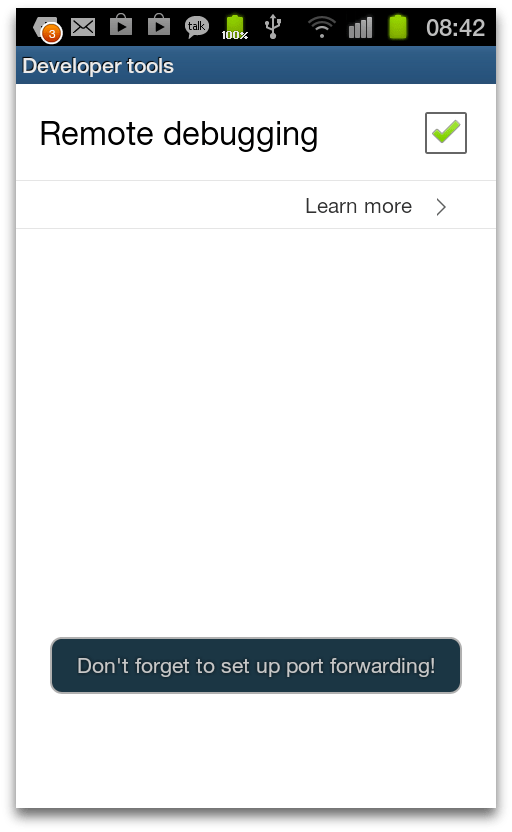
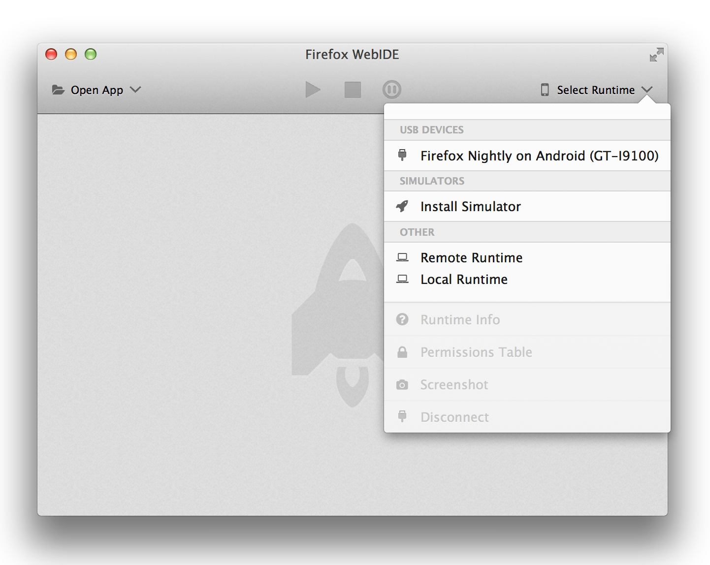
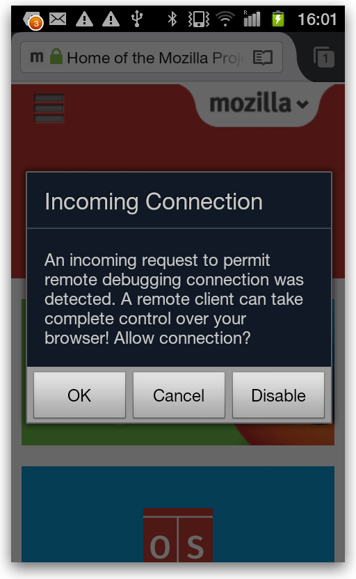
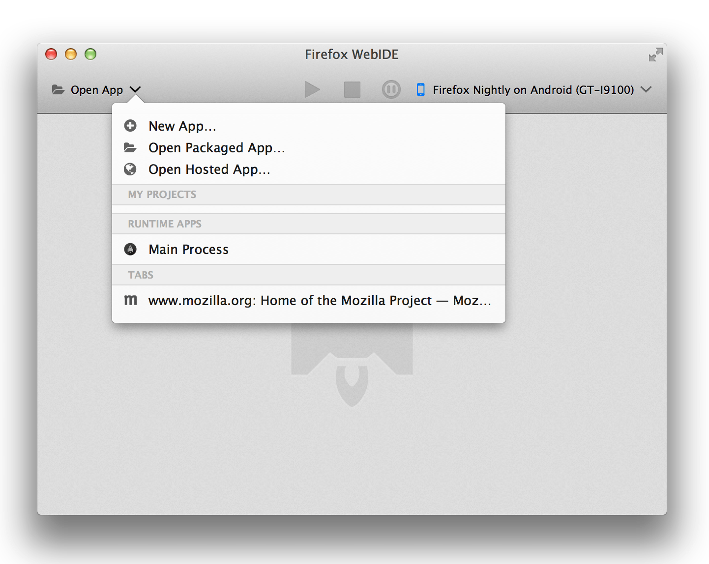
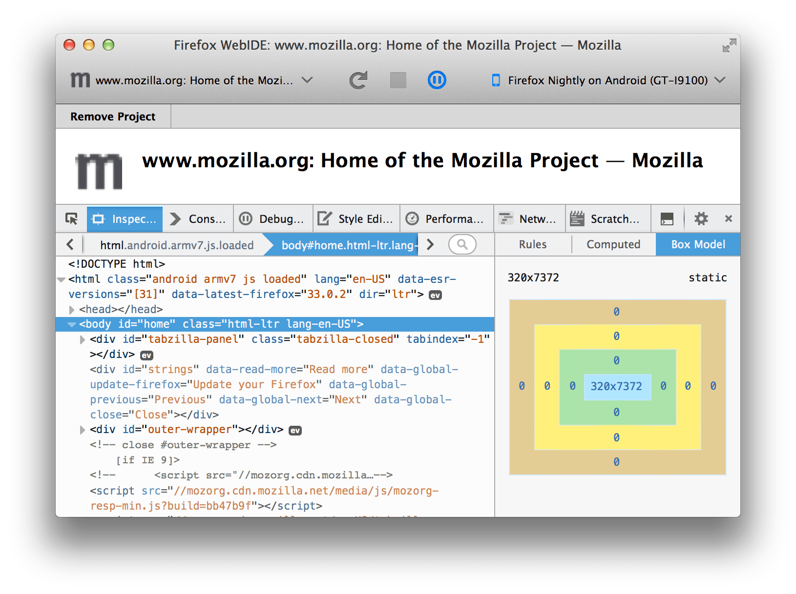

=========================================
Debugging Firefox for Android with WebIDE
=========================================

This article describes how to connect the :doc:`Firefox Developer Tools <../../index>` to Firefox for Android from Firefox 36 onwards.

It's been possible for a long time to connect the Firefox Developer Tools to Firefox for Android so you can debug your mobile website. Until now, though, this was a fairly complex and error-prone process. From Firefox 36 we've made the process much simpler: in particular, you don't need to deal directly with the `adb <https://developer.android.com/tools/help/adb.html>`_ tool at all. Now you connect using **WebIDE**, which takes care of setting up adb behind the scenes.

.. note::
  For this to work, you need at least Firefox 36 on the desktop and Firefox 35 on the mobile device. If you need to use an earlier version, see the older instructions for :doc:`connecting the developer tools to Firefox for Android <../firefox_for_android/index>`

This guide is split into two parts: the first part, "Prerequisites", covers stuff you only need to do once, while the second part, "Connecting", covers stuff you need to do each time you connect the device.

Prerequisites
*************

First, you'll need:

- a desktop or laptop computer with Firefox 36 or higher running on it
- an Android device `capable of running Firefox for Android <https://support.mozilla.org/en-US/kb/will-firefox-work-my-mobile-device>`_ with Firefox for Android 35 or higher running on it
- a USB cable to connect the two devices

ADB Helper
----------

Your desktop Firefox also needs to have the ADB Helper add-on, version 0.7.1 or higher. This should be installed for you automatically the first time you open WebIDE. To check the version, type ``about:addons`` into the browser's address bar and you should see ADB listed.

If you don't have ADB Helper version 0.7.1 or higher, select "Manage Extra Components" from the "Projects" menu, and you'll see the "Extra Components" window, which will contain an entry for ADB Helper:

Click "uninstall", then "install", and you should now have the latest version.

Setting up the Android device
-----------------------------

First, enable USB debugging by following `steps 2 and 3 of this link only <https://android-doc.github.io/tools/device.html#setting-up>`_.

Next, enable remote debugging in Firefox for Android. Open the browser, open its menu, select "Settings", then "Developer tools" (on some Android devices you may need to select "More" to see the "Settings" option). Check the "Remote debugging" box:

The browser might display a notification reminding you to set up port forwarding, which you can ignore.

Connecting
**********

Connect the Android device to the desktop with the USB cable, open **WebIDE**, and open the **Runtimes menu**. You will see Firefox for Android listed as a debugging target under "USB DEVICES":

Select it. On the Android device, you'll now see a warning message:

Click OK. Now click the "Open App" menu in WebIDE. You'll see a list of all the tabs open on the device:

Select a tab to attach the developer tools to it:

Now you should be able to use all the Firefox developer tools that support remote debugging. See the page on :doc:`remote debugging <../index>` for more details.
