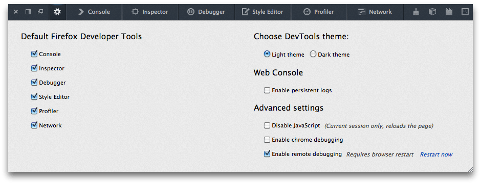
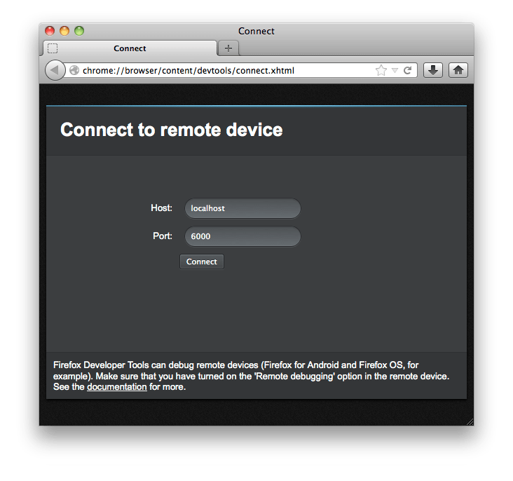

==========================================
Remotely debugging Firefox <36 for Android
==========================================

.. note::
  This guide is for Firefox version 36 and earlier. To debug in Firefox 68 and later, follow the instructions on :doc:`about:debugging <../../about_colon_debugging/index>`.

  For Firefox between 37 and 67, please use the :doc:`WebIDE <../debugging_firefox_for_android_with_webide/index>` guide.

This guide explains how to use :doc:`remote debugging <../index>` to inspect or debug code running in Firefox for Android over USB.

This guide's split into two parts: the first part, "Prerequisites" covers stuff you only need to do once, while the second part, "Connecting", covers stuff you need to do each time you connect the device.

Prerequisites
*************

First, you'll need:

- a desktop or laptop computer with Firefox running on it
- an Android device `capable of running Firefox for Android <https://support.mozilla.org/en-US/kb/will-firefox-work-my-mobile-device>`_ with Firefox for Android running on it
- a USB cable to connect the two devices

ADB setup
---------

Next, you'll need to get the desktop and the Android device talking to each other using the `adb <https://developer.android.com/tools/help/adb.html>`_ command-line tool.

On the Android device
~~~~~~~~~~~~~~~~~~~~~

- `Enable USB debugging in phone settings <https://developer.android.com/studio/command-line/adb.html#Enabling>`_.
- Attach the device to the desktop via USB.

On the desktop
~~~~~~~~~~~~~~

- Install the correct version of the `Android SDK <https://developer.android.com/sdk/index.html>`_ for your device.
- Using the Android SDK, install the `Android Platform Tools <https://developer.android.com/sdk/installing.html#components>`_.
- Android Platform Tools installs adb in the "platform-tools" directory under the directory in which you installed the Android SDK. Make sure the "platform-tools" directory is in your path.

To check it worked, open up a command shell on the desktop and type:

.. code-block::

  adb devices

You should see some output like:

.. code-block::

  List of devices attached
  51800F220F01564 device

(The long hex string will be different.)

If you do, then ``adb`` has found your device and you've successfully set up ADB.

Enable remote debugging
-----------------------

Next, you need to enable remote debugging on both the Android device and the desktop.

Firefox for Android 24 and earlier
~~~~~~~~~~~~~~~~~~~~~~~~~~~~~~~~~~

To enable remote debugging on the device, you need to set the ``devtools.debugger.remote-enabled`` preference to ``true``.

Go to ``about:config`` in Firefox for Android, type "devtools" into the search box and press the Search key. You'll see all the devtools preferences. Find the ``devtools.debugger.remote-enabled`` preference, and press "Toggle".

Firefox for Android 25 and later
~~~~~~~~~~~~~~~~~~~~~~~~~~~~~~~~

On Firefox for Android 25 and later, there's a menu item to enable remote debugging. Open the menu, select "Settings", then "Developer tools" (on some Android devices you may need to select "More" to see the "Settings" option). Check the "Remote debugging" box:

The browser will display a notification reminding you to set up port forwarding, which we'll do later on.

On the desktop
~~~~~~~~~~~~~~

On the desktop, remote debugging is enabled by a setting in the Toolbox. :doc:`Open the Toolbox <../../tools_toolbox/index>`, click the "Settings" button in the :ref:`toolbar <tools-toolbox-toolbar>`, and check "Enable remote debugging" in the :ref:`Settings <tool-toolbox-settings>` tab:

.. note::

  If you're using a version of Firefox older than 27, you'll need to restart the browser for the setting to take effect.

You'll then see a new option in the Web Developer menu labeled "Connect...":

.. image:: remote-debugging-connect-menuitem.png
  :class: center

Connecting
**********

Now you can connect the remote debugging tools to the device. First, attach the device to the desktop with a USB cable, if you haven't already.

On the desktop
--------------

For Firefox 34 or below, go to a command prompt, and type:

.. code-block::

  adb forward tcp:6000 tcp:6000

For later versions of Firefox, go to a command prompt, and type:

.. code-block::

  adb forward tcp:6000 localfilesystem:/data/data/org.mozilla.firefox/firefox-debugger-socket

(If you've changed the value the Android device uses for a debugging port, you'll need to adjust this accordingly.)

For Firefox OS, type:

.. code-block::

  adb forward tcp:6000 localfilesystem:/data/local/debugger-socket

You'll need to reissue this command each time you physically attach desktop and device with the USB cable.

Then go to the Web Developer menu on Firefox, and select "Connect...". You'll see a page that looks like this:

Unless you've changed the port numbers, choose 6000 and press the "Connect" button.

On the Android device
---------------------

Next you'll see a dialog in Firefox for Android asking you to confirm the connection:

Press "OK". The desktop waits for a few seconds to give you time to acknowledge this dialog: if it times out, just press "Connect" in the desktop dialog again.

On the desktop
--------------

Next, the desktop shows you a dialog that looks something like this:

.. image:: remote-debugging-desktop-select-target.png
  :class: center

This is asking whether you want to debug web content running in a browser tab, or to debug the browser code itself.

- You'll see one entry under "Available remote tabs" for each open tab, and clicking it will attach the debugging tools to the web content hosted by that tab. If you want to debug your web content, you'll choose the relevant content tab.
- You'll see one entry under "Available remote processes": this is the browser process itself. You'll choose this option if you want to debug the browser's own code.

Let's choose to attach to the mozilla.org website. The Toolbox will open in its own window, attached to the Firefox for Android tab that's currently hosting mozilla.org:

The Toolbox, and the tools it hosts, work in just the same way as they do when attached to local content.

